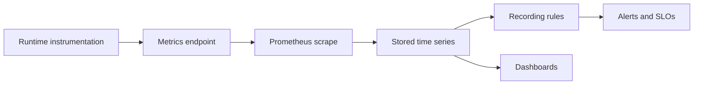
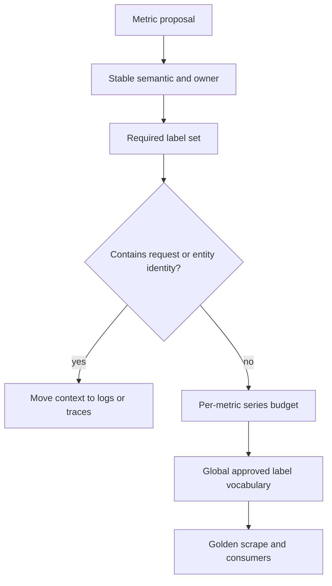

# Metrics Contracts

The Atlas metrics contract binds each required signal to type, unit, labels,
owner, semantics, cardinality budget, and SLO relevance. This contract—not the
existence of a `/metrics` endpoint—is the operational surface.

## Governed Surface

`ops/observe/contracts/metrics-contract.json` currently defines 39 metric
specifications. They cover:

- HTTP rate, status, size, class, and latency;
- admission, bulkhead saturation, queue depth, overload, and shedding;
- cache hits, misses, and disk use;
- store request latency, breaker state, and errors;
- dataset presence and missing-dataset requests;
- registry refresh age and failures;
- policy and invariant violations;
- filesystem and disk-I/O pressure; and
- request-stage and SQLite latency.

Each specification names its owning crate and module. A change is incomplete
when runtime emission changes without updating the contract, golden scrape,
dashboards, alerts, and SLO maps that consume it.

## Signal Delivery Chain

Each boundary needs its own evidence. A metric present in source code may never
be emitted. A sample at the endpoint may never be scraped. A stored series may
be invisible to a rule because labels or units differ. A rendered dashboard
may query an empty or stale series.

| Claim | Evidence |
| --- | --- |
| instrumented | owned emitter and contract entry |
| emitted | runtime scrape containing the expected type, unit, and labels |
| collected | target health plus stored sample for the exact release |
| usable | query result over the required interval and label population |
| decision-bearing | recording rule, alert, or SLO result tied to release and profile |

## Cardinality Controls

Request IDs, trace IDs, IP addresses, raw names, gene and transcript IDs,
cursors, prefixes, and regions are forbidden metric labels. Route, status,
query type, stage, and error code are allowed dynamic dimensions in the metric
contract. The separate label policy allows a broader vocabulary and caps it at
200 values. Both the per-metric series limits and global vocabulary policy must
pass.

Estimate the cartesian product of dynamic labels before accepting a metric.
Several individually bounded labels can still exceed a series budget when
combined. Validate the observed label population under representative load.
Include scrape size, series count, and memory impact in the change evidence.

## Registry Snapshot Limitation

`ops/observe/metrics/registry.snapshot.json` currently contains only metadata:
its kind, source, and `authoritative-template` status. It carries no metric
entries. Do not use it to prove that 39 metrics were emitted or discovered.
Use the detailed metrics contract for required definitions and a captured,
validated scrape for runtime presence.

## SLO Consumption

Four declared SLOs consume metrics: 99.9% availability over 30 days, 300 ms
p95 latency over 30 days, a 0.5% error-rate budget over 30 days, and 50 ingest
records per second over 10 minutes. Their recording expressions evaluate every
30 seconds. A metric rename or label change can silently invalidate these
calculations even when raw samples still exist.

## Freshness and Absence

A zero sample, a missing series, and a stale series mean different things. Zero
is a measured value. Missing can mean no matching target, no emission, label
drift, or query mismatch. Stale means collection stopped after earlier samples.

When an alert is unexpectedly quiet, inspect target health, last scrape time,
release labels, raw series, recording rules, and alert evaluation in that
order. Never convert missing data to healthy zero unless the metric contract
defines that behavior.

## Accepting a Metric Change

Require a stable name and meaning, owner, type and unit, bounded labels,
per-metric budget, golden sample, and applicable endpoint coverage. Validate
dashboard queries, alerts, recording rules, and SLO expressions. Then capture a
runtime scrape and stored query result showing resolved labels, values, and
freshness for the candidate release.

See [Service Objectives and Error Budgets](service-objectives-and-error-budgets.md)
for indicator and budget semantics, [Dashboards and Panels](dashboards-and-panels.md)
for diagnostic consumers, and [Alert Rules](alert-rules.md) for action
thresholds.
