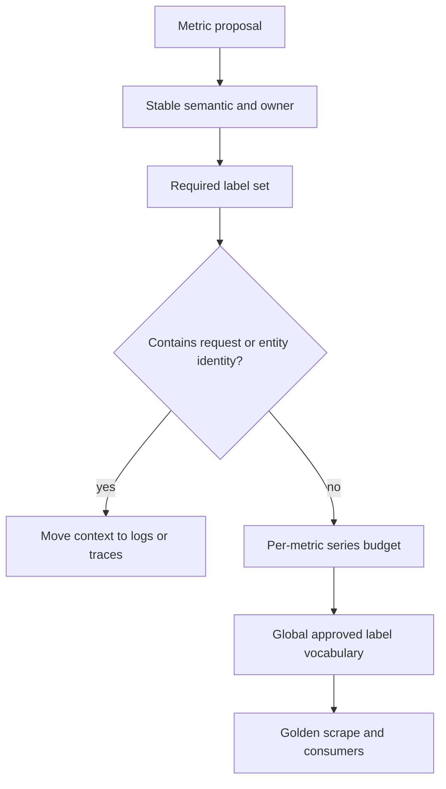

# Metrics Contracts

The Atlas metrics contract binds each required signal to type, unit, labels,
owner, semantics, cardinality budget, and SLO relevance. This contract—not the
existence of a `/metrics` endpoint—is the operational surface.

## Governed Surface

`ops/observe/contracts/metrics-contract.json` currently defines 39 metric
specifications. They cover:

- HTTP rate, status, size, class, and latency;
- admission, bulkhead saturation, queue depth, overload, and shedding;
- cache hits, misses, and disk use;
- store request latency, breaker state, and errors;
- dataset presence and missing-dataset requests;
- registry refresh age and failures;
- policy and invariant violations;
- filesystem and disk-I/O pressure; and
- request-stage and SQLite latency.

Each specification names its owning crate and module. A change is incomplete
when runtime emission changes without updating the contract, golden scrape,
dashboards, alerts, and SLO maps that consume it.

## Cardinality Controls

Request IDs, trace IDs, IP addresses, raw names, gene and transcript IDs,
cursors, prefixes, and regions are forbidden metric labels. Route, status,
query type, stage, and error code are allowed dynamic dimensions in the metric
contract. The separate label policy allows a broader vocabulary and caps it at
200 values. Both the per-metric series limits and global vocabulary policy must
pass.

## Registry Snapshot Limitation

`ops/observe/metrics/registry.snapshot.json` currently contains only metadata:
its kind, source, and `authoritative-template` status. It carries no metric
entries. Do not use it to prove that 39 metrics were emitted or discovered.
Use the detailed metrics contract for required definitions and a captured,
validated scrape for runtime presence.

## SLO Consumption

Four declared SLOs consume metrics: 99.9% availability over 30 days, 300 ms
p95 latency over 30 days, a 0.5% error-rate budget over 30 days, and 50 ingest
records per second over 10 minutes. Their recording expressions evaluate every
30 seconds. A metric rename or label change can silently invalidate these
calculations even when raw samples still exist.

## Accepting a Metric Change

Require a stable name and meaning, owner, type and unit, bounded labels,
per-metric budget, golden sample, and applicable endpoint coverage. Validate
dashboard queries, alerts, recording rules, and SLO expressions. Then capture a
runtime scrape showing the resolved labels and values.

See [Dashboards and Panels](dashboards-and-panels.md) for diagnostic consumers
and [Alert Rules](alert-rules.md) for action thresholds.
