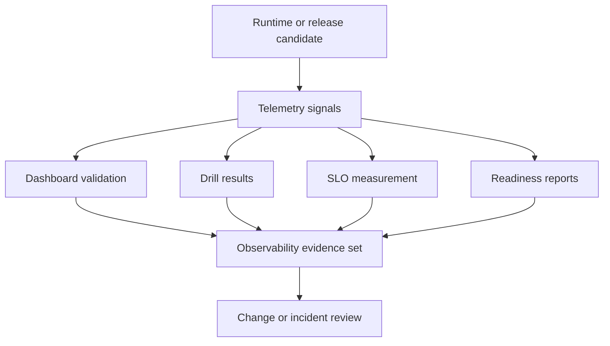

# Operational Evidence Reports

Generated reports under `ops/report/generated/` and related evidence outputs
turn runtime and platform checks into reviewable artifacts.

This page is about turning observability from something an operator sees live
into something a reviewer can inspect later. The evidence set needs to preserve
not only that telemetry existed, but which alerts, dashboards, drill outputs,
SLO measurements, and readiness checks supported the decision.

## Purpose

Use this page when assembling observability evidence for a rollout review,
release decision, or incident record.

## Source of Truth

- `ops/observe/generated/telemetry-index.json`
- `ops/observe/dashboard-registry.json`
- `ops/observe/drills/result.schema.json`
- `ops/observe/slo-measurement.json`
- `ops/observe/readiness.json`

## Observability Evidence Set

Operators should expect the observability evidence surface to include:

- the telemetry index, which enumerates the key observability assets
- dashboard validation outputs and the registry of accepted dashboards
- telemetry drill definitions and drill result artifacts
- SLO measurement definitions and related alert surfaces
- readiness reports that confirm the observability pack itself is ready

## Main Takeaway

The value of observability evidence is not volume. It is traceability. Another
operator should be able to follow the evidence set and understand why a change
was approved, why an incident was diagnosed the way it was, and which signal
surfaces were trustworthy at the time.

## How Operators Use the Reports

- during change review, confirm the required dashboards, alerts, and readiness
  artifacts still exist
- during incident review, attach drill results, readiness evidence, and signal
  snapshots that explain what the operator saw
- during release review, show that observability coverage still matches the
  runtime and rollout surface
