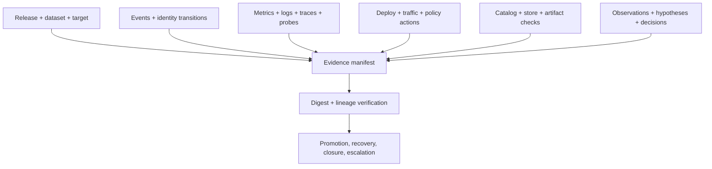

# Operational evidence reports

Operational evidence freezes the identities, observations, and reasoning behind
a promotion, hold, mitigation, recovery, or closure decision. It must remain
reviewable after live telemetry expires.

## Evidence classes are not substitutes

| Class | Establishes | Does not establish |
| --- | --- | --- |
| telemetry index | Expected assets are discoverable | A deployed signal path works |
| dashboard validation | Panel structure and query shape validate | Queries return current data |
| readiness declaration | Required asset families exist | Collectors, rules, and notifications were exercised |
| SLO definition | Objective, population, and measurement are declared | A candidate met the objective |
| drill definition | Fault, signals, timeout, and cleanup are specified | The drill ran |
| drill result | One identified execution produced evidence | Other targets or releases behave the same |

## Packet structure

```mermaid
flowchart TD
    Identity[Release + dataset + target] --> Manifest[Evidence manifest]
    Timeline[Events + identity transitions] --> Manifest
    Signals[Metrics + logs + traces + probes] --> Manifest
    Changes[Deploy + traffic + policy actions] --> Manifest
    Integrity[Catalog + store + artifact checks] --> Manifest
    Ledger[Observations + hypotheses + decisions] --> Manifest
    Manifest --> Verify[Digest + lineage verification]
    Verify --> Decision[Promotion, recovery, closure, escalation]
```

| Object | Minimum identity |
| --- | --- |
| raw signal | Source, exact query, event window, capture time, and digest |
| workload state | Cluster, namespace, workload revision, and observation time |
| data state | Dataset tuple, catalog epoch, manifest, and payload hashes |
| change event | Authorizer, executor, target, old state, new state, and time |
| hypothesis | Predicted and disconfirming evidence plus disposition |
| recovery result | Selected authority, checks, observation window, and residual risk |

Keep raw captures immutable. Redaction, normalization, correction, and summary
produce child objects with their own digests and parent links. A later diagnosis
can supersede an earlier decision but must not rewrite what was known then.

## Decision ledger

| Entry | Required content | Closure |
| --- | --- | --- |
| observation | Source, target, query or command, window, capture time, digest | Immutable once cited |
| hypothesis | Suspected boundary, support, prediction, and disconfirming evidence | Supported, rejected, or unresolved |
| action | Authorizer, executor, target, exact change, expected effect, reversal | Linked to outcome or abandoned explicitly |
| decision | Admitted facts, policy, alternatives, selected action, uncertainty, owner | Superseded only by a linked later decision |

Timestamps establish order. Digests establish retained content. Neither proves
causality by itself; causal interpretation belongs in the decision.

## Identity, custody, and time

Every object records source system, stable ID, producer version, event window,
capture time, collection time, time zone, known clock skew, digest, and
relationship to derived objects or decisions.

If rollout, request, metric, log, trace, and fault times cannot be ordered,
mark correlation uncertain. Do not infer event absence from a retention gap,
sampling gap, or unqueried interval.

Redaction must remove credentials and sensitive payloads while preserving
release, dataset, principal class, route class, decision, time, and trace
correlation. Hash the retained representation.

## Qualify negative evidence

“No errors occurred” is defensible only when the observation path could have
found them.

| Qualification | Required proof |
| --- | --- |
| population | Release, route class, dataset, status family, and traffic volume |
| interval | Event and query windows, evaluation time, skew, and retention overlap |
| instrumentation | Expected event, metric, or span was active on the exercised path |
| delivery | Scrape, export, ingestion, retention, and query paths remained healthy |
| selection | Filters, sampling, aggregation, and exclusions preserve the target condition |
| control | A known event or healthy source proves the query can return data |

Without these facts, say “no matching evidence retrieved.” A zero-valued
series, an empty query result, and an absent series are different observations.

## Decision depth

| Decision | Minimum evidence |
| --- | --- |
| local investigation | Bounded signal window and identities sufficient to test a hypothesis |
| containment | Timeline, affected boundary, mitigation, reversal, and evidence gaps |
| rollout continuation | Probes, request paths, error and saturation windows, rollout identity |
| release promotion | Conformance, SLO, load, recovery, raw references, verdict, artifact binding |
| security response | Exposure, identity, authorization, audit, containment, integrity |

Structural validity and decision sufficiency are separate verdicts. A packet
can be schema-valid yet stale, weakly identified, or too narrow for its claim.

## Current evidence boundary

The generated telemetry index inventories six artifact classes. Static
readiness becomes `ready` when SLO definitions, alert catalog, telemetry drills,
and dashboard index exist. That does not establish scrape freshness, trace
retention, alert delivery, dashboard population, or drill execution.

No schema-valid drill result is checked in under `ops/observe/`. Release
evidence has empty drill and simulation summary collections. Until execution
produces immutable candidate-bound captures and results, static readiness is
not promotion evidence.

Preserve failed and partial packets. Reject mutable release references, missing
windows, absent raw signals, unresolved redaction, or verdicts disconnected
from thresholds. Continue with [Telemetry Drills](telemetry-drills.md) and
[Release Evidence](../release/release-evidence.md).
