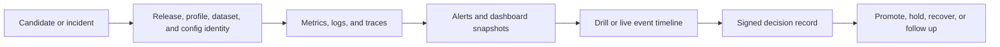
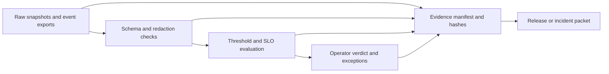
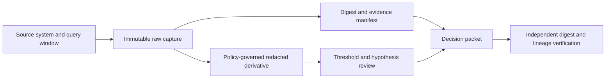

# Operational Evidence Reports

Operational evidence freezes the signals and identities behind an action. It
must remain useful after live telemetry expires. A second operator should be
able to reconstruct the decision. Asset inventory, readiness declaration,
runtime observation, and drill result are different evidence classes. They
must not substitute for one another.

## Evidence Chain

```mermaid
flowchart LR
    C["Candidate or incident"] --> I["Release, profile, dataset, and config identity"]
    I --> S["Metrics, logs, and traces"]
    S --> A["Alerts and dashboard snapshots"]
    A --> D["Drill or live event timeline"]
    D --> R["Signed decision record"]
    R --> P["Promote, hold, recover, or follow up"]
```

## Evidence Classes

| Class | Establishes | Does not establish |
| --- | --- | --- |
| Telemetry index | Required observability assets are discoverable | A deployed signal path works |
| Dashboard validation | JSON and panel contracts are structurally valid | Queries return current data |
| Readiness declaration | Named observability prerequisites are present | Collectors, rules, and notifications were exercised |
| SLO definition and measurement map | Objectives and PromQL are declared | The observation window met the objective |
| Drill definition | Fault, expected signals, timeout, and cleanup are described | The drill ran or passed |
| Drill result | One identified execution produced bounded evidence | All profiles or releases behave identically |

## Required Record

For a rollout or release decision, retain:

- source revision, release, image, chart, profile, values, and dataset identity;
- observation start and end times with clock and time-zone context;
- raw metric snapshots and evaluated SLO windows;
- alert rule and dashboard versions plus rendered snapshots;
- representative successful and failing trace IDs and correlated logs;
- readiness, probe, dependency, and replica transitions;
- drill result and injected-fault timestamps when a rehearsal supports the
  claim; and
- operator verdict, exceptions, rollback target, and unresolved risks.

An incident record adds detection time, first user impact, containment actions,
recovery time, and integrity assessment. It also preserves the evidence that
ruled out competing causes.

## Evidence Lineage

```mermaid
flowchart LR
    Raw[Raw snapshots and event exports] --> Normalize[Schema and redaction checks]
    Normalize --> Evaluate[Threshold and SLO evaluation]
    Evaluate --> Verdict[Operator verdict and exceptions]
    Raw --> Manifest[Evidence manifest and hashes]
    Normalize --> Manifest
    Evaluate --> Manifest
    Verdict --> Manifest
    Manifest --> Packet[Release or incident packet]
```

Derived summaries must retain links to raw inputs. Redaction should remove
secrets and sensitive payloads. It must preserve the timestamps, request
classes, release identity, dataset identity, principal class, decision result,
and trace correlation needed for review. Hash the retained form so later
mutation is detectable.

## Custody and Time Integrity

```mermaid
flowchart LR
    Source[Source system and query window] --> Capture[Immutable raw capture]
    Capture --> Hash[Digest and evidence manifest]
    Capture --> Redact[Policy-governed redacted derivative]
    Redact --> Review[Threshold and hypothesis review]
    Hash --> Packet[Decision packet]
    Review --> Packet
    Packet --> Verify[Independent digest and lineage verification]
```

Every retained object needs a stable identifier, source, capture time, event
window, producer version, digest, and relationship to its derivative or
decision. A redacted export is a new evidence object: preserve its parent
digest and redaction policy instead of silently replacing the raw capture.

Time integrity is part of custody. Record the source clock and collection
clock, known skew, query boundaries, and time zone. If a metric window, log
event, trace span, rollout, and injected fault cannot be ordered reliably,
mark the correlation as uncertain. Do not infer absence of an event from a
retention gap or an unqueried interval.

## Qualify Negative Evidence

“No errors were observed” is a strong claim only when the observation path was
capable of finding errors. Before using absence as evidence, bind the claim to
the population and prove the collection boundary.

| Qualification | Evidence required |
| --- | --- |
| population. | Release, route class, dataset, status family, and traffic volume are explicit. |
| interval. | Event window, query window, evaluation time, clock skew, and retention overlap are explicit. |
| instrumentation. | The expected event, metric, or span is registered and enabled on the exercised path. |
| delivery. | Scrape, export, ingestion, and query paths were healthy for the interval. |
| selection. | Filters, sampling, aggregation, and exclusions are recorded and do not discard the target condition. |
| comparison. | A known event or healthy control demonstrates that the query can return data from the same source. |

Without these qualifications, report “no matching evidence retrieved,” not
“the event did not occur.” A zero-valued series, an empty query result, and an
absent series are different observations and must remain distinct in the raw
record and verdict.

## Evidence Quality Dimensions

| Dimension | Acceptance question |
| --- | --- |
| Identity | Is every signal bound to the intended release, profile, dataset, and environment? |
| Coverage | Are all required classes and representative success and failure paths present? |
| Freshness | Does the captured window cover the decision or incident interval? |
| Integrity | Can digests and manifests detect later mutation? |
| Lineage | Can a reviewer trace summaries and verdicts to raw inputs? |
| Confidentiality | Was sensitive content removed under a recorded policy without erasing decision context? |
| Interpretability | Are units, populations, thresholds, exclusions, and known gaps explicit? |

An evidence packet may be internally well formed yet too stale, narrow, or
weakly identified for its claim. Structural validity and decision sufficiency
therefore receive separate verdicts.

| Decision | Minimum evidence depth |
| --- | --- |
| local investigation | bounded signal window and identities sufficient to test a hypothesis |
| incident containment | timeline, affected boundary, mitigation, reversal condition, and evidence gaps |
| rollout continuation | probes, request-path signals, error and saturation windows, and rollout identity |
| release promotion | conformance, SLO/load/recovery results, raw references, verdict, and artifact binding |
| security response | exposure and identity state, authorization decisions, audit trail, containment, and integrity assessment |

## Current Evidence Boundary

The generated telemetry index inventories six artifact classes. The readiness
file declares `ready` when four asset families exist: SLO definitions, the
alert catalog, telemetry drills, and the dashboard index. That declaration is
static asset readiness. It does not prove scrape freshness, trace retention,
alert delivery, dashboard population, or drill execution.

No schema-valid drill result is checked in under `ops/observe/`. Release
evidence also carries empty drill and simulation summary collections. Until a
run produces immutable snapshots and a result tied to a candidate, do not use
the static readiness declaration as promotion evidence.

## Acceptance

Reject reports with missing time windows or mutable release references. Also
reject absent raw signals, unresolved redaction, or a verdict disconnected from
thresholds. Generated summaries must link to their inputs and schema. Preserve
failed and partial runs. Deleting them removes information needed to assess
reliability.

Use [Telemetry Drills](telemetry-drills.md) for executable-coverage limits and
[Release Evidence](../release/release-evidence.md) for packaging constraints.
