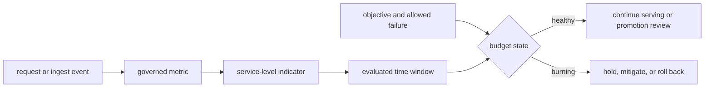
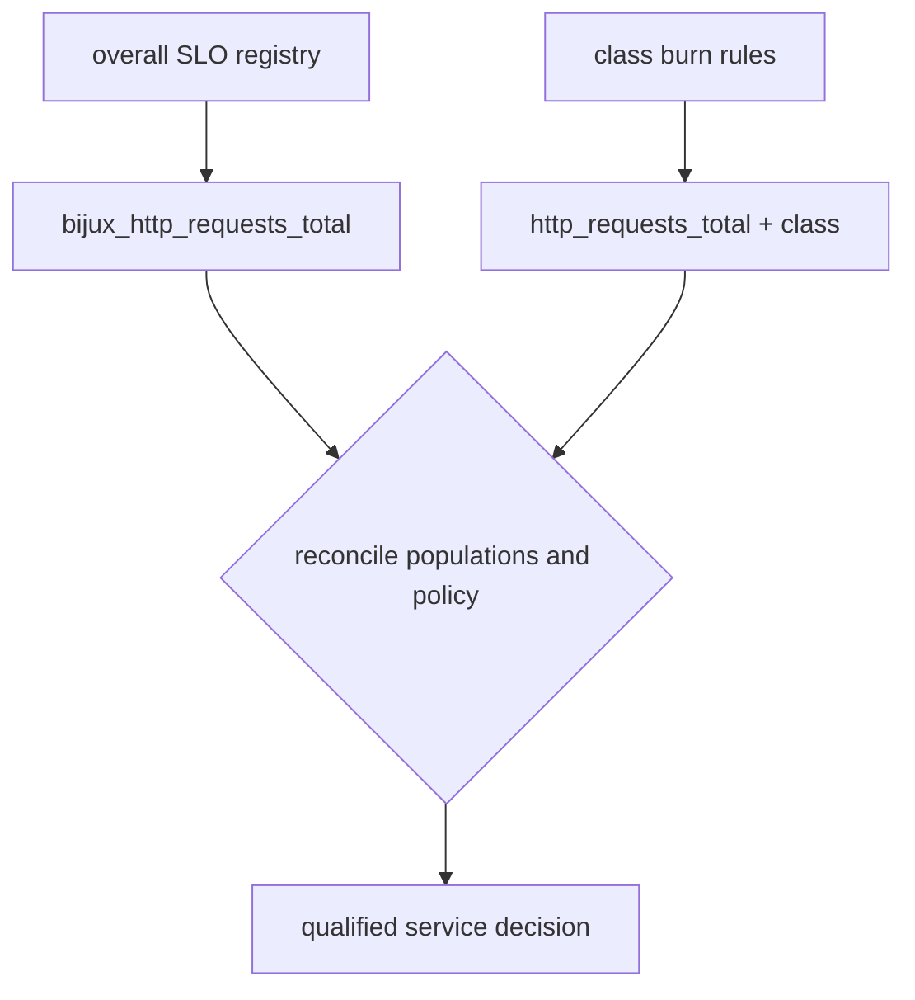
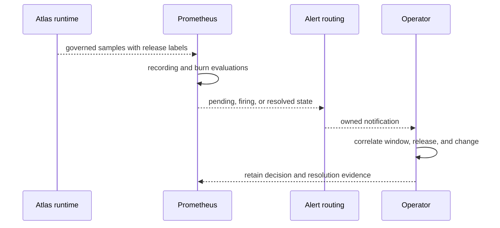

# Service Objectives and Error Budgets

Atlas service objectives turn telemetry into bounded operating decisions. They
define what success means over a window, how the signal is measured, and when
budget consumption must block promotion or trigger mitigation.

## Declared Objectives

`ops/observe/slo-definitions.json` declares four objectives:

| Objective | Target | Window | Primary metric |
| --- | ---: | --- | --- |
| availability | 99.9% successful requests | 30 days | `bijux_http_requests_total` |
| p95 latency | at most 300 ms | 30 days | `bijux_http_request_latency_p95_seconds` |
| server error rate | at most 0.5% | 30 days | `bijux_http_requests_total` |
| ingest throughput | at least 50 records/s | 10 minutes | `atlas_ingest_records_total` |

The corresponding PromQL, recording-rule identity, and 30-second evaluation
interval live in `ops/observe/slo-measurement.json`. The metric map identifies
the required source series. These files declare measurement intent; they do not
contain an evaluated window.

## Objective, Indicator, and Budget

For a success objective `O`, the failure budget is `1 - O`. Consumption must be
calculated from the same eligible-event population as the objective. Changing
route filters, status classification, request classes, or missing-data policy
changes the indicator and requires a new comparison boundary.

Latency and throughput objectives are not availability budgets. Report their
distance from target and time outside the objective separately instead of
converting every violation into an invented availability percentage.

## Two Governed SLO Surfaces

Atlas currently carries two related but distinct control surfaces:

1. the four overall objectives and recording expressions in the SLO JSON files;
2. cheap- and standard-request burn alerts in
   `ops/observe/alerts/slo-burn-rules.yaml`.

The overall availability and error-rate definitions use
`bijux_http_requests_total`. The class-specific burn rules use
`http_requests_total` with `class` labels and budgets of `0.0001` for cheap
traffic and `0.001` for standard traffic. Both metrics are governed in the
metrics contract, but the class budgets are not derived from the four-objective
JSON registry.

Treat them as parallel authorities until a generated relationship binds their
populations, objectives, and rule revisions. A passing overall window does not
erase a cheap-path burn, and an inactive class alert does not prove the overall
30-day objective passed.

## Burn-Rate Semantics

The class-specific rules evaluate paired windows:

| Burn class | Windows | Factor | Persistence | Action |
| --- | --- | ---: | --- | --- |
| fast | 5 minutes and 1 hour | 14 | 5 minutes | page |
| medium | 30 minutes and 6 hours | 6 | 15 minutes | page |
| slow | 2 hours and 24 hours | 3 | 30 minutes | warn |

Both windows must exceed the factor. The short window detects acute harm; the
longer window reduces noise from a brief spike. The rule expression and
contract severity remain authoritative over prose summaries or catalog display
labels.

## Missing and Low-Volume Data

The expressions use `clamp_min(..., 1)` to avoid division by zero. That makes
the query numerically defined; it does not prove that enough traffic existed to
qualify the objective.

| Observation | Interpretation |
| --- | --- |
| fresh numerator and denominator | calculate the bounded indicator |
| no eligible requests | mark the window insufficient, not perfect |
| source series absent | treat collection or label coverage as unknown |
| recording rule stale | reject the evaluated value for current decisions |
| release label changed mid-window | split the window by release identity |
| traffic mix changed materially | retain both populations and narrow comparison |

Budget evidence must record sample count, eligible-event definition, missing
intervals, release and profile identity, and the exact query revision.

## Promotion Policy

An error budget governs risk; it is not permission to spend failures without
attribution. Before promotion, retain:

- objective and measurement revisions;
- source metric contract and observed label population;
- complete evaluation window with gaps and deploy markers;
- budget remaining, consumption rate, and active burn alerts;
- release, dataset, profile, target, and workload identities;
- exceptions, owner, decision time, and follow-up condition.

Freeze promotion when a required objective is burning, blind, incomparable, or
unbound to the candidate. Emergency mitigation may proceed under incident
authority, but it does not rewrite the budget history.

## Prove the Evaluation Path

A source-contract test proves expression and metadata shape. A live evaluation
requires emitted samples, successful collection, query results, rule state,
notification delivery, and operator acknowledgement. A release claim further
requires the complete result to be bound to candidate artifacts.

## Current Qualification Boundary

The checked-in objective, measurement, metric-map, and burn-rule files are
governed source inputs. They are not a current 30-day evaluation or proof of
notification delivery. The generated telemetry index establishes inventory
presence only.

Use [Metrics Contracts](metrics-packages.md) for source-series semantics,
[Alert Rules](alert-rules.md) for delivery assurance, and
[Incident Response](incident-response.md) when budget burn requires action.
