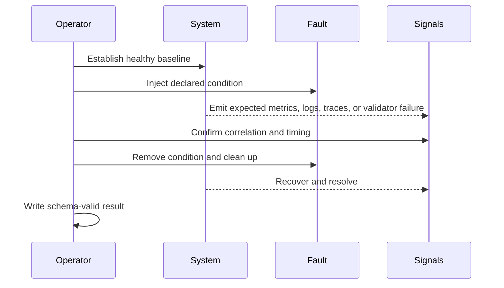

# Telemetry Drills

A telemetry drill proves that an injected condition becomes visible, remains
diagnosable, and clears predictably. A JSON registry entry is a design claim;
only an executed result with captured signals supports an operating claim.

## Three Registries

| Registry | Entries | Meaning |
| --- | ---: | --- |
| `drills.json` | 8 | High-level service and recovery rehearsal designs |
| `drills/drills.json` | 21 | Intended runners, expected signals, timeouts, cleanup, and runbooks |
| `telemetry-drills.json` | 2 | Focused OpenTelemetry-outage and Prometheus-gap classifications |

The 21 execution entries cover store and collector outages, latency,
admission control, schema and cardinality violations, missing spans, alert and
runbook checks, cheap-path survival, cache and registry failure, dataset
corruption, garbage collection, restart, autoscaling, resource pressure, and
dashboard fault signatures.

## Execution Contract

Every result requires drill ID, start and end timestamps, `pass` or `fail`,
metric, trace, and log snapshot paths, trace IDs, and expected signals. Preserve
the fault parameters, release and profile identity, actual signals, cleanup
outcome, and recovery time as supporting context.

## Current Executability Gap

Every runner path in `ops/observe/drills/drills.json` points to a Python file
under a historical `src/bijux-atlas-dev/...` layout that does not exist in the
current crate. The observability suite registry likewise references missing
Python and shell test files. No drill result file is present under
`ops/observe/`.

Therefore the current drill catalogs describe intended coverage but do not
provide an executable or completed drill program from those paths. The static
`readiness.json` value of `ready` cannot close this gap. Do not claim that the
21 drills pass, or that the `full` observability suite is runnable, until the
registry points to real maintained entrypoints and fresh results are retained.

## Judging a Drill

A drill passes only when the intended fault occurred, all expected signals were
observed within the declared window, protected service behavior remained inside
contract, the condition resolved after cleanup, and the result validates
against `ops/observe/drills/result.schema.json`.

Fail the drill for missing or ambiguous telemetry even if service behavior is
correct. Also fail it when a validator merely confirms that a rule file exists
without proving the runtime signal and notification path needed by the claim.

See [Alert Rules](alert-rules.md) for paging readiness and
[Operational Evidence Reports](operational-evidence-reports.md) for retention.
