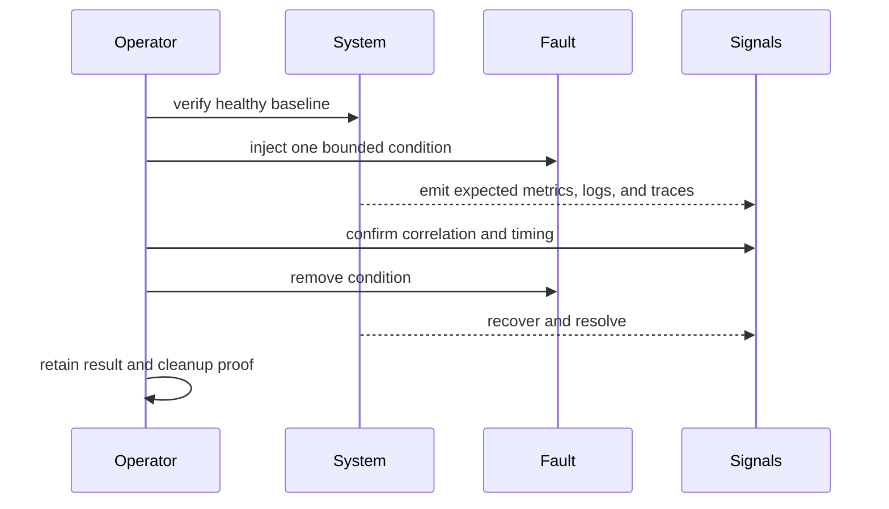

# Telemetry Drills

A telemetry drill proves that a bounded fault becomes visible, remains
diagnosable, and clears after recovery. Registry entries and file-existence
checks describe intended coverage; they do not prove that a fault was injected
or observed.

## Current registries

| Registry | Entries | Role |
| --- | ---: | --- |
| `ops/observe/drills.json` | 8 | high-level service and recovery contracts |
| `ops/observe/drills/drills.json` | 21 | intended runners, signals, timeouts, cleanup, and runbooks |
| `ops/observe/telemetry-drills.json` | 2 | focused collector-outage and Prometheus-gap classifications |

The 21-entry registry spans store and collector outages, latency, admission,
schema and cardinality, spans, alerts, runbooks, cache, registry, corruption,
garbage collection, restart, autoscaling, pressure, and dashboard signatures.
That breadth is planned coverage, not completed coverage.

## Current execution boundary

Every runner in the 21-entry registry points to a Python file under an absent
historical source layout. The observability suite registry also names missing
Python and shell tests. No completed drill result is checked in under
`ops/observe/`.

The available `ops drills run --name ... --allow-write` command uses
`execution_mode: contract-verification`. It checks whether a small set of
expected documentation, configuration, and source paths exists, then writes a
report. It does not invoke the registered runner, mutate a cluster, inject the
fault, query metrics, capture traces, or verify cleanup.

`ops obs drill run` is routed to an action explanation rather than a live drill
executor. The static `readiness.json` value of `ready` does not close these
gaps. Do not claim that the 21 drills pass or that the full observability suite
is runnable.

## Contract for a real execution

Before injection, bind the release, profile, dataset, target, fault parameters,
blast radius, protected traffic, maximum duration, abort signals, cleanup owner,
and recovery target. Do not start in a degraded environment or without a tested
cleanup path.

The result schema requires drill ID, start and end timestamps, verdict, metric,
trace, and log snapshot paths, trace IDs, and expected signals. Supporting
evidence must also preserve actual observations, release identity, fault
parameters, cleanup outcome, and recovery time.

## Verdict semantics

A drill passes only when the intended fault occurred, every required signal
appeared within its window, protected behavior remained inside contract,
cleanup completed, and service plus telemetry recovered.

Fail when telemetry is missing or ambiguous, even if service behavior appears
correct. An abort indicates that the drill exceeded its safety boundary; it
requires containment and review. A validator that proves a rule file exists is
not a firing test.

Cleanup is part of the verdict. Confirm that injected resources, silences,
routing overrides, credentials, network policy, and test data are removed or
restored. A drill that detects a fault but leaves the environment altered has
failed and may have become an incident.

See [Alert rules](alert-rules.md) for notification-path proof and
[Operational evidence reports](operational-evidence-reports.md) for custody.
