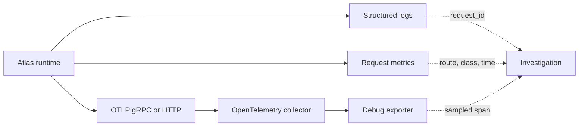

# Tracing Pipelines

Atlas tracing has two contracts: request-path coverage and stable lifecycle
identity. A collector configuration moves spans, but durable incident use also
requires storage, retention, query access, sampling policy, and correlation.

## Trace Path

All three checked-in collector configurations receive OTLP over gRPC and HTTP
and export spans to `debug`. They do not configure durable trace storage, a
remote backend, retention, or a Grafana trace datasource. The local stack can
prove emission and collector intake; it cannot by itself prove historical
search or durable trace availability.

## Request-Path Contract

Every governed request trace has a `request_root` span with request ID, route,
and method. Path coverage requires admission control, cache lookup, dataset
resolution, response serialization, SQLite query, and store fetch spans where
applicable. Slow-query spans also carry cost class, dataset hash, and query
name.

The endpoint observability contract maps 15 HTTP routes to cheap, medium, or
heavy classes and declares their required metrics and spans. Validate paths by
route; a trace from `/v1/version` cannot prove store-fetch coverage for a
sequence request.

## Stable Lifecycle Contract

The tracing registry separately names runtime root, HTTP request, query,
ingest, artifact, registry, configuration, startup, shutdown, and structured
error spans. Their stable trace IDs are immutable. Adding an ID is allowed;
renaming or deleting one requires explicit migration evidence because incident
queries and longitudinal comparisons may depend on it.

## Correlation

Request IDs must propagate across asynchronous boundaries and appear on
request, query, and error spans. Logs use request and optional trace IDs for
high-cardinality correlation. Metrics use bounded route, class, status,
dataset, subsystem, and version dimensions instead of trace IDs.

When a span is missing, distinguish instrumentation loss, sampling, exporter
failure, collector failure, and a code path that never executed. An empty
backend is not proof that no request occurred.

## Acceptance

For a release claim, retain the runtime and collector versions, effective
collector configuration, sampling policy, representative successful and
failing trace IDs, required-span validation, exporter health, and correlation
to logs and metrics. If durable trace investigation is required, also prove
backend ingestion, retention, access control, and retrieval after the incident
window.

Use [Telemetry Drills](telemetry-drills.md) to exercise exporter and span gaps
and [Logging Contracts](logging-contracts.md) for request correlation.
