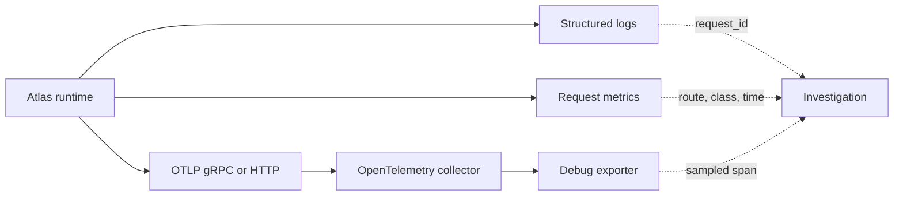
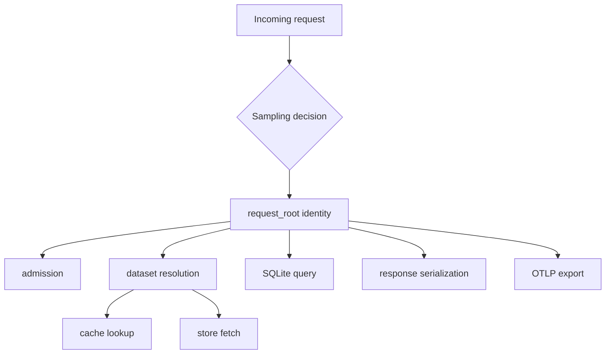

# Tracing Pipelines

Atlas tracing has two contracts: request-path coverage and stable lifecycle
identity. A collector configuration moves spans, but durable incident use also
requires storage, retention, query access, sampling policy, and correlation.

## Trace Path

All three checked-in collector configurations receive OTLP over gRPC and HTTP
and export spans to `debug`. They do not configure durable trace storage, a
remote backend, retention, or a Grafana trace datasource. The local stack can
prove emission and collector intake; it cannot by itself prove historical
search or durable trace availability.

The debug exporter may expose span attributes in collector output. Treat that
output as diagnostic data subject to the same access, redaction, and retention
controls as structured logs.

## Request-Path Contract

Every governed request trace has a `request_root` span with request ID, route,
and method. Path coverage requires admission control, cache lookup, dataset
resolution, response serialization, SQLite query, and store fetch spans where
applicable. Slow-query spans also carry cost class, dataset hash, and query
name.

The endpoint observability contract maps 15 HTTP routes to cheap, medium, or
heavy classes and declares their required metrics and spans. Validate paths by
route; a trace from `/v1/version` cannot prove store-fetch coverage for a
sequence request.

## Stable Lifecycle Contract

The tracing registry separately names runtime root, HTTP request, query,
ingest, artifact, registry, configuration, startup, shutdown, and structured
error spans. Their stable trace IDs are immutable. Adding an ID is allowed;
renaming or deleting one requires explicit migration evidence because incident
queries and longitudinal comparisons may depend on it.

## Correlation

Request IDs must propagate across asynchronous boundaries and appear on
request, query, and error spans. Logs use request and optional trace IDs for
high-cardinality correlation. Metrics use bounded route, class, status,
dataset, subsystem, and version dimensions instead of trace IDs.

When a span is missing, distinguish instrumentation loss, sampling, exporter
failure, collector failure, and a code path that never executed. An empty
backend is not proof that no request occurred.

## Parentage and Sampling

A valid trace is more than a set of span names. The request root must own the
request lifecycle. Child spans must preserve parentage across asynchronous
boundaries, and error status must attach to the failing operation. Orphaned
spans can satisfy a name inventory while failing to explain latency or
causality.

Record head or tail sampling mode, probability or policy, error-retention
rules, attribute limits, and propagation format. A sampled successful trace
cannot prove that errors are retained. A forced sample is useful for path
coverage, but it does not measure normal production sampling behavior.

## Measure Trace Completeness

Define the eligible request population before calculating coverage. Compare
request counts, sampling decisions, exported roots, collector intake, and
backend-retrievable roots over the same release, route, and time window.

| Loss boundary | Evidence |
| --- | --- |
| sampling. | Eligible requests minus selected requests, partitioned by outcome and route class. |
| instrumentation. | Selected requests without a root span or required child span. |
| export. | Created spans minus accepted export batches, including queue drops. |
| collection. | Exported roots absent from collector intake. |
| storage. | Collected roots absent from backend query inside the retention window. |

Do not report one undifferentiated trace-coverage percentage. Each boundary has
a different owner and recovery action, and aggregate success can hide complete
loss of errors or one expensive route class.

## Trace Evidence Boundary

| Observation | Safe conclusion |
| --- | --- |
| runtime created a span | instrumentation executed for that operation |
| exporter reports success | the exporter accepted the batch |
| collector debug output contains the trace | collector intake and processing occurred |
| backend query returns the trace | backend ingestion and query path worked |
| trace remains after the incident window | configured retention preserved it for that interval |
| logs join on request or trace ID | cross-signal propagation worked for that request |

Do not use one trace to claim route coverage. Select representative routes and
both successful and failing outcomes according to the endpoint observability
contract.

## Acceptance

For a release claim, retain the runtime and collector versions, effective
collector configuration, sampling policy, representative successful and
failing trace IDs, parentage validation, exporter health, and correlation to
logs and metrics. If durable trace investigation is required, also prove
backend ingestion, retention, access control, and retrieval after the incident
window.

Use [Telemetry Drills](telemetry-drills.md) to exercise exporter and span gaps
and [Logging Contracts](logging-contracts.md) for request correlation.
