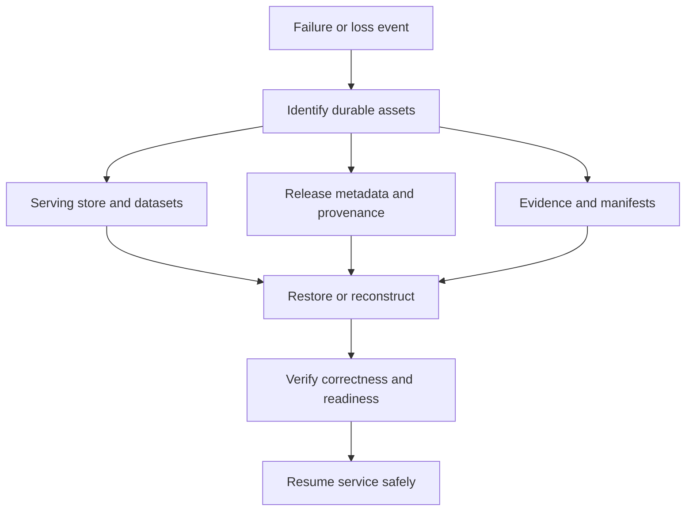
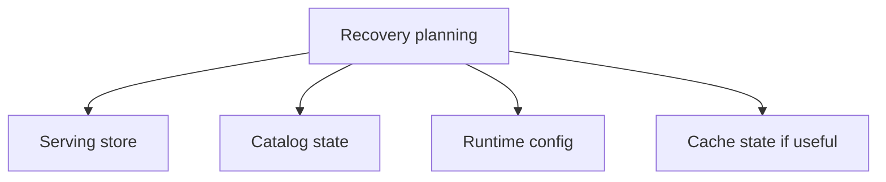

# Backup and Recovery

Atlas recovery planning should focus on the durable serving store and the ability to reconstruct runtime state safely.

This page is about recoverability as an operational claim, not a comforting
idea. Atlas is only recoverable when operators can restore the durable serving
surface, prove the restored release identity, and show the service is ready to
serve the right data again.

## Recovery Priority

This recovery-priority diagram keeps the durable pieces at the center. Atlas recovery should start
from serving store state, catalog state, and runtime configuration before anyone worries about cache
warmth.

## What Matters Most

- published manifests and SQLite artifacts
- catalog state that exposes those published datasets
- the runtime configuration needed to serve them correctly

## Recovery Model

This recovery model emphasizes validation after restore. A restored file tree is not yet a recovered
service until discoverability and readiness checks say so.

## Practical Advice

- back up the serving store, not only a build root
- treat catalog integrity as part of recoverability
- keep recovery procedures separate from cache rewarming procedures
- verify readiness after restore rather than assuming successful file copy equals successful service recovery

## What Recovery Is Not

Recovery is not “copy whatever is in the cache and hope for the best.” Cache loss may hurt performance, but store loss is what threatens durable serving ability.

## Recovery Questions to Answer Before an Incident

- where is the authoritative backup of the serving store?
- how is catalog integrity preserved or rebuilt?
- what checks prove the recovered instance is ready to serve again?

## Purpose

This page explains the Atlas material for backup and recovery and points readers to the canonical checked-in workflow or boundary for this topic.

## Source of Truth

- `ops/release/evidence/manifest.json`
- `ops/release/packet/packet.json`
- `ops/release/provenance.json`
- `ops/datasets/rollback-policy.json`

## What Must Be Restorable

To claim Atlas is recoverable, operators must be able to restore or reconstruct:

- the serving dataset and manifest surface
- the release metadata that proves what version is being restored
- the evidence and provenance that let another operator trust the restored state
- the runtime configuration needed to make the service discoverable and ready

## Durable Versus Reconstructable

- durable and worth backing up directly: dataset manifests, release manifests,
  evidence identity, provenance, and package references
- reconstructable but still review-relevant: generated summaries, dashboard
  snapshots, and some validation outputs if the source evidence survives
- disposable: caches and other acceleration surfaces that do not define durable
  serving truth

## Recovery Drill Success Criteria

A recovery drill is successful only when it proves:

- the restored service exposes the expected release identity
- the dataset surface is discoverable and governed by the expected rollback
  policy
- readiness and key query paths pass after restore
- the recovered state can be explained from release evidence, not guesswork

## Stability

This page is part of the canonical Atlas docs spine. Keep it aligned with the current repository behavior and adjacent contract pages.
