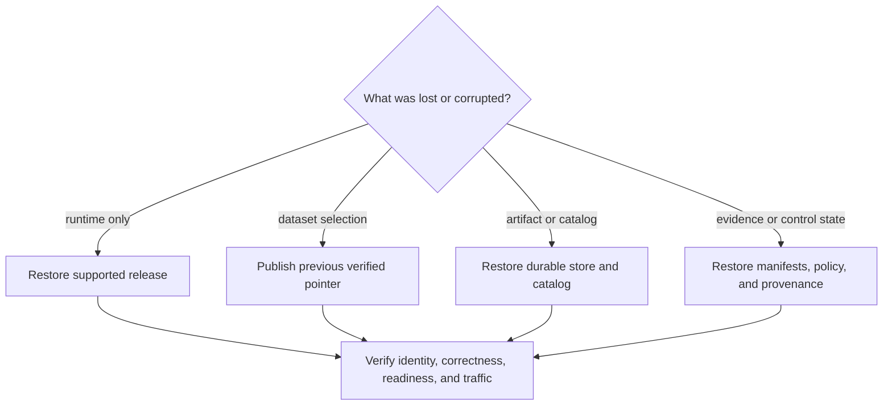
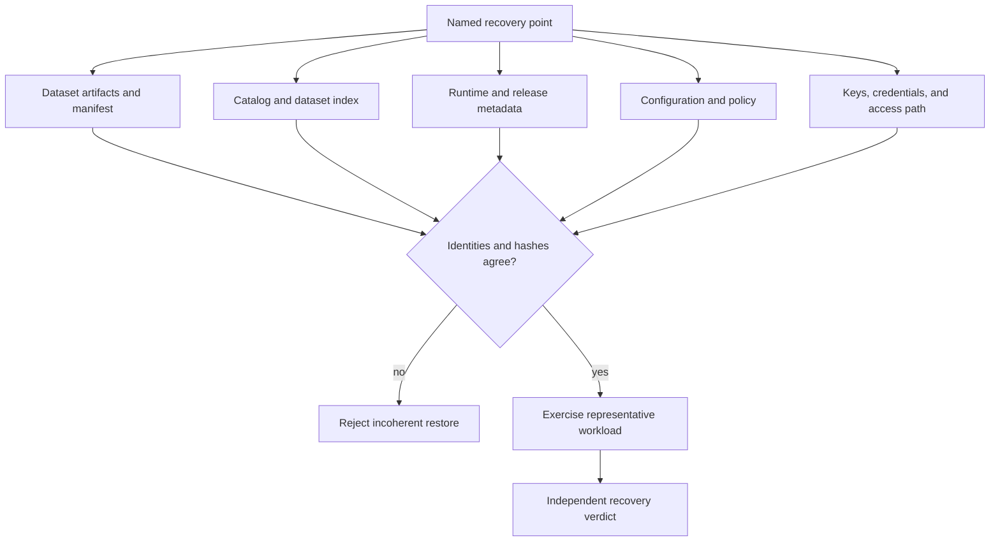

# Backup and Recovery

Atlas recovery begins with immutable dataset artifacts, catalog and manifest
identity, release metadata, configuration, and evidence. Cache state is
disposable. Runtime rollback and dataset-pointer rollback are useful recovery
tools, but neither replaces a durable backup and tested restore.

## Recovery Domains

```mermaid
flowchart TD
    Incident{"What was lost or corrupted?"}
    Incident -->|runtime only| Runtime["Restore supported release"]
    Incident -->|dataset selection| Pointer["Publish previous verified pointer"]
    Incident -->|artifact or catalog| Store["Restore durable store and catalog"]
    Incident -->|evidence or control state| Control["Restore manifests, policy, and provenance"]
    Runtime --> Verify["Verify identity, correctness, readiness, and traffic"]
    Pointer --> Verify
    Store --> Verify
    Control --> Verify
```

## Protection Inventory

| State | Protection requirement | Recovery proof |
| --- | --- | --- |
| Dataset artifacts and `manifest.lock` | Immutable, replicated, checksum-verified copy | Artifacts validate and governed queries match |
| Catalog and dataset index | Versioned copy or deterministic rebuild inputs | Expected releases and datasets are discoverable |
| Release packet and provenance | Retained outside the failed environment | Consumer verification passes after restore |
| Runtime configuration and secrets | Versioned policy plus protected secret backup | Render and security contracts pass |
| Cache | No authoritative backup required | Rebuild from verified store without result drift |

Define recovery-point and recovery-time objectives for each durable class. Test
the same encryption keys, credentials, network boundary, storage class, and
catalog scale used by the target environment. A file copy is not recovered
service until identity, integrity, readiness, and representative queries pass.

## Recovery Objectives

| Objective | Governing question | Required measurement |
| --- | --- | --- |
| recovery point | How much committed state may be lost? | newest restorable identity and gap from incident time |
| recovery time | How long may the service remain unavailable or degraded? | detection-to-restored-service timeline |
| integrity | Can restored bytes be trusted? | manifest, checksum, signature, and catalog verification |
| completeness | Are all required durable classes present? | artifact, catalog, release, configuration, and secret inventory |
| usability | Can the intended workload resume safely? | readiness plus representative correctness and load checks |

Objectives apply per durable class. A current catalog backup paired with stale
artifact bytes is not a coherent recovery point. Restoring bytes inside the
time objective does not pass recovery if identity or query correctness fails.

## Coherent Recovery Set

```mermaid
flowchart TD
    RP[Named recovery point] --> Artifacts[Dataset artifacts and manifest]
    RP --> Catalog[Catalog and dataset index]
    RP --> Release[Runtime and release metadata]
    RP --> Config[Configuration and policy]
    RP --> Access[Keys, credentials, and access path]
    Artifacts --> Bind{Identities and hashes agree?}
    Catalog --> Bind
    Release --> Bind
    Config --> Bind
    Access --> Bind
    Bind -->|no| Reject[Reject incoherent restore]
    Bind -->|yes| Exercise[Exercise representative workload]
    Exercise --> Verdict[Independent recovery verdict]
```

The backup unit is the coherent recovery set, not an individual archive.
Artifact bytes without their manifest cannot establish identity. Encrypted
backups without recoverable keys cannot establish availability. A restored
catalog that selects a different artifact generation cannot establish the
declared recovery point.

Preserve the dependency order for each environment. Recover the access path
needed to read protected backups, then authoritative artifacts and catalog,
then policy and runtime configuration, and only then rebuild disposable caches.
Do not allow a rebuilt cache to become evidence for an unverified store.

## Restore Validation Sequence

```mermaid
flowchart LR
    Select[Select named recovery point] --> Isolate[Isolate failed state]
    Isolate --> Restore[Restore durable classes]
    Restore --> Integrity[Verify bytes, manifests, and catalog]
    Integrity --> Configure[Restore policy, configuration, and secrets]
    Configure --> Admit[Start without normal traffic]
    Admit --> Query[Run representative correctness checks]
    Query --> Load[Observe bounded traffic and dependencies]
    Load --> Resume[Resume service or reject recovery]
```

Keep the failed state and restore evidence isolated until the verdict is
recorded. A failed restore is diagnostic evidence and must not overwrite the
last known recoverable point.

## Exercise and Acceptance Authority

A recovery exercise records the selected point, backup age, restore start and
end, recovered identities, validation results, data-loss interval, and operator
verdict. Measure recovery point and recovery time from observed timestamps;
archive timestamps or workflow duration alone are insufficient.

When practical, a person other than the restore executor should confirm the
manifest and catalog binding, representative query results, and traffic-ready
state. Independence protects against repeating the same assumption that caused
or concealed the incident. If independent verification is unavailable, record
that limitation with the acceptance decision.

Test more than the successful path. An unreadable object, missing key, partial
catalog, stale manifest, and unavailable rollback target should fail closed
without damaging the last verified recovery point. A restore procedure that
has only been read or rendered is not a tested recovery capability.

## Current Repository Boundary

The repository defines a dataset pointer rollback policy with a maximum depth
of three and retains release manifests, packets, and provenance contracts. It
does not contain an operational backup configuration, backup schedule, storage
retention policy, restore runner, or completed recovery result.

The checked-in MinIO stack manifest is a single-replica end-to-end fixture with
development credentials and no persistent volume. It cannot support a durable
backup claim. The release packet is also stale and the current evidence bundle
fails verification.

Accordingly, Atlas currently documents reconstruction inputs and rollback
policy, not a proven disaster-recovery system. An environment must supply and
exercise the missing backup, retention, restore, credential, and off-site
controls before claiming recoverability.

## Recovery Acceptance

Preserve the incident scope, selected recovery point, backup identity and age,
restore timestamps, artifact and catalog checksums, release verification,
configuration and secret restoration, readiness, representative query results,
load behavior, and residual data-loss assessment. Test failure paths, including
an unreadable backup and an unavailable previous release.

Do not resume writes or promotion when artifact integrity is uncertain. Isolate
the affected release, restore from a verified point, and retain the failed
evidence for investigation.

See [Cache and Store Operations](../stack/cache-and-store-operations.md) for
state authority and [Release Evidence](release-evidence.md) for current packet
limitations.
