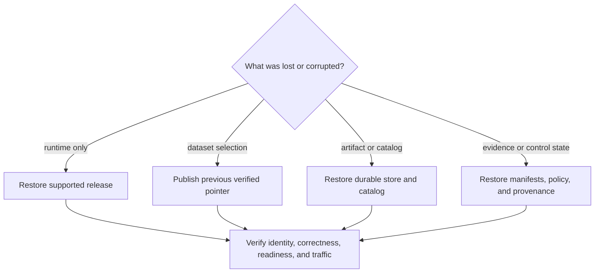

# Backup and Recovery

Atlas recovery begins with immutable dataset artifacts, catalog and manifest
identity, release metadata, configuration, and evidence. Cache state is
disposable. Runtime rollback and dataset-pointer rollback are useful recovery
tools, but neither replaces a durable backup and tested restore.

## Recovery Domains

```mermaid
flowchart TD
    Incident{"What was lost or corrupted?"}
    Incident -->|runtime only| Runtime["Restore supported release"]
    Incident -->|dataset selection| Pointer["Publish previous verified pointer"]
    Incident -->|artifact or catalog| Store["Restore durable store and catalog"]
    Incident -->|evidence or control state| Control["Restore manifests, policy, and provenance"]
    Runtime --> Verify["Verify identity, correctness, readiness, and traffic"]
    Pointer --> Verify
    Store --> Verify
    Control --> Verify
```

## Protection Inventory

| State | Protection requirement | Recovery proof |
| --- | --- | --- |
| Dataset artifacts and `manifest.lock` | Immutable, replicated, checksum-verified copy | Artifacts validate and governed queries match |
| Catalog and dataset index | Versioned copy or deterministic rebuild inputs | Expected releases and datasets are discoverable |
| Release packet and provenance | Retained outside the failed environment | Consumer verification passes after restore |
| Runtime configuration and secrets | Versioned policy plus protected secret backup | Render and security contracts pass |
| Cache | No authoritative backup required | Rebuild from verified store without result drift |

Define recovery-point and recovery-time objectives for each durable class. Test
the same encryption keys, credentials, network boundary, storage class, and
catalog scale used by the target environment. A file copy is not recovered
service until identity, integrity, readiness, and representative queries pass.

## Current Repository Boundary

The repository defines a dataset pointer rollback policy with a maximum depth
of three and retains release manifests, packets, and provenance contracts. It
does not contain an operational backup configuration, backup schedule, storage
retention policy, restore runner, or completed recovery result.

The checked-in MinIO stack manifest is a single-replica end-to-end fixture with
development credentials and no persistent volume. It cannot support a durable
backup claim. The release packet is also stale and the current evidence bundle
fails verification.

Accordingly, Atlas currently documents reconstruction inputs and rollback
policy, not a proven disaster-recovery system. An environment must supply and
exercise the missing backup, retention, restore, credential, and off-site
controls before claiming recoverability.

## Recovery Acceptance

Preserve the incident scope, selected recovery point, backup identity and age,
restore timestamps, artifact and catalog checksums, release verification,
configuration and secret restoration, readiness, representative query results,
load behavior, and residual data-loss assessment. Test failure paths, including
an unreadable backup and an unavailable previous release.

Do not resume writes or promotion when artifact integrity is uncertain. Isolate
the affected release, restore from a verified point, and retain the failed
evidence for investigation.

See [Cache and Store Operations](../stack/cache-and-store-operations.md) for
state authority and [Release Evidence](release-evidence.md) for current packet
limitations.
