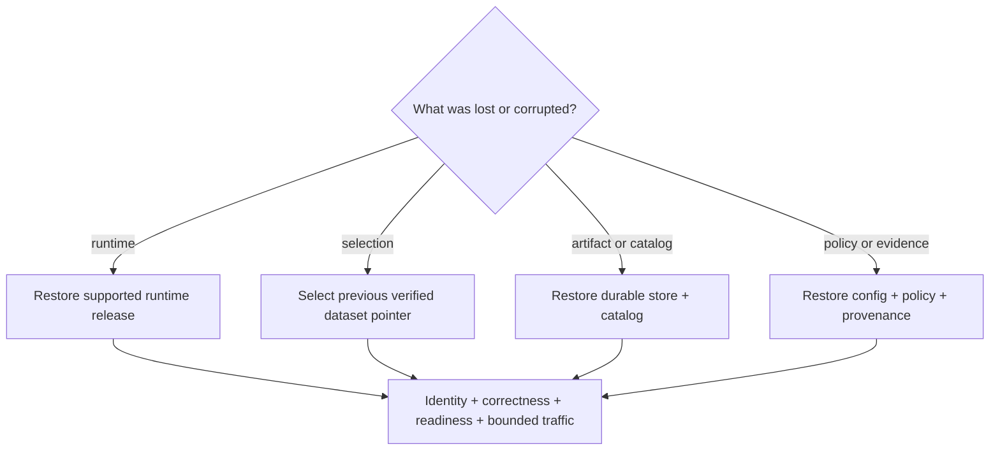
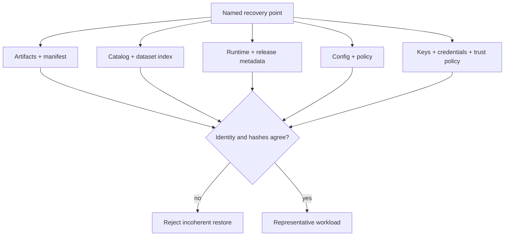
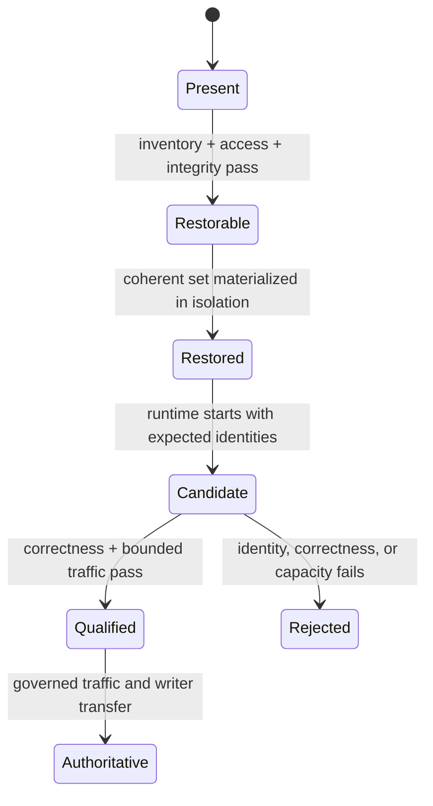

# Backup and recovery

Atlas recovery restores a coherent set of dataset artifacts, catalog state,
release metadata, configuration, policy, and access custody. Cache state is
disposable. Runtime rollback and dataset-pointer rollback are useful controls,
but neither replaces a durable backup and exercised restore.

## Identify the recovery domain

```mermaid
flowchart TD
    Loss{What was lost or corrupted?}
    Loss -->|runtime| Runtime[Restore supported runtime release]
    Loss -->|selection| Pointer[Select previous verified dataset pointer]
    Loss -->|artifact or catalog| Store[Restore durable store + catalog]
    Loss -->|policy or evidence| Control[Restore config + policy + provenance]
    Runtime --> Verify[Identity + correctness + readiness + bounded traffic]
    Pointer --> Verify
    Store --> Verify
    Control --> Verify
```

| Durable class | Protection | Recovery proof |
| --- | --- | --- |
| dataset artifacts and manifest lock | Immutable replicated copy with checksum verification | Payload hashes pass and representative queries agree |
| catalog and index | Versioned copy or deterministic rebuild inputs | Expected identities are discoverable |
| release packet and provenance | Retained outside the failed target | Fresh consumer verification passes |
| configuration and policy | Versioned governed inputs | Render, admission, and runtime identity agree |
| secrets and trust roots | Independent protected custody | Least-privilege access, rotation, and revocation pass |
| caches | No authoritative backup | Rebuild from verified store without result drift |

## Recover one coherent point

```mermaid
flowchart TD
    Point[Named recovery point] --> Artifacts[Artifacts + manifest]
    Point --> Catalog[Catalog + dataset index]
    Point --> Release[Runtime + release metadata]
    Point --> Config[Config + policy]
    Point --> Access[Keys + credentials + trust policy]
    Artifacts --> Bind{Identity and hashes agree?}
    Catalog --> Bind
    Release --> Bind
    Config --> Bind
    Access --> Bind
    Bind -->|no| Reject[Reject incoherent restore]
    Bind -->|yes| Exercise[Representative workload]
```

The recovery unit is this set, not an archive in isolation. A current catalog
with stale artifacts is incoherent. Encrypted bytes without recoverable keys
are unavailable. A cache rebuilt from unverified state is not recovery evidence.

Define recovery point and recovery time per durable class. Measure the recovery
point from the latest included mutation to the earliest excluded mutation.
Measure recovery time from declared incident start to recorded authority
transfer, preserving detection, isolation, restore, qualification, and failover
timestamps separately.

## Keep trust inputs independent

| Trust input | Independent requirement |
| --- | --- |
| encryption key | Separately governed generation, quorum, or break-glass custody |
| storage credential | Audited least-privilege restore identity with bounded lifetime |
| expected release | Outer digest or identity stored outside the recovered packet |
| verifier policy | Current roots, withdrawals, policy, and reliable time source |
| target authority | Named approver for restore, traffic transfer, and writer activation |

Use separate identities to read backups, materialize an isolated target,
verify it, and activate service. Revoke temporary access after its boundary
completes. Break-glass use requires an attributable audit record.

## Restore without split authority

```mermaid
stateDiagram-v2
    [*] --> Present
    Present --> Restorable: inventory + access + integrity pass
    Restorable --> Restored: coherent set materialized in isolation
    Restored --> Candidate: runtime starts with expected identities
    Candidate --> Qualified: correctness + bounded traffic pass
    Candidate --> Rejected: identity, correctness, or capacity fails
    Qualified --> Authoritative: governed traffic and writer transfer
```

Freeze the failed writer path before restore. Expose the candidate only to
verification traffic. Transfer one catalog pointer, runtime endpoint, and
writer authority in a recorded decision. Confirm that stale endpoints,
credentials, jobs, and publishers cannot mutate retired state.

If any class restores partially, stop before serving. Preserve the partial
result, return to a known restorable point, and repeat the complete chain. A
failed restore must not overwrite the last verified recovery point.

## Acceptance exercise

1. Select and independently identify the recovery point.
2. Isolate failed state and fence mutation.
3. Restore access, artifacts, catalog, release metadata, config, and policy.
4. Verify manifests, payload hashes, catalog selection, and consumer trust.
5. Start without normal traffic and confirm effective identities.
6. Exercise representative cheap and heavy queries plus dependency behavior.
7. Transfer authority, observe bounded traffic, and record residual data loss.
8. Test failure paths such as unreadable media, missing keys, partial catalogs,
   stale manifests, and unavailable rollback targets.

Independent review of manifest/catalog binding, query results, and traffic
readiness is preferred. Record when the restore executor also makes the
acceptance decision.

## Current repository boundary

The repository defines a dataset-pointer rollback policy with maximum depth
three and retains release manifest, packet, and provenance contracts. It does
not include an operational backup configuration, schedule, storage-retention
policy, restore runner, or completed recovery result.

The checked-in MinIO stack is a single-replica fixture with development
credentials and no persistent volume. The current release packet is stale and
its evidence bundle does not pass fresh verification. Atlas therefore provides
reconstruction inputs and rollback policy—not a proven disaster-recovery
system.

An environment claiming recoverability must supply and exercise off-target
backup, retention, restore, credential, key, and authority-transfer controls.
Do not resume writes or promotion while integrity is uncertain.

See [Cache and Store Operations](../stack/cache-and-store-operations.md) and
[Release Evidence](release-evidence.md).
