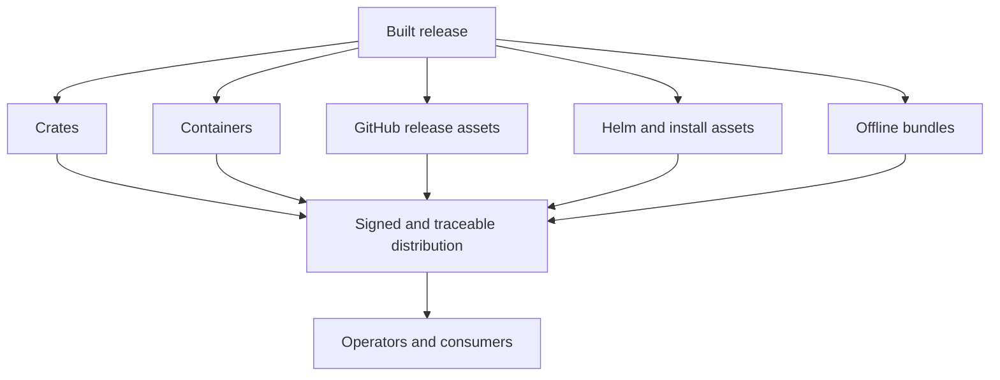

# Distribution Channels

Atlas release distribution spans crates, Docker, GitHub releases, Helm-facing
artifacts, and offline bundles.

Each channel carries a different slice of the release, but none of them should
break the trust chain. The point of this page is to make the differences
between crates, images, charts, evidence bundles, and offline packets explicit
so operators know which artifacts belong in which promotion path.

## Source of Truth

- `.github/workflows/release-github.yml`
- `.github/workflows/release-crates.yml`
- `.github/workflows/docker-publish.yml`
- `ops/release/crates-release.toml`
- `ops/release/images-release.toml`
- `ops/release/ops-release.toml`
- `ops/release/ops-release-bundle-manifest.json`
- `ops/release/notes/`

## Channel Contract

- crates carry publishable Rust package surfaces and their version identity
- images carry runtime execution artifacts and image digests
- GitHub releases carry human-facing release payloads and notes
- Helm-facing assets carry installable chart artifacts and cluster-facing
  release metadata
- offline bundles carry the governed asset set for disconnected installation

## Promotion Expectations

Before promoting any channel, confirm the release has:

- matching signing and provenance evidence
- the correct notes or manifest payload for that channel
- the required package or bundle references in the release manifests
- no missing dependency between the distribution artifact and the evidence set
