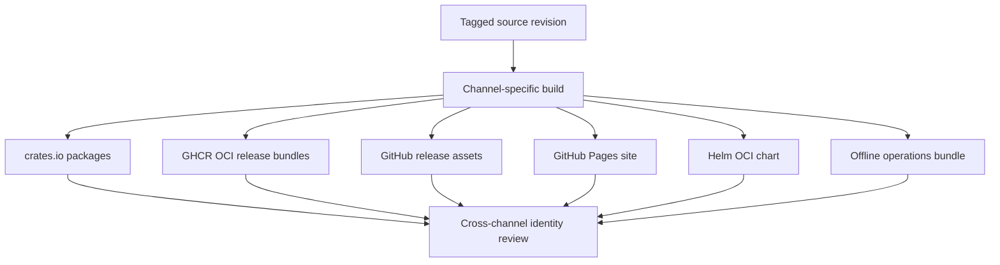
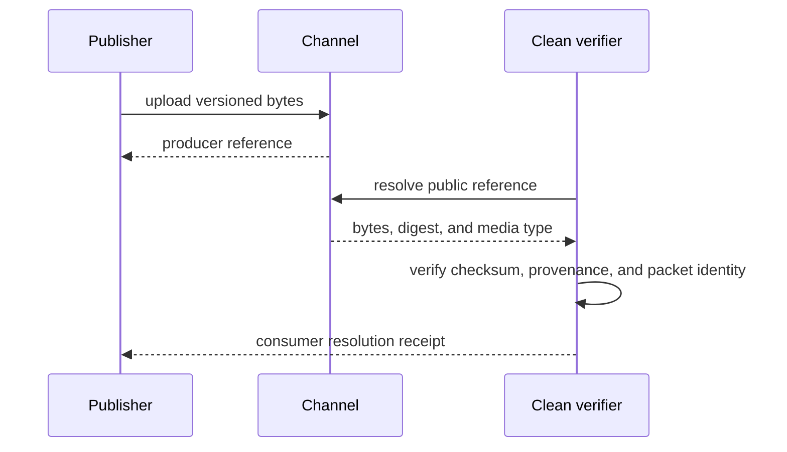
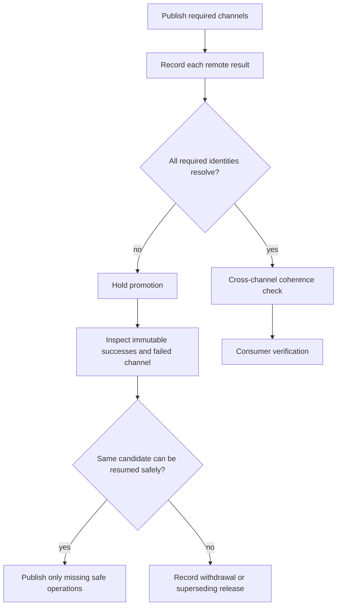

# Distribution Channels

Atlas separates package publication, OCI bundle publication, GitHub release
assets, documentation deployment, chart distribution, and offline delivery.
These channels carry different media and are not interchangeable merely because
they share a release tag.

```mermaid
flowchart TB
    Source[Tagged source revision] --> Build[Channel-specific build]
    Build --> Crates[crates.io packages]
    Build --> OCI[GHCR OCI release bundles]
    Build --> GitHub[GitHub release assets]
    Build --> Docs[GitHub Pages site]
    Build --> Chart[Helm OCI chart]
    Build --> Offline[Offline operations bundle]
    Crates --> Verify[Cross-channel identity review]
    OCI --> Verify
    GitHub --> Verify
    Docs --> Verify
    Chart --> Verify
    Offline --> Verify
```

## Channel Map

| Channel | Authority | Publisher | Consumer verifies |
| --- | --- | --- | --- |
| crates | package plan | crates workflow | name, version, checksum, closure |
| GHCR | workflow matrix | ORAS workflow | reference, digest, media type |
| GitHub | release plan | release workflow | tag, revision, assets, checksums |
| docs | MkDocs config | Pages workflow | revision and canonical URLs |
| Helm | operations plan | package commands | version, digest, schema, install |
| offline | bundle manifest | bundle commands | assets and offline install |

`release-ghcr.yml` publishes tarred release artifacts as generic OCI artifacts
using ORAS. That is distinct from proving that a runnable multi-architecture
container image satisfying `images-release.toml` was built. Check the artifact
media type and contents instead of inferring “container image” from GHCR alone.

## Declared and Automated Surfaces

The checked-in GitHub workflows directly automate crates.io publication, GHCR
OCI bundle publication, GitHub release publication, and documentation deploy.
Helm packaging, Helm OCI push, and offline-bundle assembly exist as
`bijux-atlas-dev` release commands, but no dedicated checked-in workflow invokes
those operations end to end.

The former documentation reference to `.github/workflows/docker-publish.yml`
was invalid; that file does not exist. Runtime-image policy remains declared in
`ops/release/images-release.toml`, while the active GHCR workflow publishes
release bundles according to caller-provided matrices.

## Cross-Channel Coherence

A release is coherent only when all promoted channels resolve to the same
release identity:

- workspace and package versions match the intended tag
- OCI and chart digests identify the artifacts named in provenance
- GitHub assets match the checksum and signing records
- deployed documentation describes the released, not merely checked-out,
  surface
- the offline bundle contains the exact chart, profiles, images, tools, and
  evidence it declares

A successful channel publish proves only that channel. Crates.io success does
not prove chart availability; a GitHub release does not prove an offline
install; a GHCR tag does not prove its media type or digest matches another
manifest.

## Channel Failure Domains

Each channel has a different safe retry boundary. Reconciliation must preserve
successful immutable publications and avoid overwriting their history.

| Channel | Characteristic failure | Safe reconciliation |
| --- | --- | --- |
| crates.io | sibling package fails | verify success; publish missing versions |
| GHCR | wrong media or digest | hold; publish a corrected version |
| GitHub | partial assets | verify retained assets; add missing ones |
| Pages | wrong revision | deploy the selected revision |
| Helm OCI | runtime mismatch | rebuild the chart and runtime pair |
| offline | missing or changed asset | rebuild and verify the bundle |

Remote immutability and overwrite rules are part of the release contract. A
retry is safe only when it cannot change the bytes behind an identity already
observed by consumers. Otherwise publish a corrected release identity and
record the supersession.

Documentation is an informational channel, not an artifact trust anchor. It
helps readers discover a release and understand its contract, but Pages content
cannot establish package checksums, runtime digests, or provenance subjects.

## Channel Completion States

| State | Evidence | Promotion consequence |
| --- | --- | --- |
| planned | expected identity is declared | no publication claim |
| uploaded | producer accepted the upload | retrieval remains unproven |
| resolved | consumer retrieves immutable bytes | delivery established |
| cross-checked | required channel records agree | eligible for completion |
| failed | upload, retrieval, or policy failed | promotion held |

Use immutable digests or registry checksums for completion. A mutable tag, web
page, or package search result is useful for discovery but cannot by itself
bind the received bytes to the release packet.

## Producer and Consumer Receipts

Producer completion and consumer retrievability are separate observations.

```mermaid
sequenceDiagram
    participant P as Publisher
    participant C as Channel
    participant V as Clean verifier
    P->>C: upload versioned bytes
    C-->>P: producer reference
    V->>C: resolve public reference
    C-->>V: bytes, digest, and media type
    V->>V: verify checksum, provenance, and packet identity
    V-->>P: consumer resolution receipt
```

The consumer receipt records the exact requested reference, resolved digest or
registry checksum, media type, retrieval time, byte length, verifier identity,
and release-packet digest. It also records authentication mode and visibility
because a maintainer-only retrieval does not prove public distribution.

Withdrawal or supersession must remain discoverable from that receipt. Do not
erase a failed or withdrawn resolution result after a later channel retry; the
history explains which bytes were available to consumers at a given time.

## Partial Publication Reconciliation

```mermaid
flowchart TD
    Attempt[Publish required channels] --> Inventory[Record each remote result]
    Inventory --> Complete{All required identities resolve?}
    Complete -->|yes| Cross[Cross-channel coherence check]
    Complete -->|no| Hold[Hold promotion]
    Hold --> Inspect[Inspect immutable successes and failed channel]
    Inspect --> Decide{Same candidate can be resumed safely?}
    Decide -->|yes| Resume[Publish only missing safe operations]
    Decide -->|no| Withdraw[Record withdrawal or superseding release]
    Cross --> Consumer[Consumer verification]
```

Do not delete the record of a partial attempt. It explains why some registries
contain a version that was never promoted. Before resuming, prove that local
candidate bytes still match already published immutable references and that
the channel permits the remaining operation without overwriting history.

## Current Manifest Limit

The workspace version is `0.2.2`, while several checked-in release and
operations bundle manifests still identify `0.2.0`. Treat those files as stale
evidence fixtures until they are regenerated and verified together. They must
not be cited as the distribution manifest for the current workspace version.

## Promotion Checklist

1. Resolve the tag, source revision, and channel-specific manifest.
2. Build the channel artifact from that revision.
3. Record the immutable digest or registry checksum.
4. Attach signing, provenance, SBOM, and channel-specific validation.
5. Verify the consumer retrieval path, not only the producer upload path.
6. Compare version and digest identities across every channel being promoted.
7. Retain a verifier result that fails on missing or mismatched artifacts.

Also record the required-channel set. Optional channels may legitimately lag,
but that policy must be declared before publication; reclassifying a failed
required channel as optional after the fact weakens the release contract.

## Authorities

- `.github/workflows/release-crates.yml`
- `.github/workflows/release-ghcr.yml`
- `.github/workflows/release-github.yml`
- `.github/workflows/deploy-docs.yml`
- `ops/release/crates-release.toml`
- `ops/release/images-release.toml`
- `ops/release/ops-release.toml`
- `ops/release/ops-release-bundle-manifest.json`
