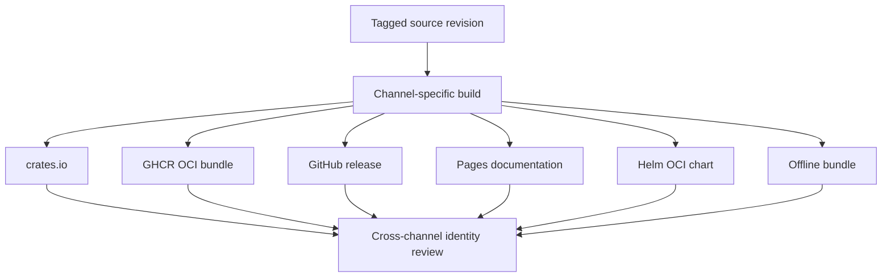
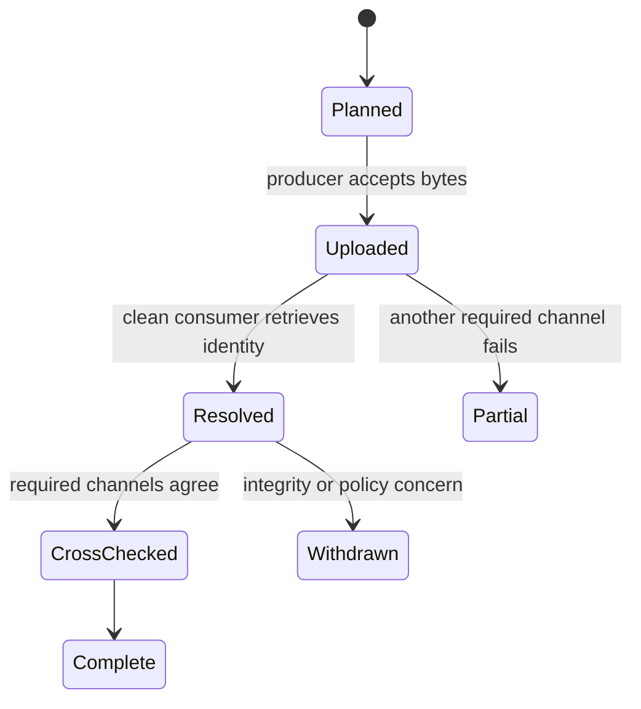

# Distribution channels

Atlas uses separate channels for Rust packages, generic OCI bundles, GitHub
release assets, documentation, Helm charts, and offline operations material.
Sharing a tag does not make their media, lifecycle, or evidence interchangeable.

## Channel map

```mermaid
flowchart TB
    Source[Tagged source revision] --> Build[Channel-specific build]
    Build --> Crates[crates.io]
    Build --> OCI[GHCR OCI bundle]
    Build --> GitHub[GitHub release]
    Build --> Docs[Pages documentation]
    Build --> Chart[Helm OCI chart]
    Build --> Offline[Offline bundle]
    Crates --> Verify[Cross-channel identity review]
    OCI --> Verify
    GitHub --> Verify
    Docs --> Verify
    Chart --> Verify
    Offline --> Verify
```

| Channel | Producer authority | Consumer verifies |
| --- | --- | --- |
| crates.io | Package release plan and workflow | Name, version, checksum, dependency closure |
| GHCR | Workflow matrix and ORAS publication | Reference, digest, artifact type, archive media |
| GitHub release | Release plan and workflow | Tag, revision, assets, byte lengths, checksums |
| documentation | MkDocs configuration and Pages workflow | Deployed revision and canonical routes |
| Helm OCI | Operations plan and release commands | Chart version, digest, schema, runtime compatibility |
| offline bundle | Bundle manifest and commands | Complete assets, trust material, disconnected install |

`release-ghcr.yml` tars release material and publishes it with ORAS as a
generic OCI artifact. GHCR presence is not proof of a runnable,
multi-architecture Atlas image. Consumers must inspect artifact type, media,
contents, and digest.

## Automated and command-owned paths

Checked-in workflows directly automate crates.io, GHCR bundle, GitHub release,
and documentation publication. Helm packaging and push plus offline-bundle
assembly exist as `bijux-atlas-dev` release commands; no dedicated checked-in
workflow executes either end to end.

Runtime-image expectations remain declared in
`ops/release/images-release.toml`. There is no
`.github/workflows/docker-publish.yml`; documentation and release decisions
must not cite that nonexistent path.

## Publication states

```mermaid
stateDiagram-v2
    [*] --> Planned
    Planned --> Uploaded: producer accepts bytes
    Uploaded --> Resolved: clean consumer retrieves identity
    Resolved --> CrossChecked: required channels agree
    CrossChecked --> Complete
    Uploaded --> Partial: another required channel fails
    Resolved --> Withdrawn: integrity or policy concern
```

Producer acceptance and consumer retrieval are separate observations. A
consumer receipt records requested reference, resolved digest or checksum,
media type, byte length, retrieval time, visibility, authentication mode,
verifier identity, and release-packet digest.

## Reconcile partial publication

| Channel | Characteristic failure | Safe response |
| --- | --- | --- |
| crates.io | Sibling package fails after others publish | Verify immutable successes; publish only missing versions |
| GHCR | Wrong media or digest is visible | Hold and publish a corrected release identity |
| GitHub release | Some assets are absent | Verify retained assets; add only safe missing assets |
| Pages | Wrong revision deploys | Deploy the selected revision and verify critical routes |
| Helm OCI | Chart and runtime disagree | Rebuild and publish a coherent pair |
| offline bundle | Asset is missing or changed | Rebuild and verify the complete disconnected bundle |

Retain every partial-attempt result. Before resuming, prove local bytes still
match immutable remote successes and the remaining operation cannot overwrite
history. Otherwise withdraw or supersede the candidate.

## Cross-channel coherence

A completed release requires:

- tag, source revision, workspace version, and package versions agree;
- OCI, image, chart, and offline digests match provenance subjects;
- GitHub assets match checksum records;
- documentation describes the released surface and revision;
- offline material contains exactly the chart, images, profiles, tools, and
  evidence named by its manifest.

A successful channel proves only itself. Documentation is an informational
channel, not an artifact trust anchor.

## Retention and withdrawal

Immediate retrieval does not prove continued availability through replication,
garbage collection, visibility changes, credential rotation, yanking, or tag
movement. Resolve required immutable identities again after the declared
retention interval from a clean consumer path.

Withdrawal records immutable identity, reason, time, affected consumers, and
replacement. Disappearance without a retained state transition is a
distribution incident.

## Current manifest boundary

The workspace version is `0.2.2`, while the checked-in operations bundle
manifest and generated release metadata still identify `0.2.0`. They are stale
fixtures, not the distribution manifest for the current workspace.

Before promotion, declare required channels, build each from the selected
revision, capture immutable identities, attach provenance and SBOM evidence,
verify clean consumer retrieval, compare identities across channels, and retain
a verifier result that fails on absence or mismatch. Do not reclassify a failed
required channel as optional after publication begins.

## Authorities

- `.github/workflows/release-crates.yml`
- `.github/workflows/release-ghcr.yml`
- `.github/workflows/release-github.yml`
- `.github/workflows/deploy-docs.yml`
- `ops/release/crates-release.toml`
- `ops/release/images-release.toml`
- `ops/release/ops-release.toml`
- `ops/release/ops-release-bundle-manifest.json`
