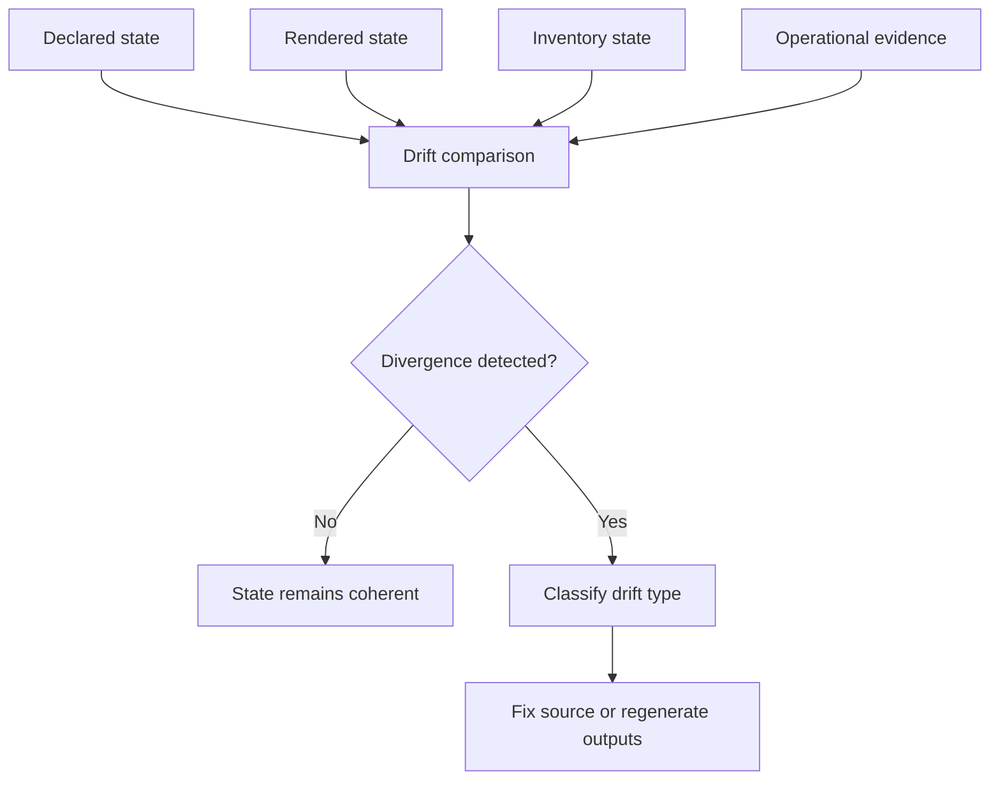

# Drift Detection

Atlas tracks drift deliberately so rendered values, declared inventory, and
operational expectations do not diverge silently.

Drift review matters because Atlas has many generated and declared surfaces that
can appear healthy in isolation while disagreeing with each other. Operators
need to know not just that drift exists, but whether it is tolerated noise or a
release-blocking inconsistency.

## Source of Truth

- `ops/drift/`
- `ops/drift/scenarios/`
- `ops/_generated/configs-drift-report.json`
- `ops/_generated/control-plane-drift-report.json`
- `ops/_generated/stack-drift-report.json`

## Drift Classes

Review drift in these buckets:

- configuration drift between declared overlays, values, or runtime inputs
- documentation drift between stated operator behavior and current repo assets
- rendered output drift between authored sources and generated manifests
- release metadata drift between manifests, packets, provenance, and evidence
- dependency drift between pinned and actually used stack or toolchain inputs

## Release-Blocking Meaning

Treat drift as release-blocking when it changes what operators would install,
trust, or recover, or when it breaks the explanation chain between source,
generated output, and release evidence.
