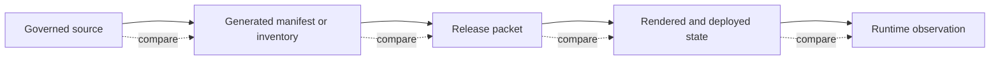

# Drift Detection

Drift is a disagreement between an authoritative input, a derived artifact, a
deployed state, or the evidence used to explain either one. Atlas classifies
drift by ownership so operators can correct the source rather than normalize an
unexplained difference.

## Drift Chain

```mermaid
flowchart LR
    Source["Governed source"] --> Generated["Generated manifest or inventory"]
    Generated --> Packet["Release packet"]
    Packet --> Deployed["Rendered and deployed state"]
    Deployed --> Observed["Runtime observation"]
    Source -. compare .-> Generated
    Generated -. compare .-> Packet
    Packet -. compare .-> Deployed
    Deployed -. compare .-> Observed
```

## Governed Classes

The checked-in drift simulation defines five negative fixtures:

| Drift class | Fixture mutation | Risk exposed |
| --- | --- | --- |
| Configuration | Changes inventory schema version | Producer and consumer interpret different shape |
| Artifact | Manifest references a missing file | Release inventory cannot be materialized |
| Registry | Adds an unknown invariant | Policy references an unowned identity |
| Runtime configuration | Offline values name an unknown dataset | Cached-only runtime cannot establish data authority |
| Operations profile | Install matrix names an unknown profile | Deployment intent has no governed profile contract |

These fixtures prove expected detector inputs. They do not show the current
repository or a deployment is drift-free.

## Current Evidence Boundary

The repository contains example drift reports under `ops/_generated.example/`,
but no current configuration, control-plane, fixture, registry, schema, or stack
drift reports under `ops/_generated/`. The active generated directory contains
only a control-plane surface list. A generated readiness score that says
`inventory_drift: none` is not a substitute for the absent reports because it
does not preserve their comparisons or findings.

The checked-in ignore rules are also an example. They suppress an unknown
profile finding by path and message. Do not activate an ignore without owner,
rationale, expiry, and evidence that the divergence is safe.

## Classification and Action

- Source changed, generated output stale: regenerate from the authoritative
  source and review the complete diff.
- Generated output changed without source change: reject it and investigate the
  generator or provenance.
- Packet differs from verified evidence: reject and rebuild the release set.
- Deployment differs from packet: contain the environment and reconcile through
  the deployment authority.
- Observation differs from declared state: confirm telemetry identity, then
  treat the result as runtime or configuration drift.

Any drift that changes installed resources, security posture, dataset identity,
recovery authority, or consumer-verifiable evidence blocks promotion. Preserve
the raw comparison, classification, owner, decision, and final corrected state.

See [Environment Overlays](../stack/environment-overlays.md) for execution
identity and [Release Packets](release-packets.md) for transport coherence.
