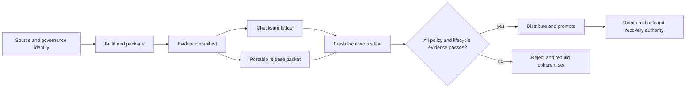
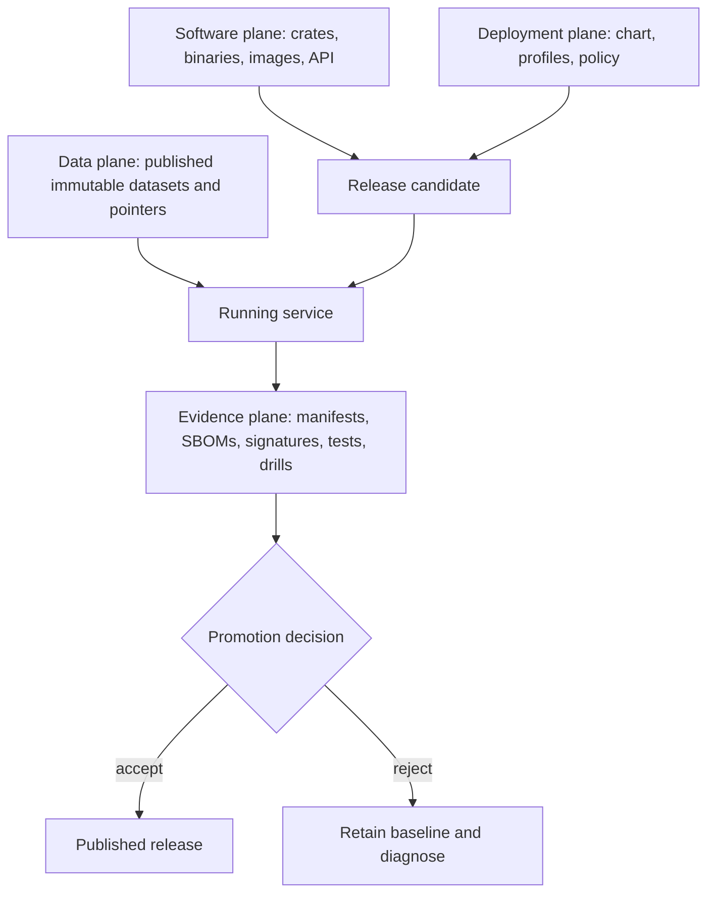

# Release Operations

An Atlas release is a coherent, consumer-verifiable set of binaries, images,
chart material, policies, software bills of materials, operational proof, and
source identity. A build is not promotable merely because its packages exist or
a historical verification report says `ok`.

## Release Trust Chain

The identity, manifest, packet, provenance, and checksum ledger must describe
the same release bytes. Regenerating one member without rebuilding the others
breaks the chain even if each JSON document remains schema-valid.

## Current Checked-In Evidence

The repository carries release-contract examples and generated evidence for
workspace version `0.2.0`. Treat this set as validation material, not as a
production release ready for promotion. A fresh local verification of the
checked-in bundle currently fails because required audit, governance,
performance, and ingest assets are absent from the bundle and several policy
and SBOM checksums do not match.

The checked-in `release-verify.json` reports `ok`, but it is not evidence for
the current file set. The transport packet also records digests that differ
from current release files, and the evidence manifest includes placeholder
profile image digests and empty drill, simulation, and scan-report collections.
Generate and verify a new coherent release set before distribution.

## Read Evidence by Strength

Release directories contain several artifact classes. Their presence answers
different questions:

| Artifact class | What it proves | What it cannot prove |
| --- | --- | --- |
| policy, schema, or scenario specification | the expected structure, rule, or workflow is declared. | that any candidate executed or passed it. |
| fixture or golden file | a parser, comparison, or test has a stable example. | that the bytes belong to a deployable release. |
| generated inventory or index | a generator observed the recorded inputs. | freshness unless source revision and generation run are bound. |
| simulated evidence | the simulation path emitted the expected class of result. | behavior of a real cluster, registry, dependency, or traffic path. |
| executed candidate report | the named candidate ran the named check in the recorded environment. | checks not included in that run. |
| verified release packet | the packet is internally coherent under the verifier and policy used. | safety in a different consumer environment without fresh verification. |

Status labels such as `placeholder`, `simulated`, and `ok` must be interpreted
with artifact class and candidate identity. An `ok` fixture is still a fixture.

## Release Planes

Software rollback, deployment rollback, dataset-pointer rollback, and durable
data recovery are separate operations. A release packet must say which plane
changed and which plane remained immutable. Otherwise “rollback succeeded” is
too ambiguous for an operational decision.

## Route by Decision

| Decision | Read | Required outcome |
| --- | --- | --- |
| Establish release identity and governed surfaces | [Version Manifests](version-manifests.md) | Workspace, chart, source, and artifact identities agree. |
| Review the proof carried with the build | [Release Evidence](release-evidence.md) | Required assets exist, match policy, and pass fresh verification. |
| Prepare portable consumer material | [Release Packets](release-packets.md) | Minimum packet is complete and digest-coherent. |
| Verify integrity and source claims | [Signing and Provenance](signing-and-provenance.md) | Checksum and provenance limits are understood and verified. |
| Compare independent rebuilds | [Reproducibility](reproducibility.md) | Declared reproducible surfaces match. |
| Detect runtime or configuration divergence | [Drift Detection](drift-detection.md) | Deployed state remains attributable to the promoted set. |
| Select a supported delivery path | [Distribution Channels](distribution-channels.md) | Channel carries the same governed identity and evidence. |
| Prove forward and reverse change | [Upgrades and Rollback](upgrades-and-rollback.md) | Compatibility and rollback invariants pass. |
| Exercise recovery before dependence | [Rollback Drills](rollback-drills.md) | Operators can restore the previous release under evidence. |
| Protect state beyond release rollback | [Backup and Recovery](backup-and-recovery.md) | Restore objectives and data boundaries are tested. |

## Promotion Rule

Promote only from a newly generated packet that passes verification in the
consumer's environment. Preserve the exact verification output, immutable
artifact references, release manifest, policy, lifecycle results, and rollback
target. Reject unexplained drift; do not repair a suspect packet by updating
checksums over unknown bytes.
