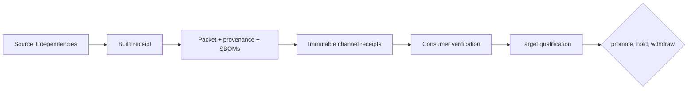
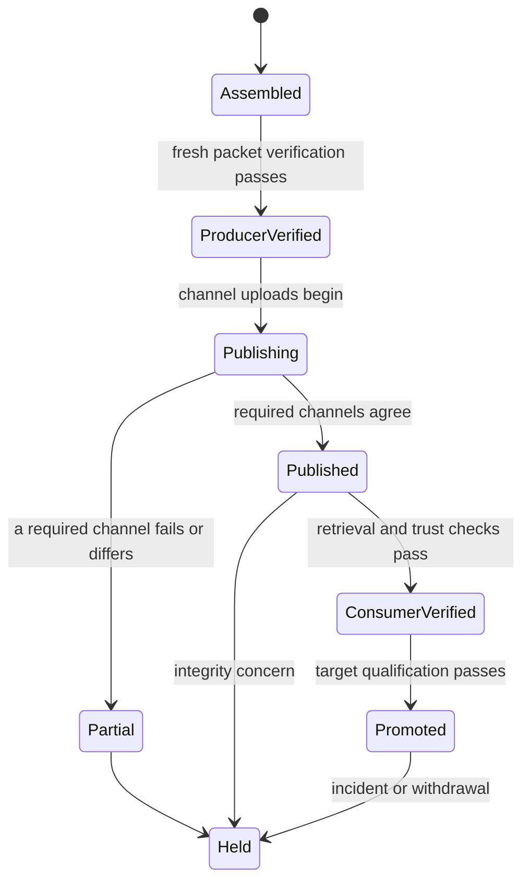

# Release operations

An Atlas release is a consumer-verifiable set of binaries, chart material,
policies, software bills of materials, evidence, and source identity. Build
success is only the first custody event. Distribution and promotion require
the same immutable candidate to remain attributable across every handoff.

## Custody chain

| Custodian | Must verify | Emits |
| --- | --- | --- |
| builder | Revision, toolchain, dependencies, and build inputs | Artifacts and build receipt |
| assembler | Membership, schemas, policy, and shared release identity | Packet, provenance, SBOMs, and checksums |
| publisher | Candidate acceptance, channel policy, reference, and remote digest | Channel receipt or partial-publication record |
| consumer | Retrieved bytes, trust policy, compatibility, and target policy | Consumer verification receipt |
| operator | Render, admission, dataset correctness, capacity, security, and recovery | Target qualification packet |
| decision owner | Producer evidence, target evidence, exceptions, and reversal authority | Promotion, hold, or withdrawal record |

A custodian can reject or hold a candidate but must not silently repair an
upstream receipt. Changed bytes create a new candidate. A changed target,
profile, dataset, dependency, or policy creates a new target qualification.

## Release states

Partial publication is a first-class state. Preserve successful immutable
references, failed operations, and the retry or withdrawal decision. Reconcile
remote state before retrying mutable tags. Never replace suspect bytes under a
published version.

## Match evidence to the decision

| Decision | Producer evidence | Consumer evidence |
| --- | --- | --- |
| bytes arrived intact | Inventory, checksums, provenance, and channel digest | Fresh hashes and trust-policy verdict |
| release can be installed | Chart, images, values, schemas, and compatibility declarations | Target render, admission, dependencies, and rollback target |
| release serves correctly | Product contracts, dataset schemas, and test results | Resolved dataset identity, representative requests, readiness, and responses |
| release meets its envelope | SLO, load, security, failure, and recovery contracts | Target telemetry, capacity, fault, rollout, and recovery results |
| release may be promoted | Complete packet and producer acceptance | Owned decision, exceptions, observation window, and reversal authority |

Packet integrity, installability, operating fitness, and promotion are separate
claims. Immutable producer evidence can be reused unchanged; target evidence
cannot be reused after its environment identity changes.

## Delivery and rollback planes

Software rollback, deployment rollback, dataset-pointer rollback, and durable
data recovery change different authorities. A release record must name which
plane moved and which remained immutable. “Rollback succeeded” is not an
auditable conclusion without that distinction.

The current GitHub Container Registry workflow publishes compressed release
bundles as OCI artifacts. That demonstrates transport for those bundles; it is
not evidence of runnable Atlas container images. Consumers must verify the
actual artifact type, media, digest, and installation path they depend on.

## Current checked-in evidence

The repository includes release-contract examples and generated evidence for
workspace version `0.2.0`. They are validation material, not a production
release. Fresh verification of that checked-in bundle currently fails: required
audit, governance, performance, and ingest assets are absent, some policy and
SBOM checksums differ, and the transport packet digests do not match current
release files. Placeholder image digests and empty drill, simulation, and scan
collections further limit the packet.

The checked-in `release-verify.json` status is historical and does not override
the current file set. Generate and verify one coherent candidate before
distribution.

## Route by decision

| Decision | Read |
| --- | --- |
| Establish one release identity | [Version Manifests](version-manifests.md) |
| Review the proof shipped with a build | [Release Evidence](release-evidence.md) |
| Assemble portable consumer material | [Release Packets](release-packets.md) |
| Verify integrity and source claims | [Signing and Provenance](signing-and-provenance.md) |
| Compare independent builds | [Reproducibility](reproducibility.md) |
| Detect deployed divergence | [Drift Detection](drift-detection.md) |
| Select a governed channel | [Distribution Channels](distribution-channels.md) |
| Prove forward and reverse change | [Upgrades and Rollback](upgrades-and-rollback.md) |
| Exercise operator recovery | [Rollback Drills](rollback-drills.md) |
| Protect durable state | [Backup and Recovery](backup-and-recovery.md) |

## Hold and withdrawal

When a post-publication concern appears, stop further promotion and preserve
the exact references under review. Classify whether it affects transport
integrity, source attribution, runtime behavior, deployment policy, or dataset
state. A new release, channel withdrawal, deployment rollback, and
dataset-pointer rollback are different responses.

Record affected identities, consumer impact, the last trusted release, and the
verification required to resume. Historical immutable digests and receipts
remain part of the incident record even when a convenience tag is redirected.
