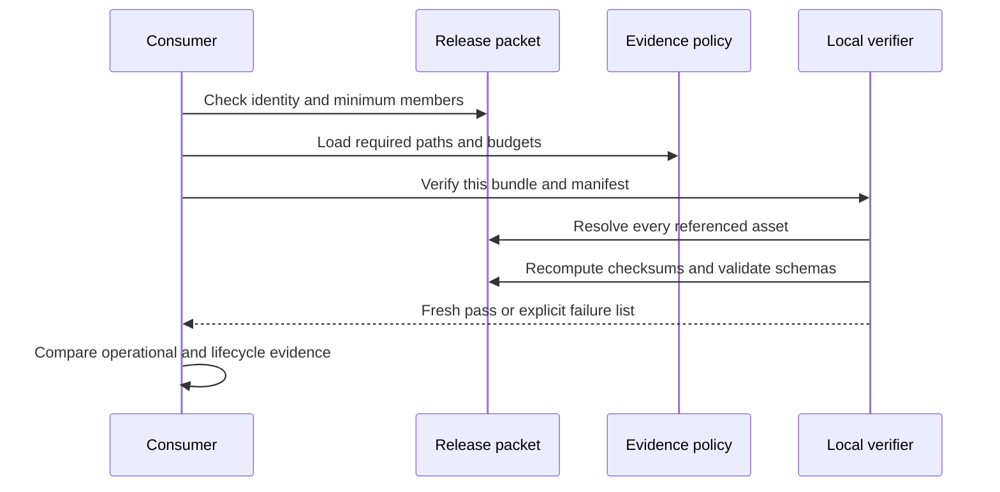
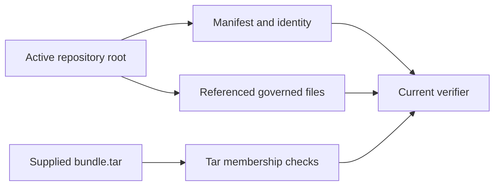

# Release Evidence

Release evidence lets a consumer answer four questions independently. What was
built? Which source and policy produced it? Is every required artifact present
and unchanged? Did the candidate pass the operational claims for its intended
profile?

## Evidence Layers

| Layer | Primary record | Consumer question |
| --- | --- | --- |
| Identity | `evidence/identity.json` | Which release, source revision, and governance revision is this? |
| Inventory | `evidence/manifest.json` | Which chart, image, SBOM, policy, audit, dataset, performance, and report assets belong? |
| Policy | `evidence/policy.json` | Which paths, SBOM formats, vulnerability limits, and production image evidence are required? |
| Integrity | `signing/checksums.json` | Do governed bytes match the recorded SHA-256 digests? |
| Provenance | `provenance.json` | Which source, toolchain, policy, manifest, and ledger produced the set? |
| Transport | `packet/packet.json` | Did the consumer receive the minimum portable release set? |
| Verdict | Fresh verifier output | Does this exact set pass now in the verification environment? |

The manifest covers more than software packages. It references the Helm chart,
profile images, and SBOMs. It also covers authentication and access policy,
audit schema and retention, dataset and ingest contracts, observability,
performance reports, governance and compatibility records, the docs build, and
supply-chain inputs.

## Claim-to-Evidence Map

| Release claim | Minimum direct evidence |
| --- | --- |
| source identity | immutable revision plus provenance and governance identity |
| package integrity | package inventory, digest ledger, and fresh recomputation |
| profile deployability | exact chart, values, images, render, policy, and conformance result |
| runtime correctness | contract results tied to released binaries and dataset identity |
| capacity | comparable scenario results, absolute budgets, and approved baseline |
| security | applicable supply-chain, threat, data-protection, and deployment-control evidence |
| rollback and recovery | supported transition plus executed traffic, integrity, and cleanup proof |
| offline use | complete local assets and verifier execution without undeclared network access |

An evidence manifest should make missing claim coverage visible. It must not
substitute a nearby asset—such as a schema, sample, or simulated result—for the
executed proof required by the claim.

## Security Evidence Closure

Security evidence is complete only when preventive intent, enforcement,
detection, and release binding agree for each required boundary.

| Boundary | Preventive evidence | Behavioral and detective evidence | Release binding |
| --- | --- | --- | --- |
| source and dependency | allowed source and dependency policy, lock state, toolchain identity | dependency audit and exception findings | source revision, package inventory, SBOM, and provenance |
| artifact integrity | immutable layout, expected hashes, publication policy | deep verification, tamper or mismatch result | evidence manifest and checksum ledger |
| identity and authorization | authentication model, roles, actions, resources, default-deny policy | permitted and denied route cases plus audit decisions | policy snapshot, runtime release, and report identity |
| workload and network | profile values, security context, RBAC, NetworkPolicy, secret references | admission, workload identity, and allowed and denied reachability | chart, values, image or bundle identity, and conformance evidence |
| audit and data protection | field classification, redaction, sink, retention, rotation | secret scanning, audit continuity, gap detection, and recovery | audit reports, retention policy, and checksum binding |
| vulnerability and withdrawal | severity, exception, minimum-version, and channel policy | fresh scan, affected-consumer inventory, and withdrawal observation | SBOM, immutable channel digest, decision, and replacement identity |

An empty report collection, example file, tolerated failing command, or
untriggered workflow does not close a boundary. Record the gap and reject or
narrow the release claim.

## Verification Sequence



Run verification from the repository root with the release consumer tool:

```bash
bijux-atlas-dev ops evidence verify \
  ops/release/evidence/bundle.tar \
  --format json
```

Do not substitute the checked-in `release-verify.json` for this command. A
verification report is bound to the bytes and references present when it was
created. It becomes stale when any governed member changes.

## Current Verification Topology

The current `ops evidence verify` command is repository-relative. It loads
`manifest.json`, `identity.json`, and referenced assets from the active
repository root. When a tarball is supplied, it also checks that governed paths
are members of that tarball. It does not extract an arbitrary packet and use
only the packet contents as its verification root.



This command can establish repository-and-tar coherence for the checked-out
release set. It is not yet a standalone consumer verifier for an isolated
download. A portable verification claim requires a clean consumer environment
that resolves every policy, manifest, ledger, schema, and governed member from
the received packet or separately trusted inputs, with no fallback to producer
workspace files.

Record which topology produced the verdict. Do not label repository-relative
success as independent packet verification.

## Current Repository Snapshot

The checked-in identity and provenance agree on release
`ops_run-39f207e4b20e` and source revision
`39f207e4b20efe6b4e4728c6bbf77d396997358b`. The current checksum ledger matches
the checked-in evidence tarball and manifest, but the complete evidence set is
not coherent:

- fresh bundle verification fails on missing audit, governance, performance,
  and ingest assets;
- the authentication-model snapshot and all six profile SBOMs fail their
  manifest checksum checks;
- the manifest's recorded provenance digest differs from the current
  `provenance.json` bytes;
- the packet records stale digests for the bundle, manifest, provenance,
  checksum ledger, signing result, and verification result;
- offline, performance, and production profiles use repeated-digit image
  digests, while the schema-failure fixture intentionally uses `latest`;
- drill summaries, simulation summaries, scan reports, and redacted-log
  collections are empty; and
- the image digest registry has no released entries.

These are release blockers, not documentation caveats. The snapshot is useful
for exercising contracts and negative paths. It must not be described or
distributed as verified production evidence.

## Propagate Evidence Invalidation

Evidence forms a dependency graph. When an upstream identity changes, every
downstream result that consumed it becomes stale even if those report bytes are
unchanged.


| Changed identity | Evidence requiring re-evaluation |
| --- | --- |
| source, dependency, compiler, or build policy | built artifacts, SBOMs, provenance, and all behavior derived from those bytes |
| image, chart, profile, or cluster capability | render, admission, security, rollout, observability, load, and recovery evidence |
| dataset, catalog, store, or query pack | correctness, compatibility, capacity, cache, and recovery evidence |
| threshold, exception, or acceptance policy | verdicts and promotion decisions; raw measurements may remain reusable when their identity is complete |
| packet inventory, ledger, or trust root | packet integrity and consumer verification |

Do not regenerate only the final checksum ledger after an upstream change.
Traverse the graph to the first changed authority, mark dependent verdicts
stale, and rerun the required observations. Preserve the superseded graph so a
consumer can explain which evidence supported the earlier decision.

## Acceptance Checklist

Before promotion, require all of the following from one newly generated run:

- identity, provenance, manifests, chart, image digests, and package versions
  agree;
- every required path is present in the consumer-visible bundle;
- all manifest, packet, and checksum digests match recomputed values;
- production image references are immutable and have matching SBOMs;
- vulnerability policy has zero unapproved critical or high findings;
- audit, authentication, observability, performance, governance, and dataset
  evidence is populated and applicable to the selected profile;
- rollout, upgrade, rollback, and recovery proof is attached where required;
- the local verifier returns a clean result for the exact transport set; and
- the verified packet and output are retained with the promoted release.

If verification fails, preserve the failure output and reject the set. Rebuild
from the intended source and regenerate the whole evidence chain. Never make a
failed set appear valid by deleting requirements or recomputing digests over
unexplained artifacts.

## Freshness and Custody

Retain when and where each report was produced, who or what approved it, and
how it entered the packet. Reverify after transport and before promotion.
Evidence becomes stale when candidate bytes, policy, configuration, selected
profile, dataset, or required external state changes—even if its file digest
still matches an old ledger.

Use [Release Packets](release-packets.md) for transport boundaries and
[Signing and Provenance](signing-and-provenance.md) for the guarantees and
limits of the checksum-ledger trust model. Use
[Supply Chain and Artifact Trust](../security/supply-chain-and-artifact-trust.md)
for consumer authorization and withdrawal.
