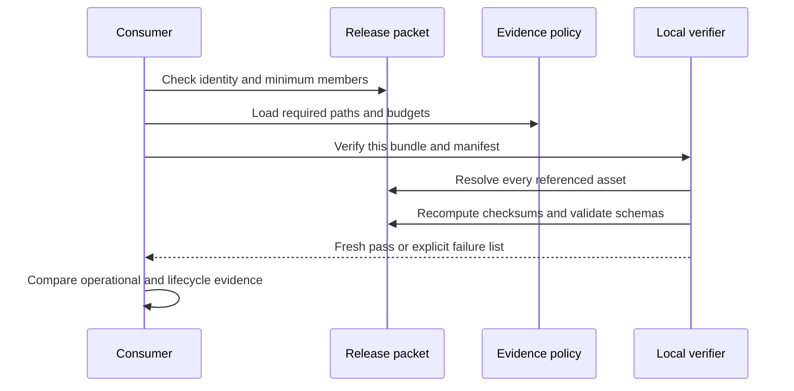

# Release Evidence

Release evidence lets a consumer answer four questions independently. What was
built? Which source and policy produced it? Is every required artifact present
and unchanged? Did the candidate pass the operational claims for its intended
profile?

## Evidence Layers

| Layer | Primary record | Consumer question |
| --- | --- | --- |
| Identity | `evidence/identity.json` | Which release, source revision, and governance revision is this? |
| Inventory | `evidence/manifest.json` | Which chart, image, SBOM, policy, audit, dataset, performance, and report assets belong? |
| Policy | `evidence/policy.json` | Which paths, SBOM formats, vulnerability limits, and production image evidence are required? |
| Integrity | `signing/checksums.json` | Do governed bytes match the recorded SHA-256 digests? |
| Provenance | `provenance.json` | Which source, toolchain, policy, manifest, and ledger produced the set? |
| Transport | `packet/packet.json` | Did the consumer receive the minimum portable release set? |
| Verdict | Fresh verifier output | Does this exact set pass now in the verification environment? |

The manifest covers more than software packages. It references the Helm chart,
profile images, and SBOMs. It also covers authentication and access policy,
audit schema and retention, dataset and ingest contracts, observability,
performance reports, governance and compatibility records, the docs build, and
supply-chain inputs.

## Verification Sequence



Run verification from the repository root with the release consumer tool:

```bash
bijux-atlas-dev ops evidence verify \
  ops/release/evidence/bundle.tar \
  --format json
```

Do not substitute the checked-in `release-verify.json` for this command. A
verification report is bound to the bytes and references present when it was
created. It becomes stale when any governed member changes.

## Current Repository Snapshot

The checked-in identity and provenance agree on release
`ops_run-39f207e4b20e` and source revision
`39f207e4b20efe6b4e4728c6bbf77d396997358b`. The current checksum ledger matches
the checked-in evidence tarball and manifest, but the complete evidence set is
not coherent:

- fresh bundle verification fails on missing audit, governance, performance,
  and ingest assets;
- the authentication-model snapshot and all six profile SBOMs fail their
  manifest checksum checks;
- the manifest's recorded provenance digest differs from the current
  `provenance.json` bytes;
- the packet records stale digests for the bundle, manifest, provenance,
  checksum ledger, signing result, and verification result;
- offline, performance, and production profiles use repeated-digit image
  digests, while the schema-failure fixture intentionally uses `latest`;
- drill summaries, simulation summaries, scan reports, and redacted-log
  collections are empty; and
- the image digest registry has no released entries.

These are release blockers, not documentation caveats. The snapshot is useful
for exercising contracts and negative paths. It must not be described or
distributed as verified production evidence.

## Acceptance Checklist

Before promotion, require all of the following from one newly generated run:

- identity, provenance, manifests, chart, image digests, and package versions
  agree;
- every required path is present in the consumer-visible bundle;
- all manifest, packet, and checksum digests match recomputed values;
- production image references are immutable and have matching SBOMs;
- vulnerability policy has zero unapproved critical or high findings;
- audit, authentication, observability, performance, governance, and dataset
  evidence is populated and applicable to the selected profile;
- rollout, upgrade, rollback, and recovery proof is attached where required;
- the local verifier returns a clean result for the exact transport set; and
- the verified packet and output are retained with the promoted release.

If verification fails, preserve the failure output and reject the set. Rebuild
from the intended source and regenerate the whole evidence chain. Never make a
failed set appear valid by deleting requirements or recomputing digests over
unexplained artifacts.

Use [Release Packets](release-packets.md) for transport boundaries and
[Signing and Provenance](signing-and-provenance.md) for the guarantees and
limits of the checksum-ledger trust model.
