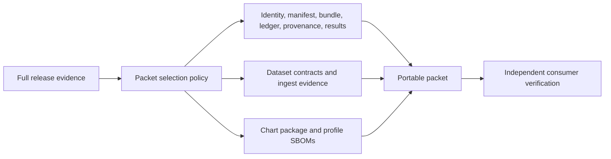
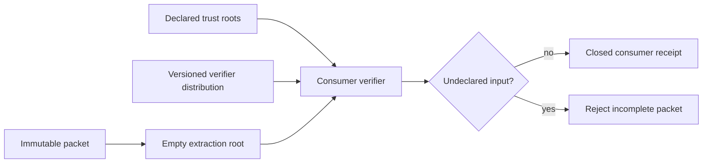
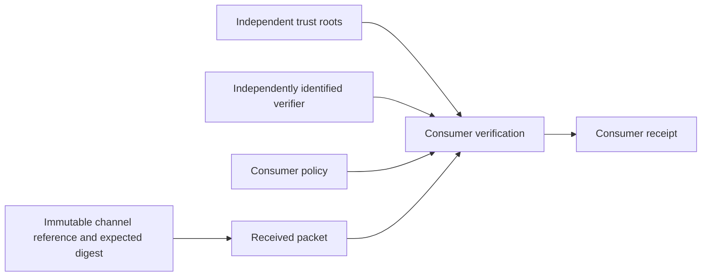
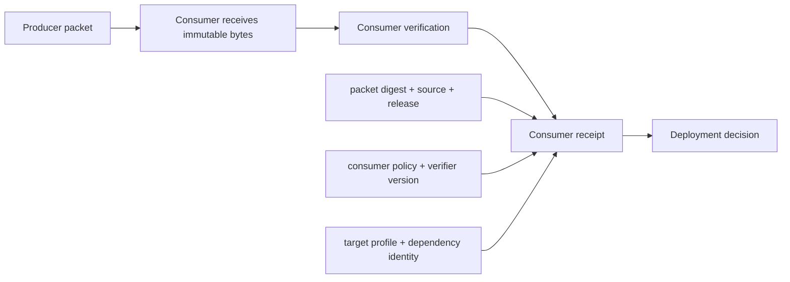

# Release Packets

A release packet is the portable subset of Atlas evidence delivered to a
consumer. It is not a second source of release truth. Every packet member and
digest must resolve to the same identity, manifest, provenance, and evidence
bundle that were verified before transport.

## Packet Boundary

The minimum set contains the evidence manifest, identity, tarball, checksum
ledger, signing result, verification result, and provenance. The current packet
also inventories dataset schemas and manifests, ingest results, the chart
package, and six profile SBOMs.

## Coherence Rules

- Every listed path exists in the transported set.
- Every SHA-256 value matches the transported bytes.
- Identity and provenance name the same release, source, and governance
  revision.
- Manifest, checksum ledger, and packet inventory agree on artifact identity.
- Chart, images, values profiles, and SBOMs refer to the same build.
- Verification is rerun after transport rather than trusted as an enclosed
  assertion.
- Unexpected files are classified; required files cannot be silently omitted.

## Safe Transport and Extraction

Treat a packet as untrusted input until consumer verification completes.
Inspect the archive inventory before extraction. Reject absolute paths, parent
traversal, duplicate normalized names, unsafe links, special files, unexpected
executables, and expansion beyond configured file-count or size limits.

Extraction must not overwrite an existing deployment, evidence directory, or
trust policy. Use a new isolated destination and promote only verified members
through the owning deployment workflow.

## Packet Closure Test

A packet is portable only when a consumer can reach a verdict from the packet,
the declared trust roots, and the documented verifier distribution. Repository
state, producer caches, and paths outside the extraction root must not repair a
missing member or replace a transported member during verification.

Run the closure test in an empty consumer workspace:

1. retain the immutable outer packet and its expected digest;
2. extract into a new root after the archive safety checks pass;
3. remove access to the producer checkout and artifact caches;
4. resolve every manifest reference within the extracted root;
5. run the declared verifier using only packet inputs and governed trust roots;
6. record every attempted external read and network request; and
7. fail when a required input is absent, substituted, or fetched implicitly.

The closure result is distinct from integrity. A packet can have internally
consistent digests and still be unusable because its verifier, schema, policy,
or referenced artifact is available only in the producer environment.

## Establish the Consumer Trust Bootstrap

Packet verification begins from inputs the packet does not get to define for
itself: expected outer identity, accepted trust roots, verifier distribution,
and consumer policy. Acquire and retain those inputs through an independently
governed channel.

| Bootstrap input | Consumer requirement |
| --- | --- |
| expected packet identity | release, channel, immutable reference, outer digest, and retrieval context |
| trust roots | key or identity set, validity and revocation state, source, and accepted policy scope |
| verifier | immutable binary or package identity, provenance, supported schema range, and invocation contract |
| consumer policy | required evidence classes, allowed exceptions, target profile, and decision owner |

Do not execute a verifier or trust a key merely because it is enclosed in the
packet under review. The packet may carry a copy for portability, but the
consumer must match it to the independently accepted identity before use. When
trust has rotated, record which generation verifies the release and whether
the rollback release remains verifiable under the retained policy.

## Current Packet Status

The checked-in packet satisfies its structural `REL-PACK-001` flag, but its
recorded digests are stale. The bundle, manifest, provenance, checksum ledger,
signing result, and verification result no longer match the current bytes.
Fresh evidence verification also fails for the checked-in bundle.

Therefore `ops/release/packet/packet.json` is a contract fixture and inventory
example, not a transportable verified release. Regenerate the entire packet
from one release run after the evidence blockers are resolved.

## Consumer Procedure

1. Compare expected release and source identity before unpacking executable
   material.
2. Reject missing, duplicate, traversal, or unexpected members.
3. Recompute packet and manifest checksums in the consumer environment.
4. Run schema, policy, provenance, SBOM, and evidence verification.
5. Confirm the target profile has applicable install, load, security,
   observability, upgrade, and rollback evidence.
6. Preserve the received packet and fresh verifier output with the deployment
   record.

The enclosed verification result is historical producer evidence. The fresh
consumer result is the decision input. Preserve both so disagreement can be
investigated rather than overwritten.

## Producer Packet and Consumer Receipt

The producer packet carries candidate evidence. The consumer receipt records
what was actually received and judged. Keep them separate so transport damage,
policy differences, verifier changes, and environment-specific rejection are
visible.

At minimum, a receipt records:

- packet digest, release, source revision, and retrieval channel;
- retrieval time and immutable remote reference;
- verifier and trust-policy versions;
- member inventory and checksum verdict;
- provenance, SBOM, schema, compatibility, and evidence verdicts;
- target profile and any evidence not applicable to that consumer;
- final accept, reject, or qualified decision with owner and timestamp; and
- the deployment or rollback record that consumed the decision.

A receipt is not a replacement manifest and must not rewrite producer claims.
It binds the consumer's observation and policy to the immutable packet.

## Packet Exposure Boundary

Release evidence can contain environment names, internal locations, logs, or
security findings even when secrets are forbidden. Apply the packet's
distribution classification before upload, and create an explicitly governed
redacted derivative when audiences differ. The derivative needs its own digest
and a lineage link to the restricted packet; silently deleting members breaks
coherence.

Never make a stale packet coherent by updating individual digest fields. Rebuild
the selected set from authoritative source inputs so all cross-references are
generated together.

See [Release Evidence](release-evidence.md) for current blockers and
[Signing and Provenance](signing-and-provenance.md) for checksum guarantees.
