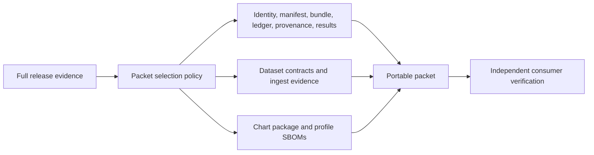

# Release Packets

A release packet is the portable subset of Atlas evidence delivered to a
consumer. It is not a second source of release truth. Every packet member and
digest must resolve to the same identity, manifest, provenance, and evidence
bundle that were verified before transport.

## Packet Boundary

The minimum set contains the evidence manifest, identity, tarball, checksum
ledger, signing result, verification result, and provenance. The current packet
also inventories dataset schemas and manifests, ingest results, the chart
package, and six profile SBOMs.

## Coherence Rules

- Every listed path exists in the transported set.
- Every SHA-256 value matches the transported bytes.
- Identity and provenance name the same release, source, and governance
  revision.
- Manifest, checksum ledger, and packet inventory agree on artifact identity.
- Chart, images, values profiles, and SBOMs refer to the same build.
- Verification is rerun after transport rather than trusted as an enclosed
  assertion.
- Unexpected files are classified; required files cannot be silently omitted.

## Current Packet Status

The checked-in packet satisfies its structural `REL-PACK-001` flag, but its
recorded digests are stale. The bundle, manifest, provenance, checksum ledger,
signing result, and verification result no longer match the current bytes.
Fresh evidence verification also fails for the checked-in bundle.

Therefore `ops/release/packet/packet.json` is a contract fixture and inventory
example, not a transportable verified release. Regenerate the entire packet
from one release run after the evidence blockers are resolved.

## Consumer Procedure

1. Compare expected release and source identity before unpacking executable
   material.
2. Reject missing, duplicate, traversal, or unexpected members.
3. Recompute packet and manifest checksums in the consumer environment.
4. Run schema, policy, provenance, SBOM, and evidence verification.
5. Confirm the target profile has applicable install, load, security,
   observability, upgrade, and rollback evidence.
6. Preserve the received packet and fresh verifier output with the deployment
   record.

Never make a stale packet coherent by updating individual digest fields. Rebuild
the selected set from authoritative source inputs so all cross-references are
generated together.

See [Release Evidence](release-evidence.md) for current blockers and
[Signing and Provenance](signing-and-provenance.md) for checksum guarantees.
