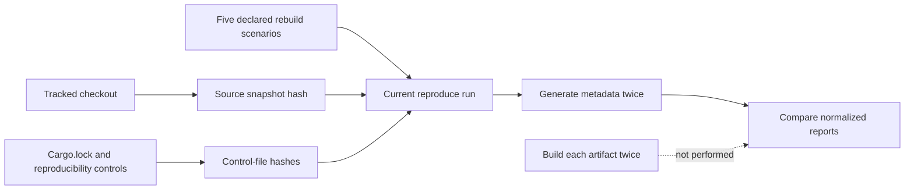
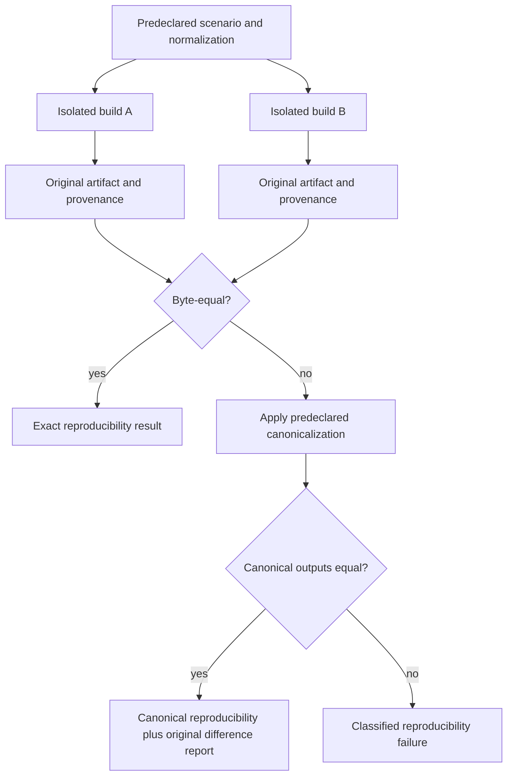

# Reproducibility

Atlas declares reproducibility scenarios for crates, a Docker image, a Helm
chart, the docs site, and the release bundle. The current repository-wide
`reproduce` command validates metadata determinism and source lineage; it does
not execute those five rebuilds.

## Declared Objective

`ops/reproducibility/spec.json` requires three signal classes:

- `source_snapshot_hash`
- `scenario_results`
- `artifact_hashes`

The catalog names five intended rebuild scenarios. Three fixtures identify
known-good inputs for crates, docs, and chart packaging. The catalog and
fixtures define vocabulary and expected shape; they are not completed rebuild
evidence.

## What the Current Commands Prove

| Command | Current behavior | Safe conclusion |
| --- | --- | --- |
| `reproduce run` | hashes tracked source and selected control files; lists catalog scenarios | source/control identity was summarized |
| `reproduce verify` | checks five scenario IDs exist and compares two normalized metadata payloads | metadata generation is deterministic for one checkout |
| `reproduce lineage-validate` | requires hashes for `Cargo.lock` and three reproducibility control files | those lineage inputs were present and hashed |
| `reproduce audit-report` | timestamps and persists the verification result | the metadata verification was recorded |
| `reproduce metrics` | counts scenarios and hashed control files | inventory counts were emitted |

`artifact_hashes` in this command refers to control files such as `Cargo.lock`
and the reproducibility specifications. It does not contain hashes of rebuilt
crate packages, OCI images, chart archives, the docs site, or a release bundle.

The emitted `offline_safe: true` value is a static property of the report
payload. The verification checks that value; it does not instrument or prove
the absence of network access during an artifact rebuild.

## Separate Repeatability, Reproducibility, and Hermeticity

These properties answer different questions and need different experiments:

| Property | Required experiment | Claim limit |
| --- | --- | --- |
| deterministic metadata. | Generate and normalize the same report twice in one checkout. | Report construction is stable for those inputs. |
| build repeatability. | Build twice with the same builder, caches, and controlled environment. | One environment can repeat its own output. |
| independent reproducibility. | Build the same source with isolated builders and independently acquired dependencies. | Separate builders agree on the governed artifact identity. |
| hermeticity. | Deny undeclared filesystem, environment, clock, credential, and network inputs during the build. | The output depends only on the declared input closure. |
| offline rebuild. | Populate a declared local dependency set, deny network access, and rebuild from it. | The retained local set is sufficient for that target. |

Passing a weaker property does not imply a stronger one. In particular,
offline execution can consume mutable local inputs, and a hermetic build can be
non-reproducible when its declared inputs contain time or randomness.

## Release-Specific Reproducibility

The separate `release reproducibility report` command checks required build
environment values, release-manifest build metadata, and a declared versus
computed bundle hash. That is stronger for a concrete release bundle, but it
still needs the referenced manifest and bundle to exist for the selected
version.

In `release-candidate.yml`, a nonzero result from that command is converted into
a `warn` gate artifact and the workflow continues. The lane therefore records
the failure but does not enforce reproducibility as a hard candidate gate.

## Evidence Required for a Rebuild Claim

To claim that a release artifact is reproducible, retain:

1. an immutable source revision and clean input snapshot
2. pinned toolchain, dependency, base-image, and environment identities
3. two isolated builds with controlled environment differences
4. canonicalization rules for timestamps, archive ordering, paths, and metadata
5. hashes of the actual output artifacts from both builds
6. a scenario result explaining equality or classified differences
7. provenance binding the compared outputs to their builders and inputs

Artifact-specific normalization matters. A deterministic JSON report does not
make a tar archive deterministic, and equal chart sources do not prove equal
packaged chart bytes.

## Compare the Right Equivalence

Byte equality is the strongest result when the artifact format permits it.
When canonicalization is necessary, define the transformation before building
and retain both original outputs. A post hoc rule created to erase an observed
difference is not reproducibility evidence.

| Artifact | Identity to pin | Differences to control or explain |
| --- | --- | --- |
| Rust packages | source, lockfile, Rust toolchain, target, feature set | archive metadata, compiler inputs, native dependencies |
| OCI image | source, base-image digest, builder, platform | layer ordering, timestamps, labels, package repositories |
| Helm chart | chart source, dependency locks, Helm version | archive order, modes, timestamps, generated metadata |
| documentation site | source, documentation toolchain, theme and plugin versions | generated timestamps, search indexes, asset ordering |
| release bundle | complete member inventory and member hashes | archive metadata, ordering, signing and provenance attachments |

The result must say whether equality was exact or canonicalized. It must also
name every ignored field and retain the unexplained-difference report.

## Independence and Custody

Two invocations in one populated workspace can reuse caches, generated files,
credentials, or mutable dependencies. Prefer isolated builders with separate
output roots and controlled differences. Record network policy, dependency
source, cache policy, locale, timezone, platform, and environment allowlist.

Bind each output hash to its source and builder provenance. Store the comparison
result with both artifact identities. A signed statement can protect custody,
but signing two different artifacts does not make them reproducible.

## Decision Boundary

Use current `reproduce` output as repository metadata and lineage evidence.
Use the release-specific report as bundle consistency evidence. Do not describe
either as successful execution of all five declared rebuild scenarios until
the commands actually build and compare those artifacts.

## Authorities

- `ops/reproducibility/spec.json`
- `ops/reproducibility/scenarios.json`
- `ops/reproducibility/fixtures/`
- `ops/reproducibility/ci-scenario.json`
- `crates/bijux-atlas-dev/src/application/reproduce.rs`
- `.github/workflows/release-candidate.yml`
