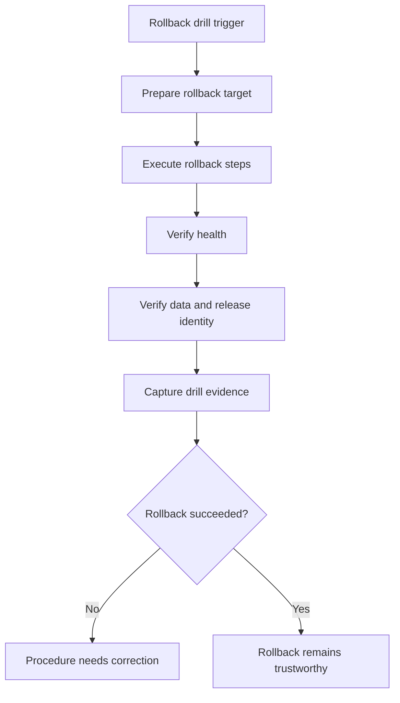

# Rollback Drills

Rollback is treated as a tested procedure with declared scenarios, not as a
hopeful operator fallback.

Rollback trust is earned before an incident, not during one. The value of a
rollback drill is that it proves operators can return to a known-good release,
verify the restored state, and capture evidence that the procedure actually
worked under declared conditions.

## Source of Truth

- `ops/e2e/scenarios/upgrade/rollback-after-failed-upgrade.json`
- `ops/e2e/scenarios/upgrade/rollback-after-successful-upgrade.json`
- `ops/e2e/scenarios/upgrade/version-compatibility.json`

## Drill Lifecycle

1. choose the rollback scenario and target version
2. establish preconditions and the release identity being rolled back from
3. execute the rollback steps
4. validate readiness, restored behavior, and release identity
5. capture the evidence and review the procedure afterwards

## Acceptance Rules

A rollback drill is only acceptable when:

- the rollback target is explicit and supported by version compatibility data
- the restored service passes health and readiness checks
- the expected version or baseline state is observable after rollback
- the drill leaves behind evidence that another operator can review
