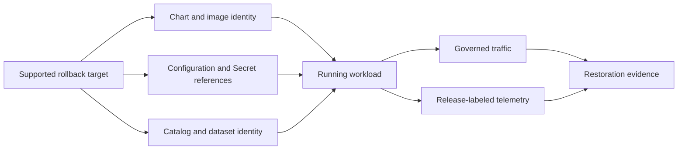
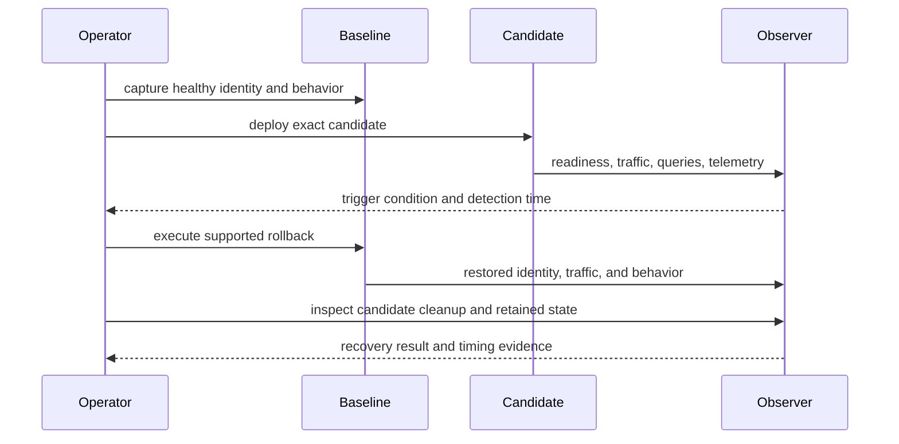

# Rollback Drills

A rollback drill proves that operators can detect a bad candidate, decide to
revert, restore a supported previous release, and verify service and dataset
identity inside a bounded recovery window. Scenario files, fixtures, and a
successful Helm command are prerequisites or observations, not the whole proof.

## Exercise Both Failure Modes

| Drill | What it challenges |
| --- | --- |
| rollback after failed upgrade | startup failure containment, partial-resource cleanup, and restoration before promotion. |
| rollback after successful upgrade | reversibility after traffic, caches, telemetry, and configuration have observed the candidate. |

The second case is essential. It exposes irreversible configuration or shared
state changes that a startup-failure rehearsal cannot reach.

## Preconditions

- The exact reverse transition is marked supported in the compatibility table.
- Baseline and candidate chart, image, configuration, and source identities are
  immutable and retained.
- Baseline request, readiness, dataset, telemetry, and load evidence is healthy.
- Previous artifacts remain reachable through the selected distribution path.
- Dataset-pointer and durable-data recovery procedures are independently known.
- Rollback triggers, decision authority, time budget, and escalation path are
  agreed before the candidate is deployed.

If any precondition is missing, record a blocked drill. Do not improvise a
different target after the failure begins.

## Restore One Coherent Identity

Rollback is complete only when every release-bearing plane agrees:


```mermaid
flowchart LR
    Decision[Supported rollback target] --> Deploy[Chart and image identity]
    Decision --> Config[Configuration and Secret references]
    Decision --> Data[Catalog and dataset identity]
    Deploy --> Runtime[Running workload]
    Config --> Runtime
    Data --> Runtime
    Runtime --> Traffic[Governed traffic]
    Runtime --> Signals[Release-labeled telemetry]
    Traffic --> Proof[Restoration evidence]
    Signals --> Proof
```

| Plane | Restoration check |
| --- | --- |
| deployment | expected chart, image digest, workload revision, and replica state |
| configuration | target values, ConfigMap, Secret references, and runtime parse result |
| data | supported catalog pointer and exact dataset tuple with verified hashes |
| traffic | intended route receives requests and rejects unsupported paths correctly |
| behavior | correctness probes, latency, error rate, overload, and dependency checks |
| telemetry | logs, metrics, and traces identify the restored release |

A healthy pod with candidate configuration is not a restored baseline. Neither
is a previous image serving a candidate dataset unless that combination is an
explicitly supported target.

## Drill Timeline


```mermaid
sequenceDiagram
    participant Operator
    participant Baseline
    participant Candidate
    participant Observer
    Operator->>Baseline: capture healthy identity and behavior
    Operator->>Candidate: deploy exact candidate
    Candidate->>Observer: readiness, traffic, queries, telemetry
    Observer-->>Operator: trigger condition and detection time
    Operator->>Baseline: execute supported rollback
    Baseline->>Observer: restored identity, traffic, and behavior
    Operator->>Observer: inspect candidate cleanup and retained state
    Observer-->>Operator: recovery result and timing evidence
```

Record at least these timestamps:

- candidate deployment started;
- first candidate readiness and first candidate traffic;
- first violated invariant;
- operator detection and rollback decision;
- rollback command started and completed;
- previous release became ready and received traffic;
- correctness and dataset identity were restored;
- candidate cleanup was confirmed.

Derive detection, decision, execution, readiness, and total service-restoration
durations from retained timestamps. Do not reconstruct them later from memory.

Measure recovery time from the first violated invariant to restored governed
service, not only the duration of `helm rollback`. If durable data can change,
also declare the recovery point objective and verify which writes or catalog
changes were retained, reversed, or lost.

## Evidence Package

A credible drill record connects all of the following to one run ID:

| Evidence | Required content |
| --- | --- |
| transition identity | baseline and candidate versions, source revisions, chart/image digests, profile, namespace, and compatibility row. |
| trigger | violated invariant, threshold, first observation, and decision owner. |
| execution | exact rollback command, Helm revision history, capability grants, exit status, and tool versions. |
| runtime restoration | pod/release identity, readiness, governed traffic, request correctness, and selected dataset IDs. |
| operational continuity | release-labeled metrics, logs, traces, error rate, latency, and load-under-rollback results. |
| cleanup | absence of candidate-owned partial resources, configuration, jobs, and mutable pointers. |
| timing | source timestamps and derived recovery durations. |

The current `ops-rollback` schema is a minimal command-result envelope. A
schema-valid object with `status: ok` does not contain all drill evidence above.
Package the command result with the additional observed artifacts and validate
each against its owning contract.

## Planning and Execution

Inspect the scenario without effects:

```bash
bijux dev atlas ops scenario run \
  --scenario rollback-after-failed-upgrade \
  --plan \
  --format json
```

The kind Helm rollback command is an execution surface for simulation and
requires subprocess, write, and network grants. Give the rehearsal a unique run
ID, preserve its artifact root, and capture observations before and after the
command. A plan or system simulation does not replace this exercised path.

## Abort and Escalate

Stop the drill and enter incident handling when:

- the supported previous release cannot become ready;
- the restored release does not receive governed traffic;
- query correctness or dataset identity remains wrong;
- rollback mutates or damages shared durable data;
- required artifacts are unavailable or fail integrity checks;
- repeated rollback attempts exceed the agreed recovery budget.

Do not cycle between releases to mask an unresolved state problem. Preserve the
failed evidence and follow [Backup and Recovery](backup-and-recovery.md) when
durable state is implicated.

## Declare the Drill Result

- **passed**: the exact supported target was restored within budget, all planes
  agreed, correctness returned, and cleanup completed;
- **failed**: execution completed but any required restoration criterion or
  time budget failed;
- **blocked**: a prerequisite, target artifact, authority, or safe execution
  environment was unavailable; or
- **aborted**: the exercise crossed a safety threshold and entered incident
  handling.

Preserve partial evidence for every outcome. Reclassifying a failed or blocked
drill as a successful command result hides the recovery risk.

## Current Readiness

Both checked-in rollback scenario files target unsupported `0.2.0` to `0.1.0`
routing. The OCI record is simulated with placeholder-like digests, and the
baseline-restoration record is a fixture. No checked-in package currently binds
a supported transition to release identity, traffic, correctness, telemetry,
timing, and cleanup evidence.

The drill catalog is therefore a specification, not proof of operational
readiness. Correct the transition targets and retain a fresh exercised record
before depending on rollback for promotion.
