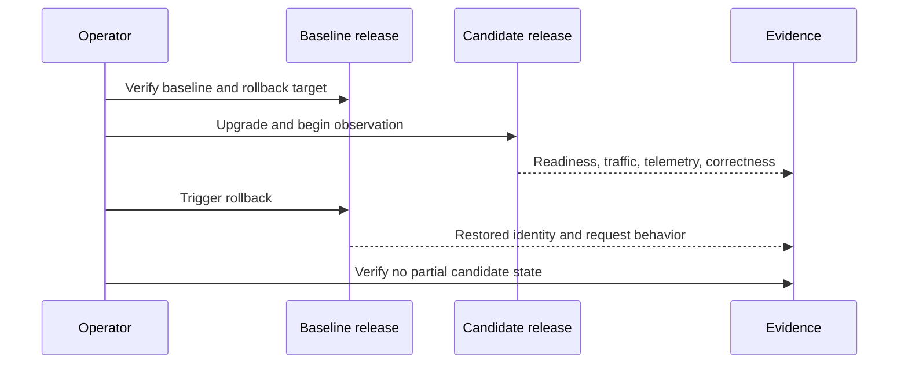

# Rollback Drills

A rollback drill proves that operators can reject a candidate, restore a
supported previous release, and verify service and data identity under a bounded
recovery window. A scenario definition or successful Helm command is not enough.

## Drill Sequence

```mermaid
sequenceDiagram
    participant Operator
    participant Old as Baseline release
    participant New as Candidate release
    participant Evidence
    Operator->>Old: Verify baseline and rollback target
    Operator->>New: Upgrade and begin observation
    New-->>Evidence: Readiness, traffic, telemetry, correctness
    Operator->>Old: Trigger rollback
    Old-->>Evidence: Restored identity and request behavior
    Operator->>Evidence: Verify no partial candidate state
```

Exercise two cases: rollback after an intentionally failed upgrade and rollback
after a candidate first succeeds. The first proves failure containment; the
second exposes irreversible migrations or state changes that only appear after
promotion.

## Preconditions

- The rollback target appears in the compatibility matrix.
- Baseline chart, image, configuration, and dataset identities are immutable.
- Previous artifacts remain available through the selected distribution path.
- The operator has a separate durable-state recovery path.
- Expected readiness, request, telemetry, and load evidence is declared.
- Escalation criteria are defined for a rollback that cannot restore service.

## Current Drill Status

The two runtime rollback scenarios target `0.2.0` to `0.1.0`, while the
compatibility matrix only declares `0.2.0` to `0.1.1` as supported. The OCI
rollback evidence is simulated and carries placeholder digests. The
`rollback-restores-baseline` record is a fixture that names an expected result;
it is not an execution result.

No current checked-in record demonstrates a completed rollback with request,
readiness, release identity, and cleanup evidence. Treat the catalog as a drill
specification until the target mismatch is corrected and a fresh run is
retained.

## Success Criteria

A drill passes only when the supported previous release becomes ready, receives
governed traffic, restores query correctness and dataset access, preserves
telemetry, stays inside rollback load budgets, and leaves no candidate-owned
partial state. Record time to detect, decide, execute, become ready, and restore
service.

If rollback changes or damages shared durable data, stop cycling runtime
releases and enter recovery. See [Backup and Recovery](backup-and-recovery.md)
for that boundary.
