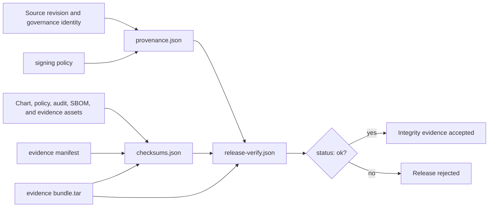

# Signing and Provenance

Atlas release verification currently uses a deterministic SHA-256 checksum
ledger and repository-governed provenance. The policy names this mechanism
`internal-checksum-ledger` in `keyless-local` mode. Detached cryptographic
signatures are not yet part of this trust model.

That distinction matters. The current evidence can prove that governed files
match the recorded release set and that the set declares a specific source and
policy identity. It does not provide an external signer identity or a public-key
chain of trust.

## Trust Chain



## Governed Artifacts

The signing policy requires checksums for more than the application package.
Its release set includes:

- the packaged Atlas Helm chart and evidence tarball;
- the evidence manifest and profile-specific SPDX SBOMs;
- authorization model and access-policy snapshots;
- audit schema, retention policy, and audit verification reports;
- governance exceptions, deprecations, compatibility warnings, breaking-change
  reports, and institutional-delta evidence.

This binds deployable material to the policies and reports used to approve it.
`ops/release/signing/checksums.json` records each path, artifact kind, and SHA-256
digest.

## Provenance Identity

`ops/release/provenance.json` records:

- the release ID and source Git SHA;
- the governance revision;
- the checksum ledger and evidence-manifest paths;
- the signing-policy path;
- the toolchain inventory used by the release process;
- the generator that produced the record.

Treat those fields as one identity. A checksum match against provenance from a
different revision is not sufficient release evidence.

## Offline Verification

The policy requires a local-only verification path and marks air-gapped
verification as supported:

```bash
bijux-atlas-dev ops evidence verify \
  ops/release/evidence/bundle.tar \
  --format json
```

Before promotion or distribution:

1. Obtain the evidence bundle, checksum ledger, provenance, policy, and
   verification report from the same release set.
2. Confirm the expected release ID, Git SHA, governance revision, and toolchain
   inventory in `provenance.json`.
3. Verify every required item in `checksums.json`; missing and unexpected paths
   require investigation.
4. Verify the evidence bundle and manifest agree on their governed assets.
5. Require `ops/release/signing/release-verify.json` to report `status: ok`, no
   errors, and successful `REL-MAN`, `REL-OPS`, `REL-PROV`, `REL-SIGN`, and
   `REL-TAR` contract checks.
6. Preserve the verified records with the promoted release.

The verifier reads local evidence files, so it does not depend on network
availability or a remote transparency service.

## What Verification Establishes

A successful verification establishes that:

- required governed artifacts are present;
- their bytes match the recorded SHA-256 digests;
- the evidence bundle, manifest, and checksum ledger are internally consistent;
- provenance declares the expected release, source, governance, policy, and
  toolchain identities;
- the release verification contracts passed when the report was generated.

It does not establish who produced the files, protect against replacement of
the entire evidence set by an attacker with repository-write authority, or
provide third-party timestamping. Those guarantees require a separately managed
signing identity, detached signatures, and an external trust or transparency
system.

## Failure Handling

Reject the release when a digest differs, a required item is absent, provenance
does not match the intended revision, or the verification report is not clean.
Do not regenerate checksums over unexplained artifacts. Rebuild the release from
the intended source, collect a new coherent evidence set, and repeat
verification.

The authoritative records are under `ops/release/signing/`,
`ops/release/evidence/`, and `ops/release/provenance.json`.
