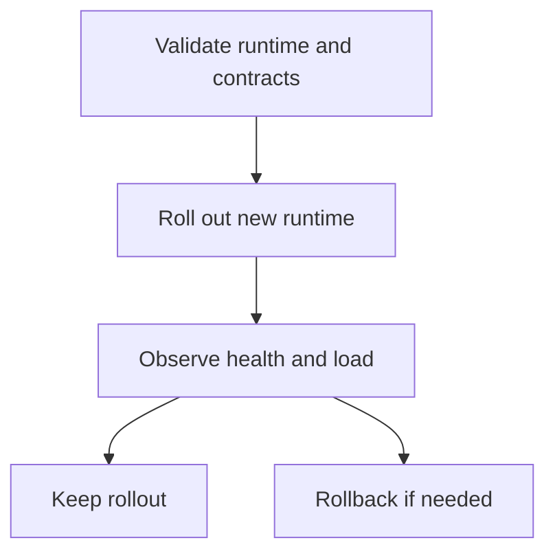
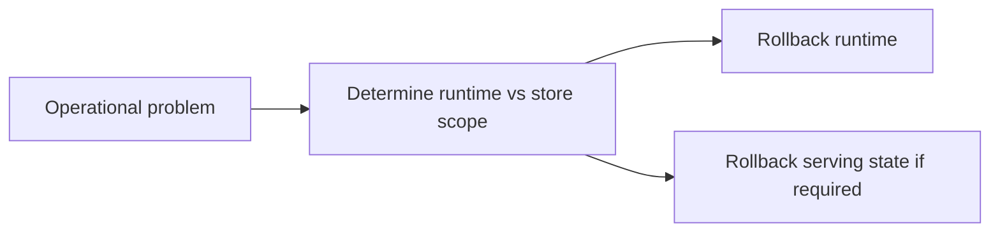

# Upgrades and Rollback

Atlas upgrades should preserve two invariants:

- contract-owned surfaces remain understood and validated
- serving state stays recoverable if a rollout goes wrong

## Upgrade Flow

This upgrade flow keeps rollout discipline visible. Atlas upgrades should be validated, observed,
and explicitly kept or rolled back rather than treated as one-way jumps.

## Rollback Flow

This rollback flow explains one of the most important operator distinctions in Atlas: not every
incident needs store-state rollback, and not every rollback should start there.

## Operator Guidance

- separate runtime rollback from store-state rollback in your thinking
- verify health, readiness, and key query paths after rollout
- keep rollback paths explicit before you need them
- use compatibility and contract evidence as rollout input, not only hope and manual spot checks

## What to Watch During Upgrade

- readiness instability
- unusual rejection or error patterns
- metrics or traces indicating saturation changes
- catalog or dataset discoverability regressions

## Rollout Question That Saves Time

Ask first whether the change affected runtime behavior, serving-store state, or both. That answer
usually determines the safest rollback path.

## Purpose

This page explains the Atlas material for upgrades and rollback and points readers to the canonical checked-in workflow or boundary for this topic.

## Source of Truth

- `ops/k8s/rollout-safety-contract.json`
- `ops/k8s/install-matrix.json`
- `ops/release/evidence/manifest.json`
- `ops/report/generated/readiness-score.json`
- `ops/e2e/scenarios/upgrade/upgrade-patch.json`
- `ops/e2e/scenarios/upgrade/upgrade-minor.json`
- `ops/e2e/scenarios/upgrade/rollback-after-failed-upgrade.json`
- `ops/e2e/scenarios/upgrade/rollback-after-successful-upgrade.json`

## Upgrade Path in This Repository

A real Atlas upgrade path is not only “deploy the new version.” It is:

1. confirm the install matrix and rollout safety contract for the target profile
2. verify the release evidence manifest for the candidate
3. apply the upgrade scenario that matches the version change type
4. review readiness, health, and load or observability signals during rollout
5. keep or roll back based on evidence, not instinct

## Required Signals During Upgrade

Operators should treat these as first-class upgrade inputs:

- readiness and health stabilization
- unusual error or rejection patterns
- latency or overload changes under real traffic
- evidence that the target release identity is the one actually serving

## Main Takeaway

An upgrade is safe only when the target release, the rollout path, and the live
signals all agree. If release evidence says one thing and readiness or traffic
behavior says another, the system is telling the operator to stop and resolve
the disagreement before promotion.

## Stability

This page is part of the canonical Atlas docs spine. Keep it aligned with the current repository behavior and adjacent contract pages.
