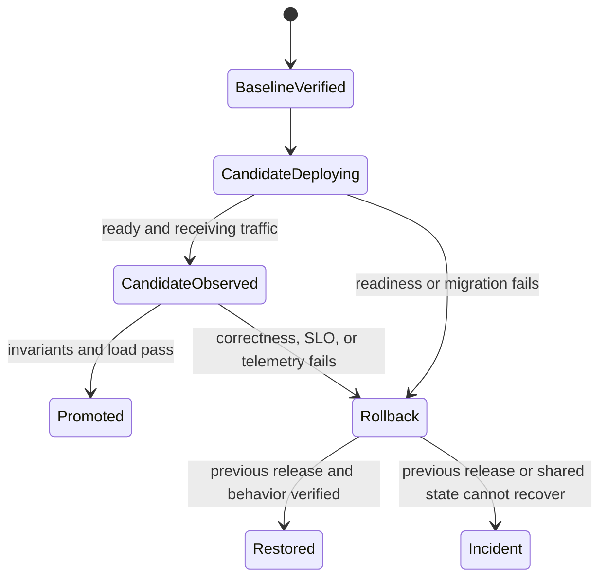

# Upgrades and Rollback

An Atlas upgrade changes runtime and deployment identity while preserving API
behavior, dataset availability, telemetry continuity, and explicit
configuration migration. Rollback restores the previous release without
leaving partial runtime state. Neither operation should mutate immutable dataset
artifacts.

## Lifecycle State Machine

```mermaid
stateDiagram-v2
    [*] --> BaselineVerified
    BaselineVerified --> CandidateDeploying
    CandidateDeploying --> CandidateObserved: ready and receiving traffic
    CandidateObserved --> Promoted: invariants and load pass
    CandidateDeploying --> Rollback: readiness or migration fails
    CandidateObserved --> Rollback: correctness, SLO, or telemetry fails
    Rollback --> Restored: previous release and behavior verified
    Rollback --> Incident: previous release or shared state cannot recover
```

## Upgrade Contract

Before changing the cluster, bind the baseline and candidate chart and image
digests, values profile, API compatibility result, dataset snapshot,
configuration migration, metric surface, and rollback target. During the
change, observe each release cohort separately and confirm that the candidate
actually receives traffic.

The scenario catalog covers patch and minor upgrades, existing datasets,
configuration migration, and feature-default changes. The install matrix adds
upgrade and rollback lifecycle coverage only for `kind`, `offline`, and `perf`.
Other profiles have installation coverage but no declared lifecycle scenario.

## Rollback Boundaries

| Boundary | Trigger | Authority |
| --- | --- | --- |
| Runtime/chart | Candidate code, configuration, readiness, or service regression | Helm release history and supported version path |
| Dataset pointer | Published dataset selection is wrong but immutable artifacts remain valid | Manifest-lock pointer policy |
| Durable store | Artifacts or catalog are missing or corrupt | Backup and recovery procedure |

Do not roll back dataset state merely because runtime code fails. The dataset
policy selects a previous dataset ID, validates `manifest.lock`, and publishes
the previous pointer without mutating old artifacts. It supports a maximum
rollback depth of three.

## Current Compatibility Gap

The compatibility matrix supports `0.1.0` to `0.1.1`, `0.1.1` to `0.2.0`, and
their adjacent rollback paths. Both checked-in rollback scenarios instead
declare `0.2.0` to `0.1.0`. That target is not supported by the current matrix.
Resolve the disagreement before using those scenarios as rollback evidence.

The OCI upgrade and rollback records are marked `simulated` and use
repeated-digit chart and image digests. The installation evidence bundle is
also marked `placeholder`. These assets define expected shape; they do not
prove an executable release transition.

## Acceptance

Promote only when compatibility, migration, dataset, readiness, traffic,
telemetry, security, and load evidence agree. Accept rollback only when the
previous release is ready, serving traffic, query correctness is restored, and
no partial release state remains. Preserve the first violated signal and all
recovery actions even after service returns.

Use [Rollout Under Load](../load/rollout-under-load.md) for traffic budgets and
[Rollback Drills](rollback-drills.md) for rehearsal evidence.
