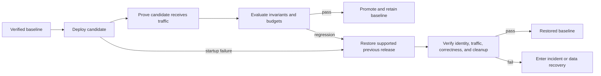

# Upgrades and Rollback

An Atlas upgrade changes a named software and deployment release while
preserving governed API behavior, published dataset access, telemetry, and
explicit configuration semantics. Runtime rollback restores the supported
previous software/deployment release. Dataset-pointer rollback and durable data
recovery are different procedures.

## Decide Which Plane Failed

| Symptom | Recovery plane | First authority |
| --- | --- | --- |
| candidate image, chart, config, readiness, or request regression | runtime and deployment rollback | Helm release history, compatibility table, and candidate evidence. |
| wrong dataset promoted while immutable artifacts remain intact | dataset-pointer rollback | catalog history, `manifest.lock`, promotion rules, and dataset index. |
| missing or corrupt catalog/artifact bytes | backup and recovery | backup manifest, integrity evidence, and restore procedure. |
| incompatible client contract | stop promotion or restore compatible runtime | OpenAPI/API compatibility result and client support policy. |

Do not roll back immutable dataset artifacts because runtime code fails. Do not
use Helm rollback as a substitute for restoring corrupt durable state.

## Bind Baseline and Candidate

Before changing traffic, record:

- source revision, product version, chart digest, and image digest for both
  baseline and candidate;
- exact values/profile identity and effective runtime configuration;
- published dataset IDs, catalog selection, and manifest-lock digests;
- supported transition row from the compatibility table;
- API and configuration migration results;
- readiness, correctness, telemetry, security, and load thresholds;
- immutable rollback artifacts and the operator decision deadline.


```mermaid
flowchart LR
    Baseline[Verified baseline] --> Candidate[Deploy candidate]
    Candidate --> Traffic[Prove candidate receives traffic]
    Traffic --> Observe[Evaluate invariants and budgets]
    Observe -->|pass| Promote[Promote and retain baseline]
    Candidate -->|startup failure| Rollback[Restore supported previous release]
    Observe -->|regression| Rollback
    Rollback --> Verify[Verify identity, traffic, correctness, and cleanup]
    Verify -->|pass| Restored[Restored baseline]
    Verify -->|fail| Incident[Enter incident or data recovery]
```

Readiness without traffic is not candidate validation. Aggregate metrics without
release labels can hide a failed candidate behind healthy baseline replicas.

## Repository Planning Checks

The repository contains hidden release-planning helpers. They are useful for
inspecting checked-in policy, but they are not deployment execution or release
proof.

```bash
bijux-atlas-dev release compatibility-check \
  --from-version 0.2.0 \
  --to-version 0.1.1 \
  --format json

bijux-atlas-dev release rollback-plan \
  --from-version 0.2.0 \
  --to-version 0.1.1 \
  --format json
```

Run compatibility checking separately. The current rollback-plan implementation
returns a plan with `status: ok` without verifying that the supplied version
pair exists in the compatibility table. It also loads the
`rollback-after-successful-upgrade` step list regardless of the supplied pair.
Never interpret plan status as transition support.

## Simulation Boundary

`ops helm upgrade` and `ops helm rollback` currently target the kind simulation
path. Rollback supports only `--to previous` and requires subprocess, write, and
network capability grants. It does not constitute a production-cluster
rollback interface.

```bash
bijux dev atlas ops helm rollback \
  --cluster kind \
  --profile kind \
  --to previous \
  --allow-subprocess \
  --allow-write \
  --allow-network \
  --evidence \
  --format json
```

Use a unique run ID and artifact root for an executed rehearsal. Retain the
command output together with Helm history, Kubernetes rollout state, request
checks, release-labeled telemetry, and cleanup inspection.

## Dataset-Pointer Rollback

The governed dataset rollback strategy is `manifest-lock-pointer`:

1. select a previous dataset ID;
2. validate its `manifest.lock` integrity;
3. publish the previous pointer without mutating old artifacts.

The policy permits a maximum depth of three and requires the manifest lock,
promotion rules, and dataset index. Exceeding that boundary is not a deeper
runtime rollback; it requires an explicit recovery decision.

## Current Evidence Limits

The compatibility matrix supports adjacent transitions: `0.1.0` to `0.1.1`,
`0.1.1` to `0.2.0`, and their reverse rollback paths. Both checked-in rollback
scenario files declare `0.2.0` to `0.1.0`, which is absent from the matrix.

The OCI transition evidence is marked `simulated` and uses repeated-digit chart
and image digests. The installation evidence bundle is marked `placeholder`.
The rollback report schema requires only profile, cluster, namespace, and
status; it does not require release identity, request correctness, traffic,
timings, telemetry, or cleanup proof. These assets are specifications and
fixtures, not evidence of a completed supported transition.

## Acceptance

Promote only when the candidate receives governed traffic and all declared
compatibility, migration, dataset, correctness, readiness, telemetry, security,
and load checks pass. Accept rollback only when the supported previous release
identity is restored, serves traffic, returns correct results, preserves the
selected dataset, and leaves no candidate-owned partial state.

Preserve the first violated signal and every recovery action. If the previous
release cannot recover or shared state is damaged, stop cycling releases and
enter [Backup and Recovery](backup-and-recovery.md). Use [Rollback
Drills](rollback-drills.md) to build the missing execution evidence.
