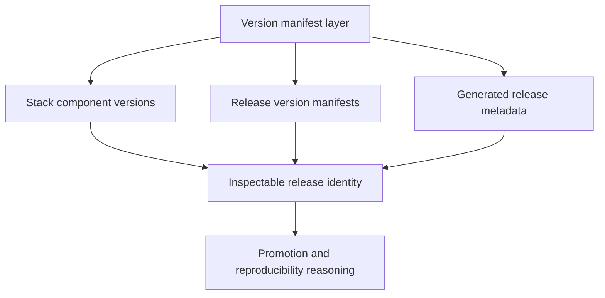

# Version Manifests

Version manifests keep operational component versions inspectable and
reviewable.

Atlas has more than one version-bearing manifest because different files answer
different questions. Operators need to know which file explains runtime
component pins, which one defines release surfaces, and which one records the
generated metadata for a particular release run.

## Source of Truth

- `ops/schema/stack/version-manifest.schema.json`
- `ops/release/generated/`
- `ops/stack/generated/version-manifest.json`
- `ops/release/release-manifest.json`
- `ops/release/ops-release-manifest.json`
- `ops/release/generated/release-metadata.json`

## Which Manifest Answers Which Question

- `ops/stack/generated/version-manifest.json` answers which stack component
  images and digests define the operational substrate
- `ops/release/release-manifest.json` answers which release surfaces and
  distribution artifacts belong to the release
- `ops/release/ops-release-manifest.json` answers which chart package, chart
  reference, and build metadata define the ops release artifact
- `ops/release/generated/release-metadata.json` answers what was generated for a
  specific release run

## Operator Takeaway

Treat version manifests as layered evidence, not duplicates. Together they let
operators reason about promotion, rollback, and reproducibility without having
to infer version identity from scattered files.
