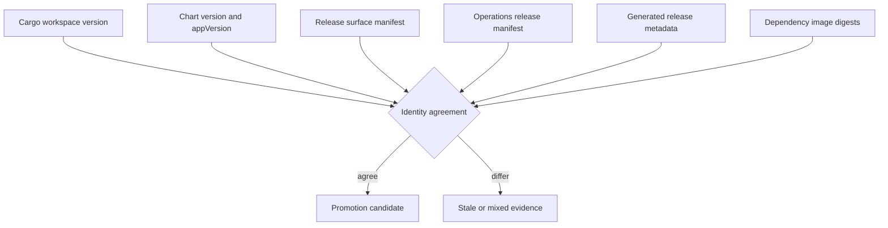
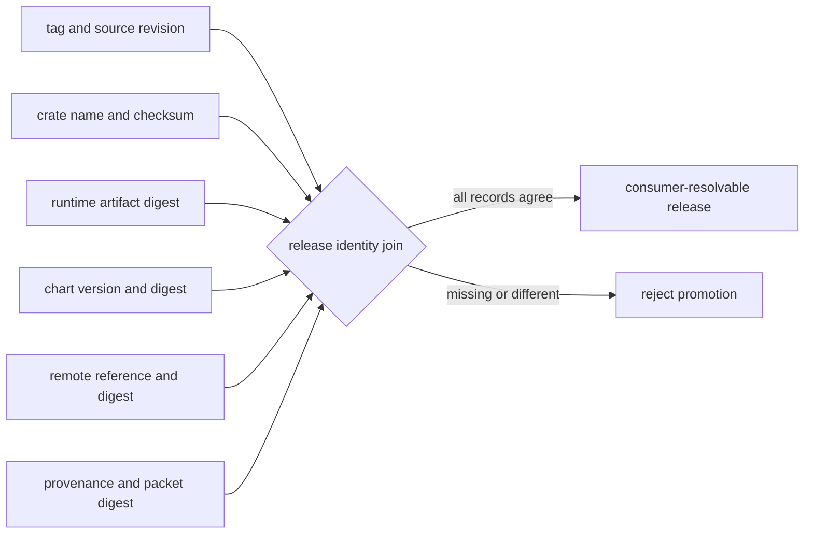
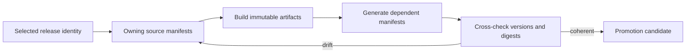

# Version Manifests

Atlas has multiple version-bearing files because packages, the Helm chart,
stack dependencies, release assets, and generated evidence have different
owners. They form release evidence only when their identities agree.

```mermaid
flowchart TB
    Workspace[Cargo workspace version] --> Coherence{Identity agreement}
    Chart[Chart version and appVersion] --> Coherence
    Release[Release surface manifest] --> Coherence
    Ops[Operations release manifest] --> Coherence
    Metadata[Generated release metadata] --> Coherence
    Stack[Dependency image digests] --> Coherence
    Coherence -->|agree| Promote[Promotion candidate]
    Coherence -->|differ| Stale[Stale or mixed evidence]
```

## Authority by Question

| Surface | Authority | Required binding |
| --- | --- | --- |
| workspace crates | root `Cargo.toml` | packages and intended tag |
| installed chart | chart `Chart.yaml` | OCI digest and operations manifest |
| chart runtime | chart `appVersion` | runtime digest and compatibility |
| public surfaces | release manifest | packet, signing, and verification |
| chart package | operations manifest | path, digest, version, and build |
| dependency images | stack manifest | composition and rendered deployment |
| release run | generated metadata | run identity and source revision |

The stack version manifest pins Kind, MinIO, Prometheus, OpenTelemetry
Collector, Redis, and Toxiproxy images. It does not declare the Atlas workspace
or chart version, so it must be joined with release identity rather than used as
a standalone release manifest.

## Release Identity Join

No single version string identifies an Atlas release. The durable identity is a
join across source, package, runtime, chart, distribution, and evidence records.

```mermaid
flowchart LR
    Source["tag and source revision"] --> Join{"release identity join"}
    Package["crate name and checksum"] --> Join
    Runtime["runtime artifact digest"] --> Join
    Chart["chart version and digest"] --> Join
    Channel["remote reference and digest"] --> Join
    Evidence["provenance and packet digest"] --> Join
    Join -- all records agree --> Resolvable["consumer-resolvable release"]
    Join -- missing or different --> Reject["reject promotion"]
```

| Record | Join key | Required comparison |
| --- | --- | --- |
| source | tag and revision | tag resolves to the built revision |
| package | name and version | checksum belongs to that source |
| runtime | platform and digest | provenance names the digest |
| chart | version and digest | `appVersion` names the runtime |
| channel | immutable reference | remote bytes match the manifest |
| packet | release and digest | inventory contains every record |

The join must be one-to-one for a promoted platform and channel. Multiple
digests for one claimed artifact, an unbound mutable tag, or a version with no
retrievable bytes is an identity failure even when every version string is
equal.

Classify a mismatch before remediation: source drift, package drift, runtime
drift, chart compatibility drift, remote channel drift, or stale evidence.
That classification determines the owning producer and prevents a generated
manifest from being edited as a substitute for rebuilding the artifact.

## Current Checkout State

The checked-in files do not currently describe one coherent release:

| Surface | Declared version |
| --- | --- |
| root workspace | `0.2.2` |
| chart `version` and `appVersion` | `0.2.0` |
| release surface manifest | `0.2.0` |
| operations release manifest | `0.2.0` |
| operations bundle manifest | `0.2.0` |
| generated release metadata | `0.2.0` |

This mismatch is visible evidence drift. The `0.2.0` files may document an
older build, but they cannot collectively prove a `0.2.2` release. Promotion
must fail closed until the intended version is selected and every generated
manifest is refreshed and verified against its actual artifact.

## Coherence Rules

- Do not “pick the newest-looking file.” Resolve authority by the question in
  the table above.
- Version equality is necessary but insufficient; package and OCI digests must
  identify the exact bytes referenced by provenance.
- `appVersion` describes application compatibility, while chart `version`
  identifies the chart package. A deliberate difference needs an explicit
  compatibility record.
- Generated metadata is evidence from a run, not an override of source
  manifests.
- A path under `artifacts/` is disposable local output until its digest and run
  identity enter a governed release packet.
- Stack dependency tags remain untrusted without the recorded digest.

## Resolve Drift at Its Owning Surface

Version drift is evidence about an ownership boundary, not a reason to copy one
string across every file. Resolve the intended release identity first, then
regenerate each dependent record from the authority that owns it.

| Mismatch | Owning decision | Required resolution |
| --- | --- | --- |
| workspace and crate | package release | select and validate the version |
| chart version and package | chart release | rebuild and record the digest |
| `appVersion` and runtime | compatibility | bind to the runtime digest |
| manifest and files | assembly | regenerate inventory and checksums |
| stack and resources | composition | render and compare dependency digests |
| metadata and provenance | release run | rerun from the intended revision |

```mermaid
flowchart LR
    Intent[Selected release identity] --> Owners[Owning source manifests]
    Owners --> Build[Build immutable artifacts]
    Build --> Generate[Generate dependent manifests]
    Generate --> CrossCheck[Cross-check versions and digests]
    CrossCheck -->|coherent| Candidate[Promotion candidate]
    CrossCheck -->|drift| Owners
```

Do not edit generated evidence to make a comparison pass. That produces a
consistent label over unproven bytes. The correction is complete only when the
owning source, generated manifests, immutable artifact digests, and provenance
all converge in a fresh release run.

## Operator Verification

1. Resolve the intended workspace version and `v`-prefixed release tag.
2. Compare every publishable crate, chart version, and `appVersion`.
3. Regenerate release, operations, and bundle manifests for that identity.
4. Verify chart, OCI, package, and bundle hashes against the built files.
5. Confirm stack digests match the selected profile and rendered resources.
6. Reject stale generated metadata or a packet containing more than one release
   identity.

## Consumer Resolution Receipt

Complete verification from a clean consumer context and retain a receipt with:

- requested channel, package name, version, and platform;
- mutable discovery reference, when used, plus the resolved immutable digest;
- registry checksum, media type, byte length, and retrieval time;
- source revision, provenance subject, signer identity, and policy result;
- verifier version and the digest of the release packet used for comparison.

The receipt proves that a consumer can obtain the same bytes the producer
declared. A producer-side upload log cannot replace it because authentication,
visibility, replication, retention, and registry resolution may fail after an
upload reports success.

## Authorities

- `Cargo.toml`
- `ops/k8s/charts/bijux-atlas/Chart.yaml`
- `ops/stack/generated/version-manifest.json`
- `ops/release/release-manifest.json`
- `ops/release/ops-release-manifest.json`
- `ops/release/ops-release-bundle-manifest.json`
- `ops/release/generated/release-metadata.json`
