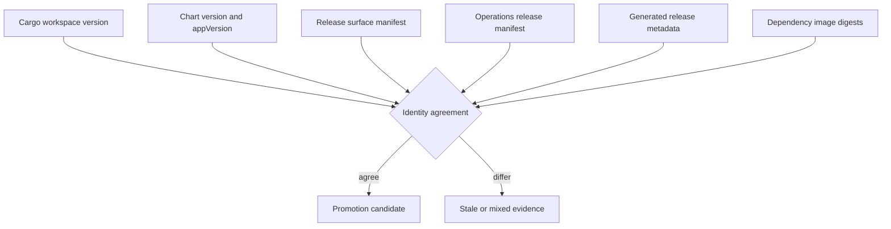
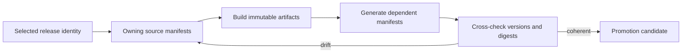

# Version Manifests

Atlas has multiple version-bearing files because packages, the Helm chart,
stack dependencies, release assets, and generated evidence have different
owners. They form release evidence only when their identities agree.

```mermaid
flowchart TB
    Workspace[Cargo workspace version] --> Coherence{Identity agreement}
    Chart[Chart version and appVersion] --> Coherence
    Release[Release surface manifest] --> Coherence
    Ops[Operations release manifest] --> Coherence
    Metadata[Generated release metadata] --> Coherence
    Stack[Dependency image digests] --> Coherence
    Coherence -->|agree| Promote[Promotion candidate]
    Coherence -->|differ| Stale[Stale or mixed evidence]
```

## Authority by Question

| Question | Authority | Required binding |
| --- | --- | --- |
| Which version do workspace crates inherit? | root `Cargo.toml` | each publishable package and intended tag |
| Which chart is installed? | chart `Chart.yaml` plus immutable package digest | operations release manifest and OCI reference |
| Which runtime does the chart describe? | chart `appVersion` | runtime artifact digest and compatibility record |
| Which public surfaces belong to a release? | `ops/release/release-manifest.json` | packet, signing, and verification records |
| Which chart package was built? | `ops-release-manifest.json` | chart path, digest, version, and build metadata |
| Which dependency images define the stack? | stack version manifest | selected composition and rendered deployment |
| Which release run produced an artifact root? | generated release metadata | run identity and source revision |

The stack version manifest pins Kind, MinIO, Prometheus, OpenTelemetry
Collector, Redis, and Toxiproxy images. It does not declare the Atlas workspace
or chart version, so it must be joined with release identity rather than used as
a standalone release manifest.

## Current Checkout State

The checked-in files do not currently describe one coherent release:

| Surface | Declared version |
| --- | --- |
| root workspace | `0.2.2` |
| chart `version` and `appVersion` | `0.2.0` |
| release surface manifest | `0.2.0` |
| operations release manifest | `0.2.0` |
| operations bundle manifest | `0.2.0` |
| generated release metadata | `0.2.0` |

This mismatch is visible evidence drift. The `0.2.0` files may document an
older build, but they cannot collectively prove a `0.2.2` release. Promotion
must fail closed until the intended version is selected and every generated
manifest is refreshed and verified against its actual artifact.

## Coherence Rules

- Do not “pick the newest-looking file.” Resolve authority by the question in
  the table above.
- Version equality is necessary but insufficient; package and OCI digests must
  identify the exact bytes referenced by provenance.
- `appVersion` describes application compatibility, while chart `version`
  identifies the chart package. A deliberate difference needs an explicit
  compatibility record.
- Generated metadata is evidence from a run, not an override of source
  manifests.
- A path under `artifacts/` is disposable local output until its digest and run
  identity enter a governed release packet.
- Stack dependency tags remain untrusted without the recorded digest.

## Resolve Drift at Its Owning Surface

Version drift is evidence about an ownership boundary, not a reason to copy one
string across every file. Resolve the intended release identity first, then
regenerate each dependent record from the authority that owns it.

| Mismatch | Owning decision | Required resolution |
| --- | --- | --- |
| workspace and publishable crate | package release | select the package version and validate inherited declarations |
| chart `version` and chart package | chart release | build the chart from the authoritative metadata and record its digest |
| chart `appVersion` and runtime | deployment compatibility | bind the application version to an immutable runtime artifact |
| release manifest and built files | release assembly | regenerate inventory and checksums from the selected artifacts |
| stack manifest and rendered resources | environment composition | render the selected profile and compare every dependency digest |
| metadata and provenance | release run | rerun the governed producer workflow from the intended source revision |

```mermaid
flowchart LR
    Intent[Selected release identity] --> Owners[Owning source manifests]
    Owners --> Build[Build immutable artifacts]
    Build --> Generate[Generate dependent manifests]
    Generate --> CrossCheck[Cross-check versions and digests]
    CrossCheck -->|coherent| Candidate[Promotion candidate]
    CrossCheck -->|drift| Owners
```

Do not edit generated evidence to make a comparison pass. That produces a
consistent label over unproven bytes. The correction is complete only when the
owning source, generated manifests, immutable artifact digests, and provenance
all converge in a fresh release run.

## Operator Verification

1. Resolve the intended workspace version and `v`-prefixed release tag.
2. Compare every publishable crate, chart version, and `appVersion`.
3. Regenerate release, operations, and bundle manifests for that identity.
4. Verify chart, OCI, package, and bundle hashes against the built files.
5. Confirm stack digests match the selected profile and rendered resources.
6. Reject stale generated metadata or a packet containing more than one release
   identity.

## Authorities

- `Cargo.toml`
- `ops/k8s/charts/bijux-atlas/Chart.yaml`
- `ops/stack/generated/version-manifest.json`
- `ops/release/release-manifest.json`
- `ops/release/ops-release-manifest.json`
- `ops/release/ops-release-bundle-manifest.json`
- `ops/release/generated/release-metadata.json`
