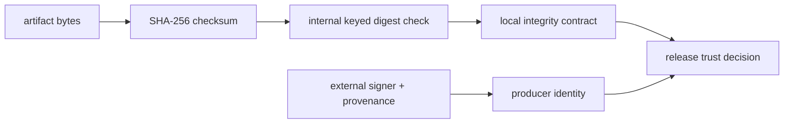
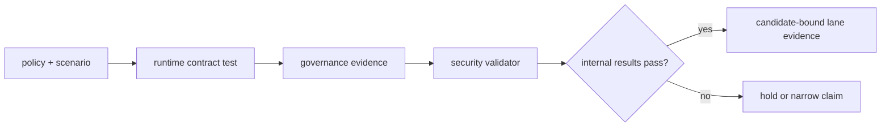

# Data Protection and Cryptographic Custody

Atlas protects dataset and request data through explicit transport, artifact,
secret-handling, classification, and evidence-retention boundaries. These
controls form a custody chain; no checksum, TLS setting, or policy file proves
the whole chain alone.

## Protection Boundaries

```mermaid
flowchart LR
    Source["classified source data"] --> Build["controlled artifact build"]
    Build --> Integrity["manifest + payload integrity"]
    Integrity --> Store["storage protection"]
    Store --> Transport["authenticated encrypted transport"]
    Transport --> Runtime["authorized bounded use"]
    Runtime --> Audit["redacted audit + detection"]
    Audit --> Retain["governed retention and disposal"]
```

| Boundary | Governing question | Evidence required |
| --- | --- | --- |
| classification | what data needs protection and redaction? | class, owner, purpose, and handling policy |
| build | which process and inputs produced the bytes? | source hashes, policy, tool identity, and provenance |
| integrity | did manifest and payload bytes remain unchanged? | manifest digest, payload checksums, and verifier result |
| storage | where is encryption enforced and who owns its keys? | backend configuration, key reference, and recovery proof |
| transport | where does TLS terminate and what identity is verified? | endpoint, certificate chain, protocol, and handshake result |
| runtime use | who may access which dataset or operation? | authentication and authorization decision with correlation |
| audit | can use, denial, rotation, and tampering be attributed? | redacted events, metrics, traces, and alert result |
| retention | how long is evidence kept and how is it disposed? | retention class, expiry, legal hold, and deletion result |

## Governed Policy

`configs/sources/security/data-protection.yaml` declares defense in depth across
confidentiality, integrity, and availability. It requires transport TLS and
at-rest protection, forbids plaintext secrets in logs, requires redaction for
credential and client identifiers, and assigns retention periods to audit,
security-event, and integrity evidence.

The policy distinguishes storage-layer encryption from application-level
dataset encryption. `at_rest_required` makes protected storage mandatory;
`dataset_encryption_optional` permits the storage platform to own that control.
An acceptance record must name the actual enforcement boundary. A policy value
cannot substitute for backend configuration or a restore exercise using the
same key authority.

## Implemented Runtime Contracts

The runtime data-protection module and its contract test exercise:

- loading PEM certificate, private-key, and optional CA material;
- rejecting incomplete certificate bundles and unsupported TLS versions;
- staging and promoting a certificate fingerprint for rotation state;
- enforcing HTTPS scheme and TLS-version policy decisions;
- calculating and verifying SHA-256 payload and manifest checksums;
- detecting checksum or signature disagreement;
- verifying that a dataset manifest is internally coherent.

These are library contracts. They do not prove that the Atlas server terminates
TLS in a target environment, that a cluster delivered the intended secret, or
that storage encryption is active. Preserve edge-proxy or mesh configuration,
live handshake evidence, workload secret references, and storage controls for
those claims.

## Signature Semantics

The current runtime helper verifies a deterministic SHA-256 value derived from
an artifact checksum and a supplied signing value. It demonstrates integrity
contract behavior; it is not an asymmetric signature, certificate identity,
hardware-backed key, transparency-log entry, or external signer attestation.

Use the checksum ledger to detect changed bytes. Use release provenance and a
consumer trust policy to establish producer identity. Do not describe the
internal digest helper as cryptographic release signing.

## Certificate and Secret Rotation

A safe rotation keeps old and new identities attributable throughout the
overlap window:

1. issue the new material through the owning secret or certificate authority;
2. record only its non-secret version and certificate fingerprint;
3. stage it in the target delivery mechanism and render the workload reference;
4. prove the new chain and identity with a live handshake or authorization test;
5. promote the new identity and reject the old identity after the overlap;
6. verify audit continuity, workload convergence, and rollback behavior;
7. revoke and dispose of old material under the retention policy.

Never place private keys, bearer tokens, API keys, or unredacted secret values
in a report. A proof of rotation records identifiers, decisions, timestamps,
and positive and negative outcomes.

## Validation Lane

The `security-data-protection-validation` workflow runs runtime foundation
contracts, repository governance validation, governance evidence generation,
artifact-presence checks, and the security validator. The governed scenario at
`ops/security/scenarios/data-protection-validation.json` names the intended
contract tests and security command.

Several governance evidence commands in the workflow are tolerated with
`|| true` before file-presence checks. Therefore a green workflow conclusion
does not, by itself, prove that every generated governance report passed
internally. Inspect the report statuses and findings. File presence is evidence
of transport, not acceptance.

## Example Reports Are Contract Fixtures

The files under `ops/security/reports/` demonstrate report shape for
capabilities, encryption metrics, configuration audit, tamper detection, and
data-protection evidence. Their `status` values describe the example payloads.
They are not observations from a deployed environment and must not enter a
release packet as target evidence.

A candidate-specific report needs the source revision, runtime artifact digest,
dataset identity, target, policy digest, tool identity, execution time, raw
findings, internal status, and verifier result.

## Acceptance Boundary

Data protection is qualified only when the required boundaries agree for the
selected exposure model. Hold acceptance when:

- TLS policy exists but termination identity or live handshake is unproven;
- at-rest protection is declared but the storage and key authorities are absent;
- integrity checks pass but producer identity or provenance is missing;
- rotation succeeds without proving rejection of the retired identity;
- audit evidence contains secrets, lacks correlation, or violates retention;
- example reports or file-presence checks are presented as live evidence.

Continue with [Identity, Authorization, and Audit](identity-authorization-and-audit.md)
for request decisions, [Security Operations](../kubernetes/security-operations.md)
for deployment enforcement, and
[Signing and Provenance](../release/signing-and-provenance.md) for producer and
consumer release trust.
