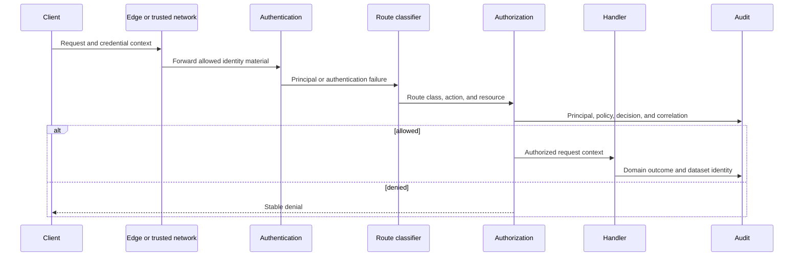
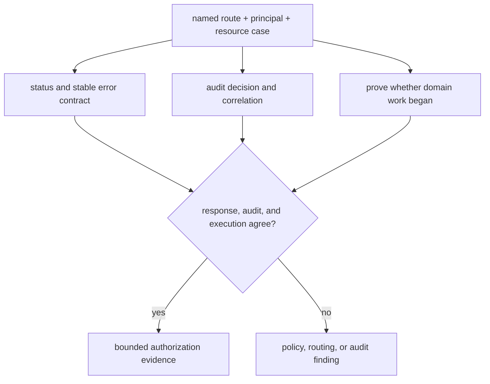

# Identity, Authorization, and Audit

Atlas request security is an evidence chain. Authentication establishes a
principal context. Authorization evaluates an action on a resource. Route
classification selects that decision. Audit evidence preserves enough of the
evaluation to reconstruct who attempted what against which runtime and dataset
without retaining credential material.

## Decision Chain

`ATLAS_AUTH_MODE` selects the runtime mode. The governed authentication model
supports API key, token, OIDC, and mTLS methods and declares an internal default
stance. Exposure beyond a private trusted network requires an ingress
authentication proxy, service mesh, or equivalent institutional boundary in
addition to the selected runtime mode.

## Route, Action, and Resource

| Route class | Runtime decision | Required assurance |
| --- | --- | --- |
| service routes | health, readiness, overload, metrics, version, and OpenAPI are authentication-exempt at the application route boundary | network reachability is bounded and the exemption cannot reach dataset or administrative work |
| catalog and dataset routes | evaluate `catalog.read` or `dataset.read` against the resolved service or dataset resource | permitted and forbidden principals are tested against explicit dataset identities |
| recognized administrative routes | evaluate `ops.admin` on the service namespace | operator authority, isolated exposure, use audit, and route registration are coherent |
| enabled but unclassified administrative routes | currently fall through to ordinary dataset-read treatment | keep disabled or govern isolated exception evidence for the complete enabled set |

Authentication exemption is not public authorization. Network policy, Service,
Ingress, and platform identity still decide who can reach an exempt route.
Likewise, authentication success is not authorization: a valid principal can
still lack the required action on the selected resource.

## Evidence Without Secrets

| Evidence field | Retain | Exclude |
| --- | --- | --- |
| authentication | mode, issuer or key version, principal ID or class, success or failure reason | API key, token, signature, private key, or raw credential header |
| authorization | normalized route, action, resource kind and ID, policy version, allow or deny | vague role-only claims without evaluated action and resource |
| request | request ID, trace ID, timestamp, client class where policy permits | unrestricted headers, query payloads, or personal data |
| runtime | software release, governance identity, effective-config fingerprint, pod or instance ID | unredacted effective configuration or secret values |
| dataset | release, species, assembly, manifest and artifact identity where applicable | internal notes or response payloads unrelated to the decision |
| outcome | HTTP status, stable error code, domain-work start state, latency class | status alone with no rejecting boundary |

The data-classification policy treats authorization material, API keys, HMAC
signatures, and bearer tokens as secrets. Audit success is not permission to
retain those values. Use non-secret versions or key IDs to demonstrate rotation
and revocation.

## Positive and Negative Assurance

For each protected route class required by the exposure model, exercise:

1. no credential;
2. malformed or invalid credential;
3. valid identity without the required action;
4. valid authorized identity;
5. authorized identity applied to a different resource; and
6. credential rotation or revocation where the deployment depends on it.

A denial is incomplete when the response is correct but no attributable audit
event exists. An audit denial is incorrect when domain work already began. A
successful request is unsafe when its resource identity differs from the
authorized dataset.

## Administrative Route Boundary

Enabling administrative endpoints registers diagnostics, cluster, replica,
recovery, failure-injection, chaos, and echo routes as one group. The runtime
authorization classifier currently covers 18 of the 26 registered routes. The
four replica routes, two recovery routes, failure injection, and chaos execution
are omitted from that classifier and receive ordinary dataset-read treatment.

Treat route registration and classification as two inventories that must agree:

| Inventory | Question |
| --- | --- |
| registered routes | Which paths exist when the feature is enabled? |
| route classes | Which action, resource, exemption, and principal context applies to each path? |
| exposure | Which clients and networks can reach each registered path? |
| live tests | Do permitted and forbidden cases produce the expected response and audit decision? |

Until parity exists, keep administrative endpoints disabled for
security-qualified profiles. An exception must isolate reachability and prove
all 26 routes, not only the route needed by an operator.

## Audit Continuity and Failure

Audit evidence has its own availability and integrity requirements. Detect and
classify sink failure, dropped or unclassified fields, rotation gaps, retention
loss, delayed export, and post-capture tampering. Application availability does
not turn a missing security record into an accepted authorization claim.

When audit continuity fails:

- preserve local logs, metrics, traces, runtime identity, and the first known
  gap without copying secrets;
- hold promotion and security-sensitive administrative changes;
- determine whether request enforcement continued and which decisions are
  unverifiable;
- restore the sink and verify a known permitted and denied request; and
- bind the gap, affected interval, recovery evidence, and residual risk to the
  incident record.

Continue with [Security Operations](../kubernetes/security-operations.md) for
deployment enforcement and [Admin Endpoint Exceptions](../kubernetes/admin-endpoints-exceptions.md)
for governed exceptional exposure.
