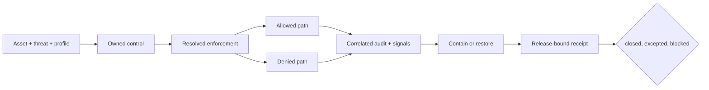

# Security assurance

Atlas security assurance connects a governed exposure to enforcement,
detection, recovery, and release identity. It spans dataset admission, request
policy, administrative routes, workloads, networks, secrets, dependencies,
audit, and artifact trust. A scanner result or secure-looking manifest covers
only one boundary.

## Close controls end to end

| Closure field | Evidence required | If absent |
| --- | --- | --- |
| exposure | Asset, trust boundary, threat or abuse path, and affected profile | The claim has no bounded subject |
| control | Mitigation ID, owner, enforcement point, and failure posture | Intent cannot be tied to implementation |
| resolved state | Effective runtime setting, workload, network, or platform policy | Deployed enforcement is unknown |
| allowed path | Authorized behavior succeeds through the intended route | Legitimate use may be broken |
| denied path | Forbidden behavior fails at the intended enforcement point | Denial behavior is unproved |
| detection | Principal, action, resource, result, and correlation key appear in audit or signals | The outcome is not attributable |
| recovery | Revocation, rotation, containment, or restoration result | Control after compromise is unproved |
| binding | Runtime, dataset, deployment, target, policy, and evidence identities | The result cannot qualify this release |

A denied request caused by routing does not prove authorization. An audit event
does not prove domain work was prevented. Preserve those results separately.
An exception must name the unresolved field, exposure, compensating control,
owner, and expiry.

## Security boundaries

| Boundary | Governing question | Representative proof |
| --- | --- | --- |
| dataset | Were only verified immutable inputs admitted and served? | Rejection tests, manifest hashes, and identity-bearing reads |
| request | Was the right principal allowed the right action and resource? | Allowed and denied requests joined to policy and audit |
| administrative | Are privileged routes completely classified, isolated, and attributable? | Registration parity, negative tests, and bounded reachability |
| workload and network | Did the target enforce process, identity, filesystem, and connectivity policy? | Render, admission, runtime identity, and connectivity tests |
| secrets | Can material be issued, delivered, rotated, revoked, and redacted? | Non-secret version identities and controlled positive and negative checks |
| supply chain | Are dependencies and distributed artifacts the reviewed bytes? | Immutable references, SBOMs, provenance, fresh hashes, and consumer trust |
| evidence | Can an incident or decision be reconstructed without exposing secrets? | Complete correlated records, retention, integrity, and custody |

## Current qualification limits

- Enabling administrative endpoints registers 26 routes. The runtime
  authorization classifier covers 18; four replica routes, two recovery
  routes, failure injection, and chaos execution receive ordinary dataset-read
  treatment. Keep the group disabled in security-qualified profiles unless a
  bounded exception isolates reachability and proves all 26 routes.
- Release trust currently uses an internal SHA-256 checksum ledger and declared
  provenance, not detached signatures backed by an external signer identity.
- Repository lanes do not establish a target's ingress identity, live secret
  delivery, storage encryption, network enforcement, or production retention.
- Policies, scenarios, and example reports describe expected controls. Only
  fresh execution bound to the candidate and target supports promotion.

These limits narrow the security claim. They are not permission to infer a
pass for an unclassified route or unobserved target control.

## Route by decision

| Decision | Read |
| --- | --- |
| Connect threats to owned controls | [Threat Model and Control Coverage](threat-model-and-control-coverage.md) |
| Qualify principals, routes, authorization, and audit | [Identity, Authorization, and Audit](identity-authorization-and-audit.md) |
| Protect data and cryptographic material | [Data Protection and Cryptographic Custody](data-protection-and-cryptographic-custody.md) |
| Verify packages, SBOMs, provenance, and consumer trust | [Supply Chain and Artifact Trust](supply-chain-and-artifact-trust.md) |
| Render workload, network, and secret controls | [Security Operations](../kubernetes/security-operations.md) |
| Govern privileged-route exposure | [Admin Endpoint Exceptions](../kubernetes/admin-endpoints-exceptions.md) |
| Investigate a suspected event | [Incident Response](../observability/incident-response.md) |
| Understand checksum and provenance guarantees | [Signing and Provenance](../release/signing-and-provenance.md) |

Security acceptance is profile- and exposure-specific. A private local
evaluation and an internet-reachable deployment do not carry the same threat
surface or proof burden.
