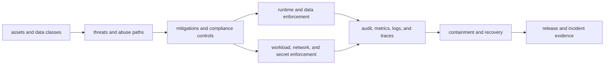
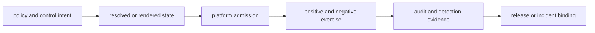
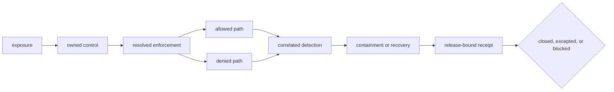

# Security Assurance

Atlas security assurance connects governed threats to preventive controls,
runtime enforcement, detection, recovery, and release-bound evidence. It spans
the dataset, request, workload, network, dependency, audit, and artifact trust
boundaries. No single scanner, policy file, or deployment setting establishes
the whole claim.

## Security System

Atlas keeps intent and observation separate. A threat registry describes the
risk. A mitigation identifies the expected control. Configuration and code
implement it. Positive and negative tests show behavior. Audit and operational
signals make use and failure attributable. Release evidence binds accepted
results to distributed bytes.

## Security Boundaries

| Boundary | Governing concern | Required proof |
| --- | --- | --- |
| dataset | source admission, manifest integrity, immutable publication, cache identity | rejected invalid input, verified artifact hashes, and identity-bearing reads |
| request | authentication, principal propagation, authorization, limits, route classification | allowed and denied requests with action, resource, policy, and correlation evidence |
| administrative | route registration, operator authority, network isolation, exceptional access | complete route inventory, classifier parity, negative checks, and bounded reachability |
| workload | pod security, service account, RBAC, filesystem, process configuration | rendered intent, admission result, and observed runtime identity |
| network | ingress, egress, service exposure, dependency reachability | policy inventory plus allowed and denied connectivity checks |
| secrets | issuance, reference, delivery, rotation, revocation, redaction | versioned non-secret identifiers and controlled positive and negative checks |
| supply chain | dependency sources, image and package identity, SBOM, provenance, release integrity | immutable references, policy results, fresh checksum verification, and consumer trust anchor |
| evidence | audit completeness, retention, tamper detection, incident custody | schema-valid records, gap detection, checksum binding, and retained decision history |

## Evidence Strength

Each level answers a stronger question. A schema-valid policy proves accepted
shape. A rendered object proves intended deployment state. Admission proves
the platform accepted that state. Live exercises prove selected behavior.
Detection evidence proves the outcome was attributable. Release binding proves
which distributed artifacts the observation supports.

## Control Closure Is a Join, Not a Checklist

A security control is closed only when the same control identity can be traced
from threat to enforcement and back from evidence to the protected release.
Keep the following fields together in the security receipt:

| Closure field | Required content | A missing field means |
| --- | --- | --- |
| exposure | asset, trust boundary, threat or abuse path, and affected profile | the control has no bounded security claim |
| control | mitigation ID, owner, enforcement point and failure posture | intent cannot be tied to implementation |
| resolved state | effective runtime setting, rendered workload or platform policy | the deployed control is unknown |
| positive exercise | an authorized action succeeds through the intended path | the control may block legitimate use |
| negative exercise | a forbidden action fails at the intended enforcement point | denial behavior is unproved |
| detection | audit event or signal identifies principal, action, resource, result and correlation key | the outcome is not attributable |
| recovery | containment, revocation, rotation or restoration result | operational control after compromise is unproved |
| binding | runtime, dataset, deployment, target, policy and evidence identities | the result cannot support this release |

A preventive control can pass while detection fails; a denied request can be
caused by routing rather than authorization; an audit event can exist without
proving the request was blocked. Preserve those outcomes separately. An
exception must name the unresolved field, compensating control, exposure
boundary, owner and expiry instead of converting partial closure into a pass.

## Known Qualification Boundaries

Atlas documents limitations as security decisions:

- administrative endpoint registration and authorization classification do
  not currently agree for all enabled routes; keep the route group disabled for
  security-qualified profiles unless isolated exception evidence covers the
  complete set;
- the release trust model currently uses an internal SHA-256 checksum ledger
  and declared provenance, not detached signatures or an external signer
  identity;
- repository security lanes do not prove target ingress identity, live secret
  delivery, storage encryption, network enforcement, or production retention;
- checked-in policies, scenarios, and example reports define contracts and
  test paths; only fresh, candidate-bound execution supports promotion.

These limits narrow claims. They are not permission to weaken the missing
control or infer an unobserved pass.

## Route by Decision

| Decision | Read |
| --- | --- |
| connect governed threats to controls and evidence | [Threat Model and Control Coverage](threat-model-and-control-coverage.md) |
| qualify principal, route, authorization, and audit behavior | [Identity, Authorization, and Audit](identity-authorization-and-audit.md) |
| qualify TLS, storage protection, integrity, rotation, and retention | [Data Protection and Cryptographic Custody](data-protection-and-cryptographic-custody.md) |
| verify dependency, package, SBOM, channel, and consumer trust | [Supply Chain and Artifact Trust](supply-chain-and-artifact-trust.md) |
| render and qualify runtime, workload, network, and secret controls | [Security Operations](../kubernetes/security-operations.md) |
| govern exceptional administrative-route exposure | [Admin Endpoint Exceptions](../kubernetes/admin-endpoints-exceptions.md) |
| investigate a suspected security event | [Incident Response](../observability/incident-response.md) |
| understand checksum and provenance guarantees | [Signing and Provenance](../release/signing-and-provenance.md) |
| review release-bound security assets | [Release Evidence](../release/release-evidence.md) |

Security acceptance requires the evidence appropriate to the selected exposure
model and release profile. A private local evaluation and a production
deployment do not have the same threat surface or proof burden.
