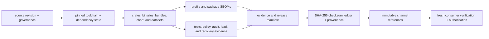
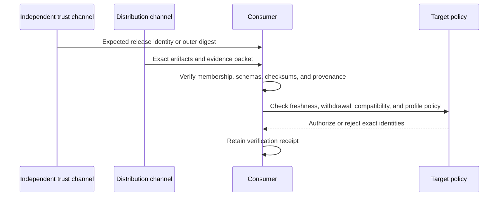

# Supply Chain and Artifact Trust

Atlas supply-chain assurance follows a release from governed sources and
dependencies to packages, deployment material, software bills of materials,
evidence, distribution channels, and consumer verification. The objective is
not merely to produce artifacts. It is to let a consumer decide whether the
exact received set is coherent, expected, current, and authorized for the
target environment.

## Trust Chain

Each edge needs identity continuity. If a lane rebuilds bytes, changes a
manifest, or resolves a mutable channel reference, downstream checksums and
evidence bindings must be regenerated and reverified for the new set.

## Security Claims by Boundary

| Boundary | Direct evidence | Claim boundary |
| --- | --- | --- |
| source and dependency | source revision, lock state, allowed source policy, dependency audit, toolchain identity | inputs were the governed set; not that produced bytes reached the consumer unchanged |
| build | reproducible inputs, builder and environment identity, output digests | outputs are attributable to the recorded build; not external producer authenticity |
| package and deployment | crate/package inventory, chart, values, immutable image or bundle reference | the declared release surface is complete; not target admission or runtime safety |
| composition | SBOM tied to the exact profile or artifact digest | components are declared for that artifact; not absence of all vulnerabilities |
| evidence | scenario, report, policy, audit, and compatibility identities | selected claims were exercised; not claims omitted by the release policy |
| transport integrity | checksum ledger, packet manifest, provenance, and fresh recomputation | received members match the received ledger; not who supplied the complete set |
| consumer authorization | independent expected identity, withdrawal status, compatibility, target policy, and verification receipt | this consumer may deploy these exact bytes in this environment |

## Current Integrity Mechanism

The current release mechanism is an internal SHA-256 checksum ledger with
repository-governed provenance in `keyless-local` mode. It detects member drift
relative to the received ledger and detects disagreement among the packet,
manifest, provenance, checksums, and governed members when the verifier covers
them.

It does not provide:

- a detached cryptographic signature;
- an external signer or certificate identity;
- a transparency-log inclusion or trusted timestamp;
- automatic revocation or withdrawal status; or
- protection when an attacker replaces the entire internally coherent set.

Obtain the expected release identity or outer digest from an independent
trusted channel. A digest copied from the same untrusted packet is not a trust
anchor.

## Artifact and Channel Identity

| Surface | Stable identity | Unsafe shortcut |
| --- | --- | --- |
| crate or package | registry version plus package checksum and release manifest | version text without registry and checksum verification |
| OCI release bundle | immutable manifest digest and packet membership | mutable tag or assumption that the bundle is a runnable container image |
| Helm chart and profile | chart digest, values identity, rendered inventory, and image references | chart version alone |
| dataset release | release, species, assembly, manifest, artifact hashes, and store publication record | directory name or catalog label alone |
| documentation | source revision and deployed-version identity | current website content as evidence for an older release |
| evidence report | report schema, run identity, input hashes, internal status, and packet binding | uploaded file presence or workflow conclusion alone |

The current GHCR release lane publishes compressed release bundles as OCI
artifacts through ORAS. Do not infer runnable image publication from that
channel without a released image manifest and immutable digest evidence.

## Consumer Verification

A verification receipt should retain the expected identity and its source,
resolved channel references, packet and ledger digests, verifier and policy
versions, verification time, findings, withdrawal observation, target profile,
exceptions, and final decision. Store the receipt outside the received packet
or protect it with a separate custody boundary.

## Vulnerability and Withdrawal

Integrity remains valid for vulnerable or withdrawn bytes. A checksum pass
therefore cannot authorize deployment by itself.

When a security concern appears:

1. freeze further promotion and preserve immutable channel references;
2. identify affected source, dependency, package, image or bundle, dataset,
   profile, and consumer identities;
3. record whether the issue requires withdrawal, target rollback, dataset
   pointer reversal, or a new release;
4. publish corrected bytes under a new release identity rather than replacing
   an immutable historical release; and
5. require consumers to observe the withdrawal and verify the replacement
   through the independent trust channel.

Software rollback, deployment rollback, and dataset rollback are separate
decisions. The affected plane determines the safe response.

## Offline and Air-Gapped Use

Offline verification needs the artifacts, manifests, schemas, policy,
checksum ledger, provenance, SBOMs, verifier, and trust expectation locally
available. “No runtime egress” is insufficient when installation or
verification still reaches an external registry.

The current `ops evidence verify` path is repository-relative: it resolves
governed members from the active repository and checks supplied tar membership.
Record that topology accurately. A standalone consumer claim requires a clean
environment that resolves every required member from the received packet or
separately trusted inputs without producer-workspace fallback.

Continue with [Signing and Provenance](../release/signing-and-provenance.md) for
the checksum-ledger details and [Release Evidence](../release/release-evidence.md)
for current packet qualification.
