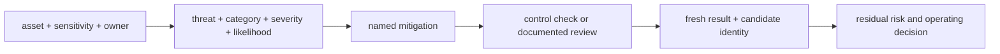
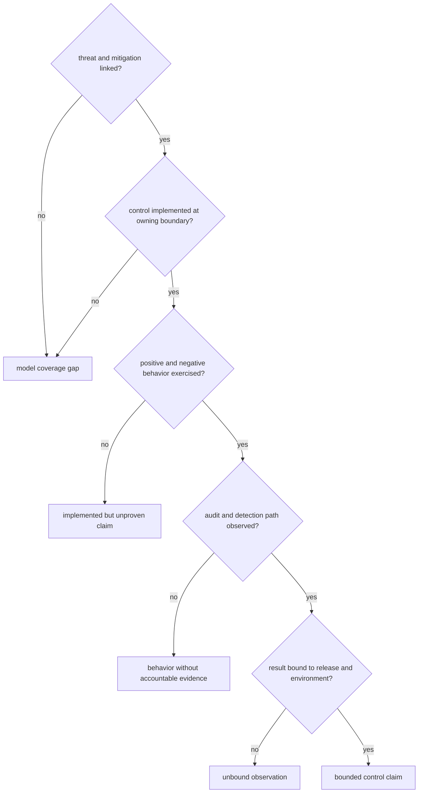

# Threat Model and Control Coverage

The Atlas threat model is a governed relationship among assets, threats,
mitigations, control checks, documentation, and residual risk. It is designed
to make coverage reviewable. It is not a claim that every threat is eliminated
or that every mitigation executed for a particular release.

## Governed Model



| Authority | Role |
| --- | --- |
| `ops/security/threat-model/assets.yaml` | names protected runtime, credential, dataset, evidence, report, and audit assets |
| `ops/security/threat-model/threats.yaml` | describes threat category, severity, likelihood, affected component, mitigations, and residual risk |
| `ops/security/threat-model/mitigations.yaml` | maps mitigation identities to checks, operating guides, and review obligations |
| `ops/security/threat-model/classification-taxonomy.yaml` | governs accepted threat categories and classification vocabulary |
| `ops/security/threat-model/threat-registry.yaml` | records the model registry and change authority |
| `ops/security/compliance/controls.yaml` | defines access, audit, privacy, logging, provenance, network, and observability controls |
| `ops/security/compliance/matrix.yaml` | maps controls to expected evidence locations |

Evidence paths in the compliance matrix identify what should support a
control. Their presence does not prove freshness, applicability, or passing
status. Verify the evidence content and bind it to the candidate under review.

## Current Threat Families

| Threat family | Protected concern | Evidence needed beyond registry validity |
| --- | --- | --- |
| runtime spoofing and unauthenticated access | trusted caller boundary and default-deny access | configured identity mode, allowed and denied route checks, ingress boundary, and audit attribution |
| secret disclosure | credentials in logs, reports, configuration, and evidence | redaction tests, evidence scanning, secret-version handling, and incident detection |
| artifact or evidence tampering | release and review bytes after production | recomputed digests, provenance agreement, consumer verification, and independent trust expectation |
| dependency outage | bounded readiness and serving behavior | failure injection, protected-route behavior, recovery timing, and residual-state proof |
| audit tamper, bypass, or loss | accountable security and operator actions | governed fields, sink continuity, retention, verification, gap detection, and checksum binding |

The registry records residual risk for each threat. Preserve that risk in the
acceptance decision instead of translating a mapped mitigation into “risk
removed.”

## Coverage Is a Chain



Classify a missing link precisely. A missing mitigation is a model gap. A
missing implementation is a control gap. A missing live exercise is an
assurance gap. A missing audit record is a detection gap. A missing candidate
identity is an evidence-binding gap. These failures have different owners and
must not collapse into a generic security status.

## Validate the Model

The focused maintainer command is:

```bash
cargo run --locked -p bijux-atlas-dev -- \
  security threats verify --format json
```

The command validates the governed threat-model contract. Its success does not
execute deployment reachability, runtime authorization, dependency failure, or
consumer release verification. Retain the source revision, model file hashes,
command version, findings, and report status with any review that cites it.

## Change Triggers

Review threat and control coverage when a change introduces or alters:

- a route, authentication mode, principal, role, action, or resource;
- a dataset, cache, store, registry, or external dependency;
- a secret source, transport, retention rule, or redaction boundary;
- a Kubernetes Service, Ingress, NetworkPolicy, service account, RBAC rule,
  volume, or security context;
- an artifact channel, dependency source, image, SBOM, checksum, provenance,
  or verification mechanism; or
- an audit field, sink, rotation, retention, alert, drill, or incident path.

Update the affected asset, threat, mitigation, control, and evidence mappings
together. Adding a control without a threat leaves its rationale unclear;
adding a threat without executable or governed mitigation leaves the risk open.

## Acceptance Record

For every accepted threat boundary, retain the asset and threat IDs,
mitigation and control IDs, implementation revision, executed evidence,
environment and release identity, exceptions, residual risk, decision owner,
and review time. Reopen the decision when any of those identities changes.

Continue with [Security Operations](../kubernetes/security-operations.md) for
deployment enforcement and [Release Evidence](../release/release-evidence.md)
for candidate binding.
