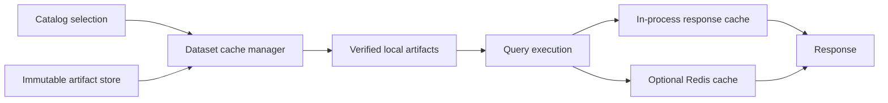
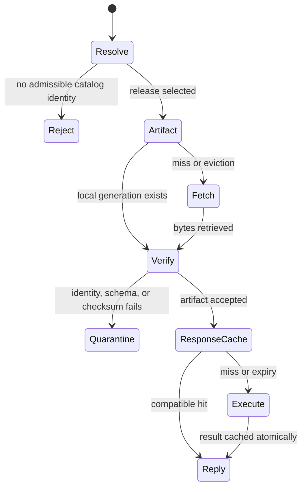
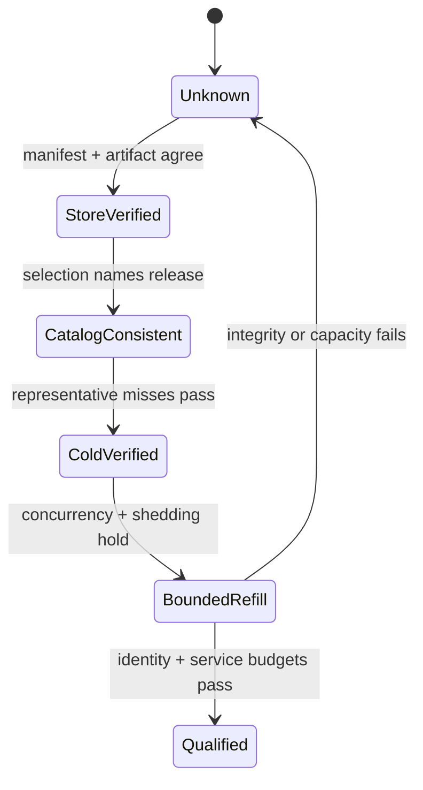

# Cache and store operations

Atlas separates immutable serving truth from disposable acceleration. The
catalog selects a release, the store owns its bytes, the dataset cache retains
verified local artifacts, and response caches reuse query results. Cache loss
may change latency and backend load; it must never change dataset meaning.

## Authority and acceleration

```mermaid
flowchart LR
    Catalog[Catalog selection] --> Manager[Dataset cache manager]
    Store[Immutable artifact store] --> Manager
    Manager --> Local[Verified local artifacts]
    Local --> Query[Query execution]
    Query --> Memory[In-process response cache]
    Query --> Redis[Optional Redis cache]
    Memory --> Response
    Redis --> Response
```

| Surface | Retains | Authority when lost |
| --- | --- | --- |
| catalog cache | Generation and freshness metadata | Refresh from governed catalog or reject selection |
| dataset cache | Manifest, artifact hash, indexes, and local database | Re-fetch and verify from store |
| in-process response cache | Normalized query, ETag, response, and TTL | Recompute against selected dataset |
| Redis response cache | Dataset hash, gene/query identity, response, and TTL | Bypass within capacity policy |
| serving store | Immutable objects and manifests | Restore the verified release set |

A reusable entry is keyed by every input that can change the result: dataset
identity, artifact hash, normalized query, pagination or region, output
contract, and relevant policy. A fast response with incomplete identity is a
correctness failure, not a cache hit.

## Read path

```mermaid
stateDiagram-v2
    [*] --> Resolve
    Resolve --> Reject: no admissible catalog identity
    Resolve --> Artifact: release selected
    Artifact --> Verify: local generation exists
    Artifact --> Fetch: miss or eviction
    Fetch --> Verify: bytes retrieved
    Verify --> Quarantine: identity, schema, or checksum fails
    Verify --> ResponseCache: artifact accepted
    ResponseCache --> Reply: compatible hit
    ResponseCache --> Execute: miss or expiry
    Execute --> Reply: result cached atomically
```

The server owns this composition. It constructs local, HTTP, S3-like, or
federated store adapters behind the runtime store port, owns artifact and
response caches, and executes queries. The runtime crate supplies policy and
shared semantics; it is not a separate cache service.

## Diagnose by authority

| Finding | Interpretation | Safe response |
| --- | --- | --- |
| store unavailable | Released bytes cannot currently be read | Reject or use explicitly qualified cached-only service |
| checksum mismatch | The named object cannot establish released truth | Quarantine and restore a coherent release |
| catalog names absent or different bytes | Selection and byte authority disagree | Stop promotion and reconcile identities |
| cache identity absent or mismatched | Acceleration is untrusted | Isolate the entry and prove the cold result |
| cache empty, store verified | Correctness may hold with reduced capacity | Bound concurrency and qualify refill behavior |
| credentials or key generation unavailable | Governed access to bytes is unavailable | Restore matching access custody; never bypass policy |

Run one authority-changing operation at a time. Simultaneous rollout, catalog
promotion, and cache eviction destroys the comparison needed to identify the
failing boundary.

## Recovery sequence

1. Preserve release, catalog, store, cache, request, and signal-window identity.
2. Stop promotion and isolate ambiguous state.
3. Verify catalog selection, manifest, artifact hashes, and serving credentials.
4. Remove only cache generations that cannot be trusted.
5. Exercise representative cold queries with bounded traffic.
6. Refill while observing store latency, errors, concurrency, queues, and
   cheap-route survival.
7. Restore normal traffic only after correctness and operating budgets hold for
   the required window.

```mermaid
stateDiagram-v2
    [*] --> Unknown
    Unknown --> StoreVerified: manifest + artifact agree
    StoreVerified --> CatalogConsistent: selection names release
    CatalogConsistent --> ColdVerified: representative misses pass
    ColdVerified --> BoundedRefill: concurrency + shedding hold
    BoundedRefill --> Qualified: identity + service budgets pass
    BoundedRefill --> Unknown: integrity or capacity fails
```

## Contain miss storms

Cache loss transfers demand to disk and object storage. Before rewarming, set
an offered-load ceiling, store-concurrency budget, retry limit, and abort
threshold. Preserve offered rate, hits, misses, store latency, queue depth,
rejection class, and cheap-route behavior.

The repository cache policy includes a 60% minimum hit ratio and an 8 GiB disk
ceiling. Those are governed inputs, not universal recovery targets. Scenario
and environment policy determine whether they fit the restored traffic mix.

## Local stack warning

The checked-in Redis and MinIO manifests are end-to-end fixtures, not durable
deployment recipes. Redis persistence is disabled. MinIO uses development
`minioadmin` credentials and no persistent volume in that manifest. Component
YAML uses tags while the generated version manifest carries reviewed pins.

Production storage needs independent credentials, encryption, replication,
retention, backup, restore, and resolved-digest evidence. Never promote the
fixture settings into a durable environment.

Retain cache incident ratios, entry identities, evictions, store pressure, and
recovery time. Store incidents also require release, catalog, artifact hashes,
backend error class, isolation, and restore verification. Continue with
[Failure Injection Under Load](../load/failure-injection-load.md) and
[Backup and Recovery](../release/backup-and-recovery.md).
