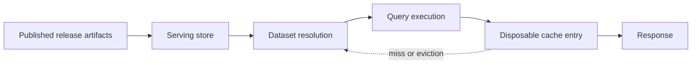
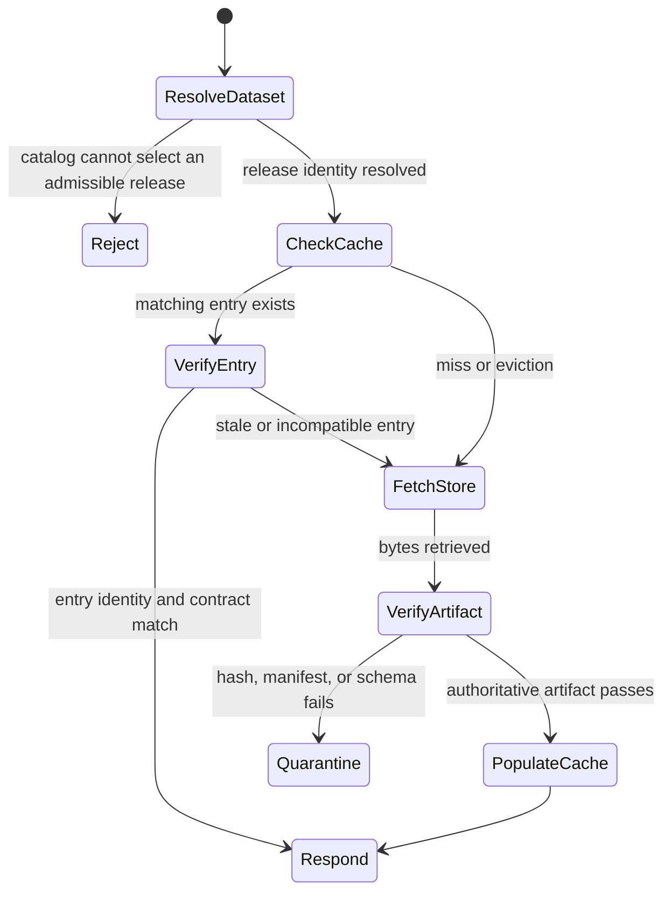
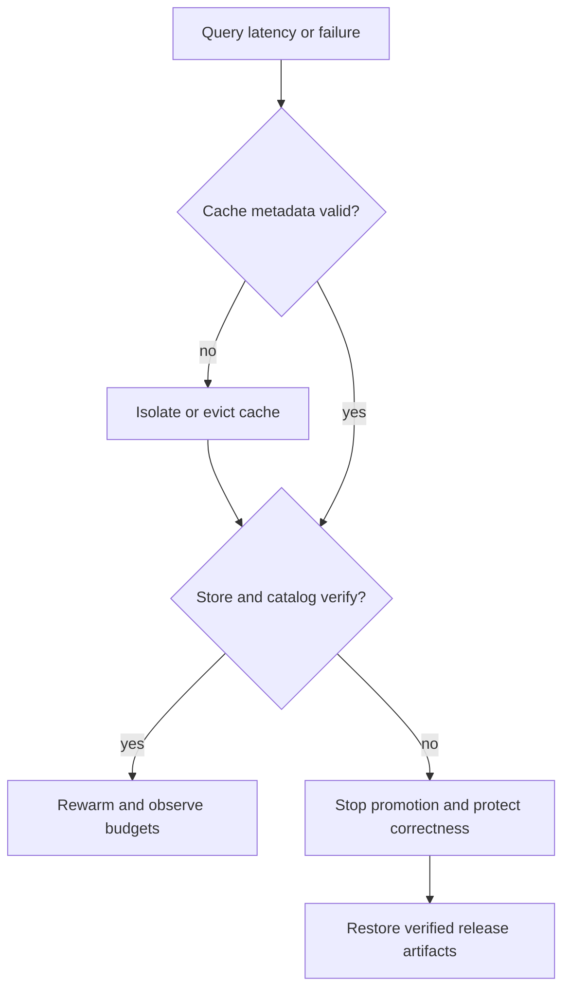
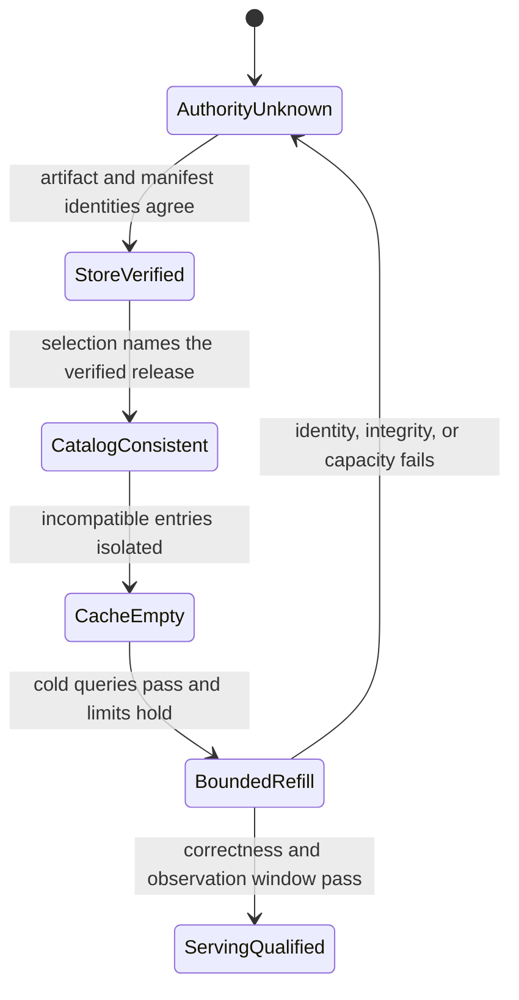
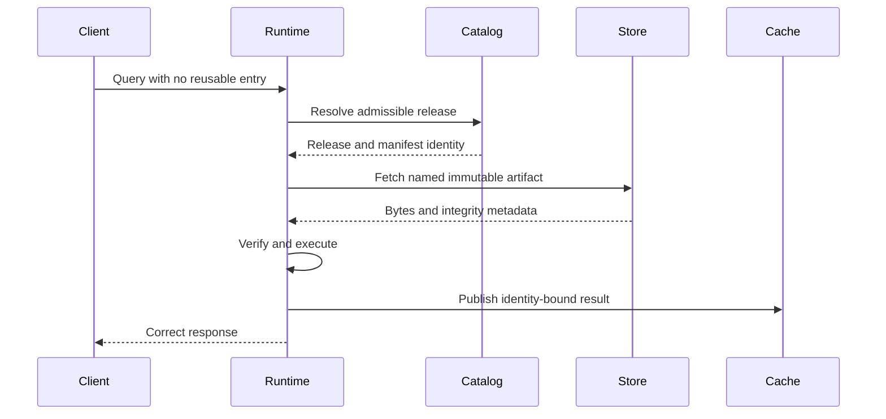
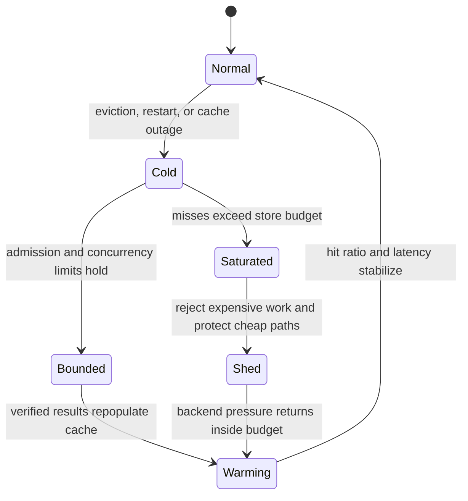

# Cache and Store Operations

Atlas separates immutable serving truth from disposable acceleration state. The
store owns released artifacts and catalog-backed dataset identity. The cache
may reduce latency, but losing it must not redefine which data exists or make a
partial result authoritative.

## Data Authority

```mermaid
flowchart LR
    Release["Published release artifacts"] --> Store["Serving store"]
    Store --> Resolve["Dataset resolution"]
    Resolve --> Query["Query execution"]
    Query --> Cache["Disposable cache entry"]
    Cache --> Response["Response"]
    Cache -. miss or eviction .-> Resolve
```

| Surface | Authority | Loss mode | Recovery requirement |
| --- | --- | --- | --- |
| Serving store | Released artifact bytes and catalog identity | Availability or correctness incident | Verify integrity and restore the governed release set. |
| Runtime cache | Recomputable acceleration state | Latency and dependency pressure | Rebuild from verified store data without changing results. |

## Read-Path Authority

```mermaid
stateDiagram-v2
    [*] --> ResolveDataset
    ResolveDataset --> Reject: catalog cannot select an admissible release
    ResolveDataset --> CheckCache: release identity resolved
    CheckCache --> VerifyEntry: matching entry exists
    CheckCache --> FetchStore: miss or eviction
    VerifyEntry --> Respond: entry identity and contract match
    VerifyEntry --> FetchStore: stale or incompatible entry
    FetchStore --> VerifyArtifact: bytes retrieved
    VerifyArtifact --> Quarantine: hash, manifest, or schema fails
    VerifyArtifact --> PopulateCache: authoritative artifact passes
    PopulateCache --> Respond
```

Cache lookup happens only after dataset resolution, and a hit is usable only
when its release and output-contract identity match the request. Store bytes
become servable only after manifest, checksum, and schema verification. A fast
response from an unbound entry is a correctness failure, not a cache success.

## Checked-In Local Dependencies

The stack manifests under `ops/stack/` are local end-to-end fixtures, not
production persistence recipes:

- Redis runs one replica in `atlas-e2e` with snapshots and append-only logging
  disabled. Its state is intentionally disposable.
- MinIO runs one replica in `atlas-e2e`, uses the development
  `minioadmin` credentials, and declares no persistent volume in that manifest.
- The component YAML uses image tags; the generated stack version manifest
  carries the reviewed digest pins. A run must record the resolved digest.

Never deploy those credentials or persistence settings as a durable environment.
Production storage must supply independent credential, encryption, replication,
retention, backup, and restore controls.

## Failure Classification

```mermaid
flowchart TD
    Symptom["Query latency or failure"] --> CacheHealthy{"Cache metadata valid?"}
    CacheHealthy -->|no| Evict["Isolate or evict cache"]
    Evict --> StoreValid{"Store and catalog verify?"}
    CacheHealthy -->|yes| StoreValid
    StoreValid -->|yes| Rewarm["Rewarm and observe budgets"]
    StoreValid -->|no| Protect["Stop promotion and protect correctness"]
    Protect --> Restore["Restore verified release artifacts"]
```

A query crash must not corrupt cache metadata. A cold cache is acceptable only
when store-backed correctness holds and the performance impact stays within the
declared budget. The repository cache policy sets a 60% minimum hit ratio and
an 8 GiB disk ceiling; scenario-specific load thresholds still govern latency
and errors.

## Cache Identity and Invalidation

A reusable entry must be scoped by every input that can change the result,
including dataset release, query shape, pagination or region selection, output
contract, and relevant policy. Entries from one immutable release must never
answer for another release merely because the user query text is identical.

Invalidate or isolate cache state when:

- the release or catalog pointer changes;
- integrity, serialization, or schema identity is uncertain;
- a partial write or process crash may have exposed incomplete metadata;
- cache policy, result limits, or authorization-relevant inputs change; or
- an incident cannot distinguish stale acceleration state from store truth.

Eviction is a performance event when the store remains verified. It is not a
repair for uncertain store or catalog integrity.

## Recovery Sequence

1. Preserve release, catalog, cache, and store identities plus the first
   failing request and signal window.
2. Stop promotion and isolate ambiguous state.
3. Verify the catalog pointer, manifest, and artifact hashes at the store
   boundary.
4. Remove only cache state that cannot be trusted or safely reused.
5. Rewarm with bounded traffic while observing store pressure, errors, latency,
   and cheap-path survival.
6. Restore normal capacity only after query correctness and operating budgets
   hold through the observation window.

## Recovery Authority Handoff

The store remains the byte authority, the catalog remains the selection
authority, and the cache remains disposable throughout recovery. Service
authority returns only when those roles agree on one release identity and the
cold path proves that the cache is not masking a broken dependency.

```mermaid
stateDiagram-v2
    [*] --> AuthorityUnknown
    AuthorityUnknown --> StoreVerified: artifact and manifest identities agree
    StoreVerified --> CatalogConsistent: selection names the verified release
    CatalogConsistent --> CacheEmpty: incompatible entries isolated
    CacheEmpty --> BoundedRefill: cold queries pass and limits hold
    BoundedRefill --> ServingQualified: correctness and observation window pass
    BoundedRefill --> AuthorityUnknown: identity, integrity, or capacity fails
```

| Finding | Authoritative interpretation | Required action before serving |
| --- | --- | --- |
| store unavailable | released bytes cannot currently be read | reject or use an explicitly qualified cached-only mode; do not recast absence as a cache miss |
| artifact checksum mismatch | the named object cannot establish released truth | quarantine the object and restore a coherent release set |
| catalog names missing or different bytes | selection and byte authority disagree | stop promotion, reconcile the catalog to verified immutable artifacts, and repeat resolution checks |
| cache entry identity is absent or mismatched | acceleration state is untrusted | isolate or evict the entry and prove the cold result from the verified release |
| cache is empty but the store verifies | correctness may hold while capacity is degraded | bound offered load and refill concurrency, then qualify latency, errors, and cheap-path survival |
| store credential or key generation is unavailable | the bytes may exist but are not recoverable through the governed access path | restore the matching access generation and record its custody; do not bypass authentication or encryption |

Record the handoff as a lineage, not a collection of green checks: selected
release and manifest, store object identity, catalog generation, isolated cache
generation, first verified cold result, refill limits, observation window, and
the person or controller that accepted serving authority. For a durable-state
restore, the selected recovery point and restored access generation come from
[Backup and Recovery](../release/backup-and-recovery.md). For a production
target, authority transfer also remains subject to
[Production Qualification](../kubernetes/production-qualification.md).

## Operation Boundaries

| Operation | May change | Must remain invariant |
| --- | --- | --- |
| cache eviction | derived local or Redis entries | store bytes, catalog selection, and query semantics |
| cache rewarm | cache population and store request volume | artifact identity and response correctness |
| catalog refresh | discoverable selection and freshness metadata | immutable artifacts already named by hash |
| dataset promotion | active catalog pointer | previously published immutable release bytes |
| runtime rollout | process, image, configuration, and local cache | selected dataset unless the rollout explicitly includes data promotion |
| store recovery | physical durable state at a named recovery point | verified manifest-to-artifact binding |

Run one authority-changing operation at a time during diagnosis. Simultaneous
runtime rollout, catalog promotion, and cache eviction removes the stable
comparison needed to identify which boundary changed the result.

## Capacity Coupling

A cache outage transfers demand to local disk and the object store. Preserve
offered query rate, hit and miss rates, store concurrency and latency, local
disk pressure, rejection behavior, and cheap-route survival. Recovery is not
complete merely because the cache reconnects: the backend pressure accumulated
during misses must drain without violating correctness or overload policy.

## Qualify the Cold Path

Warm-cache success can hide an unusable store path. Qualify the cold path
before relying on cache loss as a safe degradation mode, and repeat that proof
when release identity, store topology, cache policy, or capacity changes.

```mermaid
sequenceDiagram
    participant Client
    participant Runtime
    participant Catalog
    participant Store
    participant Cache
    Client->>Runtime: Query with no reusable entry
    Runtime->>Catalog: Resolve admissible release
    Catalog-->>Runtime: Release and manifest identity
    Runtime->>Store: Fetch named immutable artifact
    Store-->>Runtime: Bytes and integrity metadata
    Runtime->>Runtime: Verify and execute
    Runtime->>Cache: Publish identity-bound result
    Runtime-->>Client: Correct response
```

| Cold-path proof | Evidence to retain | Unsafe result |
| --- | --- | --- |
| resolution | catalog generation, selected release, and manifest identity | an unqualified default or stale pointer selects data |
| retrieval | object key, store result, latency, retries, and consistency behavior | cache miss becomes ambiguous absence or unbounded retry |
| verification | expected and observed hashes plus schema and contract result | bytes are served before integrity is established |
| execution | correctness, resource use, and latency for representative queries | valid bytes exceed the declared service or resource budget |
| population | entry key, release identity, publication outcome, and concurrency behavior | partial or cross-release state becomes reusable |
| repeated access | hit result matches the verified cold result | acceleration changes response meaning |

A cold-path failure may justify bounded rejection or cached-only service when
that policy is declared. It never justifies treating unverified cached content
as authoritative. Conversely, clearing the cache cannot repair missing or
inconsistent store state.

## Miss-Storm Containment

```mermaid
stateDiagram-v2
    [*] --> Normal
    Normal --> Cold: eviction, restart, or cache outage
    Cold --> Bounded: admission and concurrency limits hold
    Cold --> Saturated: misses exceed store budget
    Bounded --> Warming: verified results repopulate cache
    Saturated --> Shed: reject expensive work and protect cheap paths
    Shed --> Warming: backend pressure returns inside budget
    Warming --> Normal: hit ratio and latency stabilize
```

Before rewarming, set an explicit offered-load ceiling, store concurrency
budget, retry limit, and abort threshold. Rewarm only entries derived from a
verified release identity. Preserve a cheap request path so operators can
distinguish total process failure from overload on expensive queries.

| Signal | Continue warming when | Stop or shed when |
| --- | --- | --- |
| store latency and errors | stable inside the scenario budget | latency climbs with sustained errors or timeouts |
| cache hit ratio | increases without correctness findings | remains flat while backend pressure grows |
| queue and concurrency | drain remains bounded | work accumulates faster than completion |
| cheap-route behavior | remains responsive and correct | cheap work is starved by expensive misses |
| artifact verification | every populated entry binds to verified bytes | any hash, schema, or release identity is uncertain |

The repository's 60% hit-ratio threshold is a governed cache-policy input, not
a universal recovery target. The selected scenario and environment determine
whether that threshold is meaningful for the traffic mix being restored.

## Evidence

For cache incidents, retain hit and miss ratios, evictions, entry identity,
cache size, store requests, error rates, and recovery time. For store incidents,
also retain release and dataset identity, catalog and artifact checksums,
backend error class, isolation action, and restore verification.

Do not classify an empty cache as data loss or a missing artifact as a cache
miss. See [Failure Injection Under Load](../load/failure-injection-load.md) for
degraded-service proof and [Backup and Recovery](../release/backup-and-recovery.md)
for durable-state restoration.
