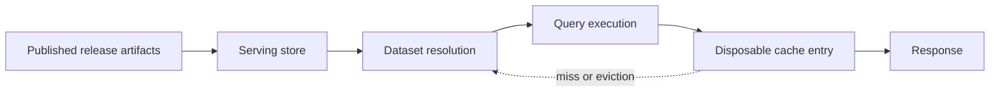
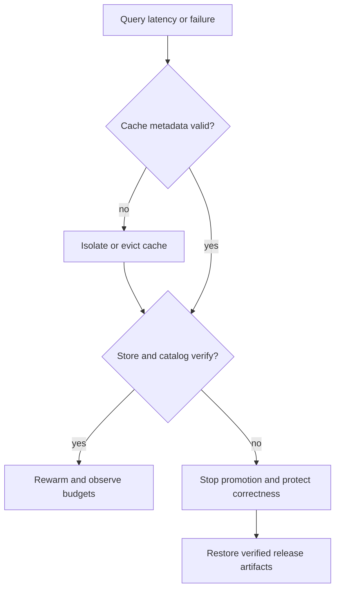

# Cache and Store Operations

Atlas separates immutable serving truth from disposable acceleration state. The
store owns released artifacts and catalog-backed dataset identity. The cache
may reduce latency, but losing it must not redefine which data exists or make a
partial result authoritative.

## Data Authority

```mermaid
flowchart LR
    Release["Published release artifacts"] --> Store["Serving store"]
    Store --> Resolve["Dataset resolution"]
    Resolve --> Query["Query execution"]
    Query --> Cache["Disposable cache entry"]
    Cache --> Response["Response"]
    Cache -. miss or eviction .-> Resolve
```

| Surface | Authority | Loss mode | Recovery requirement |
| --- | --- | --- | --- |
| Serving store | Released artifact bytes and catalog identity | Availability or correctness incident | Verify integrity and restore the governed release set. |
| Runtime cache | Recomputable acceleration state | Latency and dependency pressure | Rebuild from verified store data without changing results. |

## Checked-In Local Dependencies

The stack manifests under `ops/stack/` are local end-to-end fixtures, not
production persistence recipes:

- Redis runs one replica in `atlas-e2e` with snapshots and append-only logging
  disabled. Its state is intentionally disposable.
- MinIO runs one replica in `atlas-e2e`, uses the development
  `minioadmin` credentials, and declares no persistent volume in that manifest.
- The component YAML uses image tags; the generated stack version manifest
  carries the reviewed digest pins. A run must record the resolved digest.

Never deploy those credentials or persistence settings as a durable environment.
Production storage must supply independent credential, encryption, replication,
retention, backup, and restore controls.

## Failure Classification

```mermaid
flowchart TD
    Symptom["Query latency or failure"] --> CacheHealthy{"Cache metadata valid?"}
    CacheHealthy -->|no| Evict["Isolate or evict cache"]
    Evict --> StoreValid{"Store and catalog verify?"}
    CacheHealthy -->|yes| StoreValid
    StoreValid -->|yes| Rewarm["Rewarm and observe budgets"]
    StoreValid -->|no| Protect["Stop promotion and protect correctness"]
    Protect --> Restore["Restore verified release artifacts"]
```

A query crash must not corrupt cache metadata. A cold cache is acceptable only
when store-backed correctness holds and the performance impact stays within the
declared budget. The repository cache policy sets a 60% minimum hit ratio and
an 8 GiB disk ceiling; scenario-specific load thresholds still govern latency
and errors.

## Evidence

For cache incidents, retain hit and miss ratios, evictions, entry identity,
cache size, store requests, error rates, and recovery time. For store incidents,
also retain release and dataset identity, catalog and artifact checksums,
backend error class, isolation action, and restore verification.

Do not classify an empty cache as data loss or a missing artifact as a cache
miss. See [Failure Injection Under Load](../load/failure-injection-load.md) for
degraded-service proof and [Backup and Recovery](../release/backup-and-recovery.md)
for durable-state restoration.
