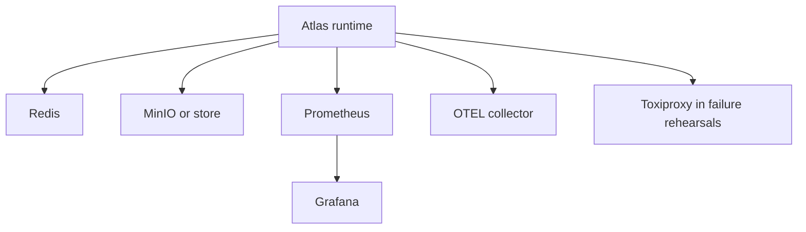

# Dependency Graph

Operators should reason about Atlas dependencies as an explicit graph rather
than as a flat list of sidecars and services.

The dependency graph is the shortest way to understand what the runtime truly
needs, what is optional, and where observability or failure-rehearsal components
attach. It is a review tool as much as a design tool: when the graph changes,
operator assumptions change too.

## Source of Truth

- `ops/stack/generated/dependency-graph.json`
- `ops/stack/service-dependency-contract.json`

## How to Read the Graph

- node entries represent concrete stack components or profile-owned surfaces
- critical dependencies are required for the profile to be viable
- optional dependencies enrich observability or testing but do not define the
  minimum serving path
- a graph change should trigger review when it widens the critical path or
  changes failure isolation
