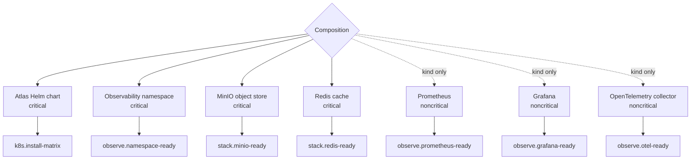

# Dependency Graph

The dependency graph answers two questions: which services must exist for a
declared composition, and which health signal proves each dependency is usable.
It is generated from the service dependency contract and stack composition,
not inferred from every configuration file under `ops/stack/`.

## Declared Graph

```mermaid
flowchart TD
    Profile{"Composition"}
    Profile --> Chart["Atlas Helm chart<br/>critical"]
    Profile --> Namespace["Observability namespace<br/>critical"]
    Profile --> MinIO["MinIO object store<br/>critical"]
    Profile --> Redis["Redis cache<br/>critical"]
    Profile -. kind only .-> Prometheus["Prometheus<br/>noncritical"]
    Profile -. kind only .-> Grafana["Grafana<br/>noncritical"]
    Profile -. kind only .-> OTel["OpenTelemetry collector<br/>noncritical"]
    Chart --> Install["k8s.install-matrix"]
    Namespace --> NamespaceReady["observe.namespace-ready"]
    MinIO --> MinIOReady["stack.minio-ready"]
    Redis --> RedisReady["stack.redis-ready"]
    Prometheus --> PromReady["observe.prometheus-ready"]
    Grafana --> GrafanaReady["observe.grafana-ready"]
    OTel --> OTelReady["observe.otel-ready"]
```

## Criticality Semantics

| Class | Admission rule | Failure interpretation |
| --- | --- | --- |
| Critical | Required health surface must pass before the composition is accepted. | The stack is unavailable or incomplete for that profile. |
| Noncritical | Component may enrich the composition without defining the serving path. | Telemetry or visualization is degraded; application health must be judged separately. |

Noncritical does not mean ignorable. A missing collector or Prometheus instance
can invalidate a rollout, incident, or SLO claim even while queries succeed.
Criticality describes stack viability; the evidence required for a particular
decision may be stricter.

## Profile Membership

`ci` and `local` contain four critical components: chart, namespace, MinIO, and
Redis. `kind` contains the same critical set plus Prometheus, Grafana, and the
OpenTelemetry collector. The generated graph does not define `dev`,
`developer`, `minimal`, `perf`, or `small`; those remain profile-policy entries
until a composition graph explicitly binds their components.

Toxiproxy has configuration and a pinned image for controlled failure work, but
it is absent from the current service dependency contract and generated graph.
Do not present it as a required stack service. Evidence from a Toxiproxy drill
must name the separately assembled component and fault configuration.

## Reviewing a Graph Change

Review every added or removed node for profile membership, criticality, health
surface, startup ordering, credentials, network access, failure isolation, and
offline availability. Then regenerate `ops/stack/generated/dependency-graph.json`
and confirm it agrees with `stack.toml` and the dependency contract.

A missing edge can hide a real dependency. An extra edge can make an optional
service look mandatory. Either mismatch is a release-evidence defect.
