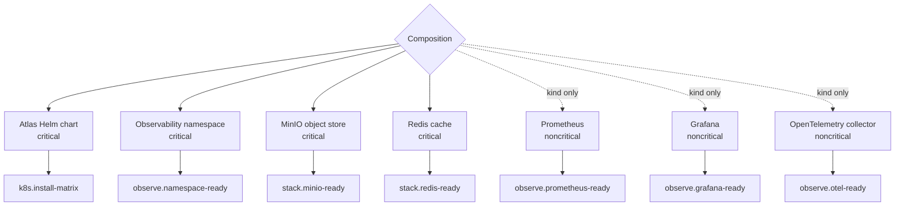
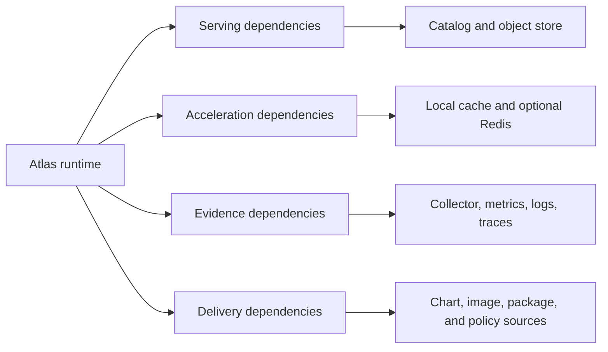
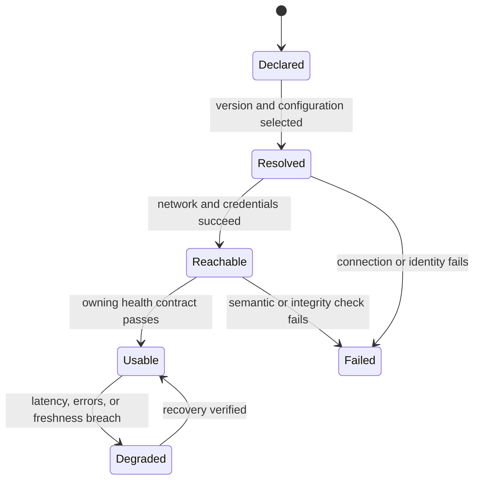

# Dependency Graph

The dependency graph answers two questions: which services must exist for a
declared composition, and which health signal proves each dependency is usable.
It is generated from the service dependency contract and stack composition,
not inferred from every configuration file under `ops/stack/`.

## Declared Graph

```mermaid
flowchart TD
    Profile{"Composition"}
    Profile --> Chart["Atlas Helm chart<br/>critical"]
    Profile --> Namespace["Observability namespace<br/>critical"]
    Profile --> MinIO["MinIO object store<br/>critical"]
    Profile --> Redis["Redis cache<br/>critical"]
    Profile -. kind only .-> Prometheus["Prometheus<br/>noncritical"]
    Profile -. kind only .-> Grafana["Grafana<br/>noncritical"]
    Profile -. kind only .-> OTel["OpenTelemetry collector<br/>noncritical"]
    Chart --> Install["k8s.install-matrix"]
    Namespace --> NamespaceReady["observe.namespace-ready"]
    MinIO --> MinIOReady["stack.minio-ready"]
    Redis --> RedisReady["stack.redis-ready"]
    Prometheus --> PromReady["observe.prometheus-ready"]
    Grafana --> GrafanaReady["observe.grafana-ready"]
    OTel --> OTelReady["observe.otel-ready"]
```

## Criticality Semantics

| Class | Admission rule | Failure interpretation |
| --- | --- | --- |
| Critical | Required health surface must pass before the composition is accepted. | The stack is unavailable or incomplete for that profile. |
| Noncritical | Component may enrich the composition without defining the serving path. | Telemetry or visualization is degraded; application health must be judged separately. |

Noncritical does not mean ignorable. A missing collector or Prometheus instance
can invalidate a rollout, incident, or SLO claim even while queries succeed.
Criticality describes stack viability; the evidence required for a particular
decision may be stricter.

## Dependency Roles

```mermaid
flowchart LR
    Runtime[Atlas runtime] --> Serving[Serving dependencies]
    Runtime --> Acceleration[Acceleration dependencies]
    Runtime --> Evidence[Evidence dependencies]
    Runtime --> Delivery[Delivery dependencies]
    Serving --> Catalog[Catalog and object store]
    Acceleration --> Cache[Local cache and optional Redis]
    Evidence --> Telemetry[Collector, metrics, logs, traces]
    Delivery --> Registry[Chart, image, package, and policy sources]
```

The declared stack graph is a composition graph, not the whole dependency
universe. A service can be absent from startup ordering yet remain necessary
for release retrieval, credential resolution, backup recovery, or promotion
evidence. Record those external dependencies in the environment's operating
inventory instead of adding false runtime edges to the generated graph.

| Role | Failure policy |
| --- | --- |
| serving authority | fail closed when correct dataset identity or immutable bytes cannot be established |
| acceleration | bypass or shed within policy; never substitute different data |
| operational evidence | continue serving only within the environment's telemetry-degradation policy; hold claims requiring missing evidence |
| delivery and recovery | block new promotion or recovery when immutable artifact or trust identity cannot be resolved |

## Dependency States

```mermaid
stateDiagram-v2
    [*] --> Declared
    Declared --> Resolved: version and configuration selected
    Resolved --> Reachable: network and credentials succeed
    Reachable --> Usable: owning health contract passes
    Usable --> Degraded: latency, errors, or freshness breach
    Degraded --> Usable: recovery verified
    Reachable --> Failed: semantic or integrity check fails
    Resolved --> Failed: connection or identity fails
```

Reachability is weaker than usability. A TCP connection does not establish
that the correct bucket, catalog, cache namespace, metrics source, or API
version is available. Health surfaces should test the narrowest semantics
needed by the dependent runtime without performing destructive work.

## Retain a Dependency Receipt

For every selected edge, retain enough identity to distinguish the intended
dependency from a reachable substitute:

| Receipt field | Why it matters |
| --- | --- |
| logical role. | Separates serving authority, acceleration, evidence, and delivery dependencies. |
| endpoint and namespace. | Identifies the actual network and tenancy boundary used by the profile. |
| version or digest. | Prevents a healthy but incompatible service from satisfying the edge. |
| credential identity and scope. | Proves least-privilege access without retaining secret values. |
| semantic health result. | Demonstrates the required bucket, catalog, cache namespace, or telemetry path. |
| timeout and retry owner. | Makes the caller deadline and amplification budget reviewable. |
| degradation and recovery result. | Shows what happened when the edge failed and when it returned. |

Bind the receipt to the profile, release, cluster, and observation window.
Reusing a health result after an endpoint, credential, version, or policy
change creates a new unverified edge even when the dependency name is the same.

## Failure Ownership

| Failure | Primary owner | Cross-domain impact |
| --- | --- | --- |
| selected version or digest cannot resolve | stack and release inputs | installation and reproducibility |
| credentials or network path fail | deployment and security profile | readiness and incident response |
| object store returns missing or inconsistent artifact | store and release identity | correctness, readiness, and recovery |
| cache is unavailable | runtime cache policy | latency, backend load, and overload |
| collector or metrics backend is unavailable | observability pipeline | promotion and diagnosis confidence |

## Profile Membership

`ci` and `local` contain four critical components: chart, namespace, MinIO, and
Redis. `kind` contains the same critical set plus Prometheus, Grafana, and the
OpenTelemetry collector. The generated graph does not define `dev`,
`developer`, `minimal`, `perf`, or `small`; those remain profile-policy entries
until a composition graph explicitly binds their components.

Toxiproxy has configuration and a pinned image for controlled failure work, but
it is absent from the current service dependency contract and generated graph.
Do not present it as a required stack service. Evidence from a Toxiproxy drill
must name the separately assembled component and fault configuration.

## Reviewing a Graph Change

Review every added or removed node for profile membership, criticality, health
surface, startup ordering, credentials, network access, failure isolation, and
offline availability. Then regenerate `ops/stack/generated/dependency-graph.json`
and confirm it agrees with `stack.toml` and the dependency contract.

A missing edge can hide a real dependency. An extra edge can make an optional
service look mandatory. Either mismatch is a release-evidence defect.

## Failure-Budget Review

For every edge, define connection and operation timeouts, retry ownership,
circuit-breaking or shedding behavior, maximum queueing, and the signal that
declares recovery. Nested retries across runtime, proxy, and dependency can
multiply traffic and extend failure beyond the caller's deadline; one layer
must own the retry budget.

Test the graph in both directions. Dependency loss must produce the declared
runtime behavior, and dependency recovery must restore service without stale
identity, retry storms, or an unbounded cache refill. A health check that only
opens a socket cannot prove either property.
