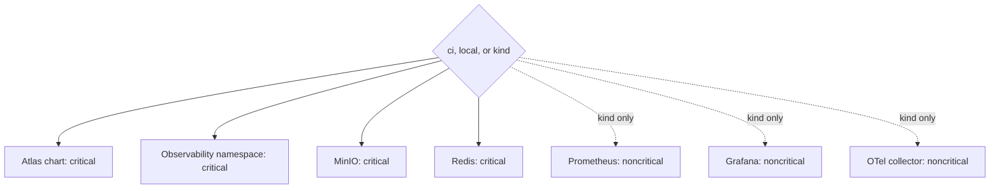
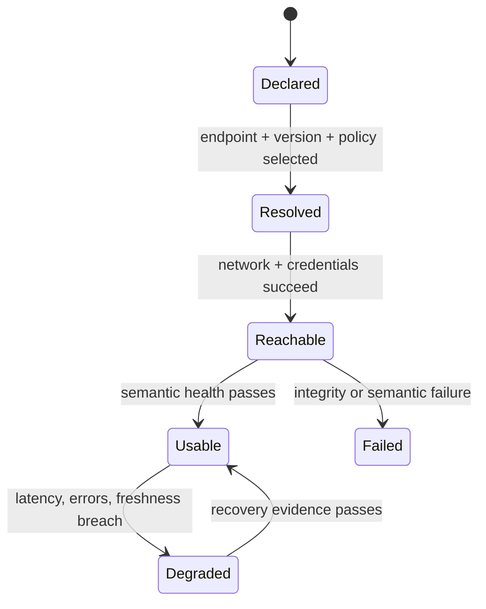

# Dependency graph

The generated dependency graph records which services belong to a checked-in
composition and which health surface evaluates each one. It is generated from
the service dependency contract and `stack.toml`; it is not inferred from every
configuration file under `ops/stack/`.

## Declared compositions

```mermaid
flowchart TD
    Profile{ci, local, or kind}
    Profile --> Chart[Atlas chart: critical]
    Profile --> Namespace[Observability namespace: critical]
    Profile --> MinIO[MinIO: critical]
    Profile --> Redis[Redis: critical]
    Profile -. kind only .-> Prometheus[Prometheus: noncritical]
    Profile -. kind only .-> Grafana[Grafana: noncritical]
    Profile -. kind only .-> OTel[OTel collector: noncritical]
```

| Class | Composition meaning | Decision caveat |
| --- | --- | --- |
| critical | Its selected health surface must pass before composition acceptance | Application correctness may require stronger semantic checks |
| noncritical | Serving may continue without the component | A missing evidence service can still block promotion or incident closure |

Redis is critical to the declared `ci`, `local`, and `kind` compositions because
those environments promise to assemble it. Redis response data remains
non-authoritative to Atlas correctness. An environment that intentionally
omits Redis needs a different composition identity and cold-path capacity proof.

## Dependency roles

| Role | Failure policy |
| --- | --- |
| serving authority | Fail closed when dataset selection or immutable bytes cannot be established |
| acceleration | Bypass or shed within policy; never substitute another dataset |
| operational evidence | Continue only within telemetry-degradation policy and hold decisions needing absent evidence |
| delivery and recovery | Block promotion or recovery when artifact, trust, or recovery identity cannot be resolved |

The composition graph is not the complete external-dependency universe.
Registries, credential providers, backup systems, and publication channels may
be required for delivery or recovery without being runtime startup nodes.

## Edge contracts

```mermaid
stateDiagram-v2
    [*] --> Declared
    Declared --> Resolved: endpoint + version + policy selected
    Resolved --> Reachable: network + credentials succeed
    Reachable --> Usable: semantic health passes
    Usable --> Degraded: latency, errors, freshness breach
    Degraded --> Usable: recovery evidence passes
    Reachable --> Failed: integrity or semantic failure
```

Reachability is weaker than usability. A TCP connection does not establish the
correct bucket, catalog generation, cache namespace, telemetry tenant, or API
version.

| Edge | Caller owns | Recovery proof |
| --- | --- | --- |
| server → catalog | Freshness, timeout, selection, and fallback policy | Expected generation resolves through serving credentials |
| server → artifact store | Identity, integrity, concurrency, retry, and breaker budget | Named object verifies within operating budgets |
| server → Redis | Namespace, TTL, cardinality, fill, and bypass limits | Cold path stays correct and return causes no miss storm |
| server → telemetry | Export queue, timeout, loss, retention, and evidence need | Required signals are queryable for the decision window |
| delivery → registry | Digest, trust, credential scope, and offline source | Immutable artifact resolves and passes consumer policy |

For every selected edge, retain logical role, endpoint and namespace, version
or digest, non-secret credential identity, semantic health result, timeout and
retry owner, degradation result, and recovery result. Bind the receipt to the
profile, release, target, and observation window.

## Current graph boundary

- `ci` and `local` contain the chart, observability namespace, MinIO, and Redis.
- `kind` adds Prometheus, Grafana, and the OpenTelemetry collector.
- `dev`, `developer`, `minimal`, `perf`, and `small` are profile-policy entries
  without generated composition graphs.
- Toxiproxy has configuration and a pinned image but is absent from the current
  service dependency contract. Failure evidence using it must record the
  separately assembled component and fault configuration.

When an edge changes, review profile membership, criticality, health semantics,
credentials, network access, timeout, retry ownership, failure isolation, and
offline availability. Regenerate `ops/stack/generated/dependency-graph.json`
and confirm it agrees with the authored composition and dependency contract.

Nested retries across runtime, proxy, and backend can multiply traffic beyond
the caller deadline. One layer must own the retry budget. Test both loss and
recovery so a returning dependency cannot introduce stale identity, retry
storms, or unbounded cache refill.
