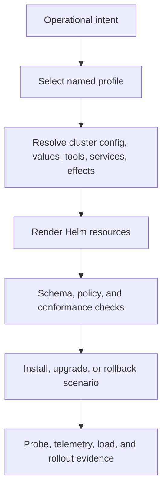
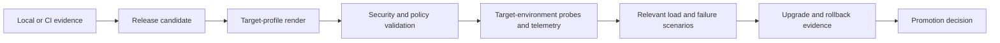

# Deployment Models

Atlas deployment models are defined by profile intent, concrete values,
required tools and services, allowed effects, cluster shape, and evidence. They
are not maturity labels. Every supported model preserves the same publication
boundary: the runtime serves an explicit catalog and immutable store state.

## Profile Selection

`ops/stack/profiles.json` defines local stack footprint. `profile-intent.json`
defines why a profile exists and which effects it permits.
`profile-registry.json` adds safety level, required tools, namespaces, services,
and source paths. `ops/k8s/install-matrix.json` binds Kubernetes values to
install, upgrade, rollback, and validation suites.

## Local and Validation Profiles

| Profile | Intended use | Required dependencies | Evidence limit |
| --- | --- | --- | --- |
| `minimal` | smallest supported contract footprint | Kind cluster and rendered manifests | not production or resilience proof |
| `small` | quick constrained local validation | Kind cluster and rendered manifests | no full telemetry claim |
| `ci` | deterministic automated validation | Kind cluster and rendered manifests | restricted effects; targeted install evidence |
| `kind` | baseline local cluster and smoke checks | cluster, rendered manifests, health endpoint | standard local integration evidence |
| `dev` | iterative local development | cluster, rendered manifests, health endpoint | allows networked local workflows |
| `developer` | workstation cluster with standard ergonomics | cluster, rendered manifests, health endpoint | development evidence only |
| `perf` | performance baseline and autoscaling checks | cluster, rendered manifests, metrics server, health endpoint | strict profile; requires load and metrics evidence |

The concrete stack manifest currently expands `ci` and `local` with the Atlas
chart, operations namespace, MinIO, and Redis. The `kind` stack adds Prometheus,
Grafana, and OpenTelemetry. A profile appearing in an intent registry does not
mean every operational component is present; the generated dependency graph is
the resolved component evidence.

## Kubernetes Delivery Profiles

The install matrix also covers `ingress`, `multi-registry`, `offline`, and
`prod` values. These are Kubernetes delivery concerns rather than extra local
stack classes.

| Delivery concern | Required proof |
| --- | --- |
| baseline install | schema-valid values, rendered resources, install suite |
| ingress | explicit ingress values, routing and security review, nightly evidence |
| multi-registry | pinned image sources and pull behavior across registries |
| offline | locally available images and artifacts, no hidden network dependency |
| performance | metrics prerequisites, autoscaling configuration, governed load evidence |
| production | security context, network policy, resource, availability, backup, and rollback review |

## Promotion Is Not Inheritance

Evidence from a smaller profile proves only that profile's contract. It cannot
be inherited as production readiness. Promotion requires the target profile's
rendered identity and all evidence demanded by its security, telemetry,
capacity, and recovery posture.

## Evidence Transfer

| Earlier evidence | Reusable conclusion | Must be repeated for the target |
| --- | --- | --- |
| source and schema validation | authored inputs satisfy repository contracts | target-specific values and overlays |
| deterministic render for another profile | chart templates can produce valid objects | target resource inventory and policy result |
| local functional result | product path works for recorded local dependencies | target networking, storage, identity, and traffic path |
| lower-scale load result | scenario and query pack can execute | target capacity, autoscaling, saturation, and recovery budgets |
| prior release rollback | recovery workflow has a known shape | candidate-to-previous compatibility in the target profile |

Evidence is reusable when the authority and unchanged inputs are identical.
Environment-dependent conclusions are not portable merely because the runtime
binary is the same.

## External Dependency Handoff

The Atlas profile controls only the assets it owns. A production decision must
also name the operator for every service supplied by the environment:

| Dependency | Atlas needs | Environment owner must establish |
| --- | --- | --- |
| object store | immutable object reads and catalog access | durability, credentials, encryption, backup, restore, and consistency behavior |
| ingress and DNS | stable routing to eligible instances | TLS policy, name ownership, timeout behavior, and traffic rollback |
| workload identity | least-privilege access to dependencies | principal lifecycle, credential rotation, revocation, and audit trail |
| telemetry backend | accepted logs, metrics, and traces | retention, query availability, access control, and loss detection |
| cluster services | scheduling, storage, metrics, and network enforcement | supported versions, capacity, admission policy, and failure ownership |

Record the provider, service identity, escalation route, recovery objective,
and evidence source for each dependency. “Managed elsewhere” is a deployment
fact, not an ownership answer. If an external service is required for
readiness, correctness, or promotion evidence, its failure policy belongs in
the target profile's operating record.

## Non-Negotiable Boundaries

- Serve from published store state, never directly from an ingest build root.
- Keep runtime, dataset, chart, values, dependency, and toolchain identity
  reviewable together.
- Treat readiness as traffic admission, not as complete performance proof.
- Record relaxed security, network, or admin behavior as an explicit exception.
- Prove rollback against the same release and profile identities used for
  promotion.

The selected model should also document who owns external dependencies. A
managed object store, ingress, identity provider, or telemetry backend may sit
outside the Atlas composition while remaining inside the release decision.

Continue with [Install Matrix](../kubernetes/install-matrix.md),
[Render and Validate](../kubernetes/render-and-validate.md), and
[Rollout Safety](../kubernetes/rollout-safety.md).
